# 06 — Guía de Pantallas y Funcionalidades — ApiTrace

> Catálogo visual y funcional de la aplicación web instalable (PWA) de ApiTrace.
> Documenta **cada pantalla, cada acción y cada estado** de la interfaz, con capturas
> tomadas sobre la aplicación en ejecución.

| Campo | Valor |
|---|---|
| Documento | 06 — Guía de Pantallas y Funcionalidades |
| Versión | **2.0** — actualizada tras el rediseño UX/UI descrito en `07-Rediseno-UX-UI-ApiTrace.md` |
| Fecha | 17 de septiembre de 2026 |
| Estado | Vigente para el MVP descrito en `04-MVP-ApiTrace.md` |
| Alcance | Frontend `apitrace-web` (React 19 + Vite 6, PWA) sobre `apitrace-backend` (NestJS 11) |
| Documentos relacionados | `00-Documento_de_Vision`, `01-Mapa_del_Dominio`, `02-Casos_de_Uso`, `03-ArquitecturaTecnica`, `04-MVP-ApiTrace`, `05-ADR-Decisiones-Tecnicas`, `07-Rediseno-UX-UI-ApiTrace` |

> **Qué cambió respecto de la versión 1.0.** La interfaz se rediseñó por completo: navegación
> con barra de pestañas en el teléfono, listados que se dibujan como tarjetas en pantallas
> chicas, altas largas convertidas en asistentes por pasos, estados del dominio traducidos al
> español y ayuda contextual bajo botones `?`. Los hallazgos de la versión anterior que el
> rediseño resolvió están marcados como tales en la [sección 10](#10-hallazgos-y-estado-de-resolución).

---

## Índice

1. [Propósito del documento](#1-propósito-del-documento)
2. [Cómo se generaron las capturas](#2-cómo-se-generaron-las-capturas)
3. [Mapa de navegación](#3-mapa-de-navegación)
4. [Convenciones de la interfaz](#4-convenciones-de-la-interfaz)
5. [Matriz de pantallas por rol](#5-matriz-de-pantallas-por-rol)
6. [Catálogo de pantallas](#6-catálogo-de-pantallas)
7. [Modo offline y sincronización](#7-modo-offline-y-sincronización)
8. [Comportamiento en móvil y PWA](#8-comportamiento-en-móvil-y-pwa)
9. [Flujo completo del circuito](#9-flujo-completo-del-circuito)
10. [Hallazgos y estado de resolución](#10-hallazgos-y-estado-de-resolución)
11. [Dependencias técnicas y riesgos](#11-dependencias-técnicas-y-riesgos)
12. [Inventario de capturas](#12-inventario-de-capturas)

---

## 1. Propósito del documento

Los documentos 00 a 05 definen **qué** hace ApiTrace y **cómo está construido**; el 07 explica
**por qué la interfaz es como es**. Este documento muestra **cómo se ve y cómo se usa**, y sirve
como:

- **manual de referencia** para quien opera el sistema (productor, sala, acopio, auditor);
- **especificación viva de la interfaz** para quien la desarrolla o la extiende;
- **material de demostración** ante SENASA, cámaras apícolas, compradores o inversores;
- **base de comparación** para detectar regresiones visuales entre versiones.

Cada pantalla se documenta con la misma estructura: ruta, propósito, roles habilitados,
elementos visibles, acciones disponibles, reglas de negocio que la gobiernan y los estados
alternativos (vacío, error, sin conexión).

---

## 2. Cómo se generaron las capturas

Las capturas **no son maquetas**: se tomaron ejecutando el build de producción real, con su
hoja de estilos y su service worker. Lo que se sustituye es la fuente de datos: en lugar de una
base PostgreSQL, la API responde desde un juego de datos determinista, de modo que el catálogo
sea reproducible y siempre muestre los mismos estados del circuito.

| Elemento | Configuración |
|---|---|
| Frontend | `vite preview` sobre el build de producción |
| API | Interceptada por Playwright con respuestas deterministas (`frontend/capturas.mjs`) |
| Automatización | Playwright sobre Chromium, guion determinista |
| Viewport escritorio | 1440 × 940 px, `deviceScaleFactor` 2 |
| Viewport móvil | 390 × 844 px, `deviceScaleFactor` 3, emulación táctil |
| Idioma / zona | `es-AR`, `America/Argentina/Buenos_Aires` |
| Total de capturas | 73 (36 escritorio + 37 móvil) |

### Regenerar el catálogo

```bash
cd frontend
npm run build
npx vite preview --port 4173 &
node capturas.mjs          # escribe en ../docs/capturas/{escritorio,movil}
```

El guion es la fuente de verdad del catálogo: agregar una pantalla al documento implica
agregarla a `SHOTS` en `capturas.mjs`, no tomar una captura a mano.

### Usuarios de demostración

Todos comparten la contraseña definida en `SEED_PASSWORD` (`ApiTrace2026!` por defecto).

| Correo | Rol | Organización | Puede escribir |
|---|---|---|---|
| `admin@apitrace.test` | ADMIN | — (sin organización) | Sí (ver hallazgo H-01) |
| `productor@apitrace.test` | PRODUCTOR | Apiarios del Sur | Sí |
| `sala@apitrace.test` | SALA | Sala San Andrés | Sí |
| `acopio@apitrace.test` | ACOPIADOR | Acopio Pampa | Sí |
| `auditor@apitrace.test` | AUDITOR | — | **No** (solo lectura) |
| `laboratorio@apitrace.test` | LABORATORIO | Laboratorio Mielab | Sí |

> El acceso rápido a estos usuarios **ya no existe en el build de producción**: queda
> condicionado a `import.meta.env.DEV` (hallazgo H-07, resuelto).

### Cadena de demostración

```
María González (productor) → Predio Los Talas → API-001/002/003
   → MOV-2026-000001 (DT-e cerrado, recepción con diferencia de 11,5 kg)
      → EXT-2026-000001 → LOTE-2026-000001 → TAM-2026-00041 / 00042
Además: MOV-…003 borrador que exige DT-e, MOV-…004 despachado esperando recepción,
MOV-…006 cancelado, LOTE-2026-000003 sin entradas declaradas (hueco de trazabilidad).
```

---

## 3. Mapa de navegación

Las rutas no cambiaron; sí cambió cómo se llega a ellas.

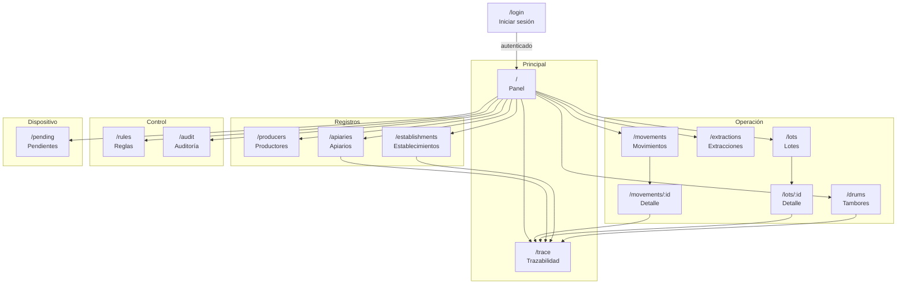
```mermaid
flowchart TD
    L["/login<br/>Iniciar sesión"] -->|autenticado| P["/<br/>Panel"]

    subgraph PRI["Principal"]
        P
        T["/trace<br/>Trazabilidad"]
    end

    subgraph OPE["Operación"]
        MV["/movements<br/>Movimientos"]
        MVD["/movements/:id<br/>Detalle"]
        EX["/extractions<br/>Extracciones"]
        LO["/lots<br/>Lotes"]
        LOD["/lots/:id<br/>Detalle"]
        DR["/drums<br/>Tambores"]
    end

    subgraph REG["Registros"]
        PR["/producers<br/>Productores"]
        ES["/establishments<br/>Establecimientos"]
        AP["/apiaries<br/>Apiarios"]
    end

    subgraph CTL["Control"]
        RU["/rules<br/>Reglas"]
        AU["/audit<br/>Auditoría"]
    end

    subgraph DIS["Dispositivo"]
        PE["/pending<br/>Pendientes"]
    end

    P --> T & MV & EX & LO & DR & PR & ES & AP & RU & AU & PE
    MV --> MVD
    LO --> LOD
    MVD --> T
    LOD --> T
    AP --> T
    ES --> T
    DR --> T
```

### Dos formas de navegar según el tamaño de pantalla

| | Escritorio (≥ 900 px) | Teléfono (< 900 px) |
|---|---|---|
| Navegación | Barra lateral fija, agrupada en cinco secciones | **Barra de pestañas fija al pie**, con 4 destinos + «Más» |
| Volver desde un detalle | Barra lateral siempre visible | Enlace *‹ Movimientos* / *‹ Lotes* en el encabezado |
| Secciones menos usadas | En la misma barra lateral | Hoja «Más», que además contiene la sesión y *Salir* |
| Barra superior | No existe | No existe |

**Los cuatro destinos de la barra de pestañas dependen del rol**, porque el trabajo diario de
cada uno es distinto:

| Rol | Pestañas |
|---|---|
| PRODUCTOR | Panel · Movimientos · Apiarios · Trazabilidad |
| SALA | Panel · Movimientos · Extracciones · Lotes |
| ACOPIADOR / FRACCIONADOR | Panel · Movimientos · Lotes · Tambores |
| EXPORTADOR | Panel · Tambores · Lotes · Trazabilidad |
| LABORATORIO | Panel · Lotes · Trazabilidad · Pendientes |
| TRANSPORTISTA | Panel · Movimientos · Trazabilidad · Pendientes |
| AUDITOR | Panel · Trazabilidad · Movimientos · Auditoría |
| ADMIN | Panel · Movimientos · Lotes · Trazabilidad |

Cuando *Pendientes* no está entre las pestañas, el contador de la cola aparece sobre «Más».

| Barra de pestañas y hoja «Más» |
|---|
|  |

---

## 4. Convenciones de la interfaz

### 4.1 Anatomía de la pantalla

| Zona | Contenido |
|---|---|
| Barra lateral (escritorio) | Marca, navegación agrupada, botón *Instalar*, usuario y última sincronización |
| Franja de estado | Una sola franja, arriba del contenido: sin conexión, sincronizando, operaciones por enviar u operaciones rechazadas. Aparece **solo cuando hay algo que decir** |
| Franja del service worker | Aviso de *lista para usar sin conexión* o *hay una versión nueva*, con su botón de cierre |
| Encabezado de página | Volver (si es un detalle), título, sello de estado, botón `?` de ayuda y acción principal |
| Cuerpo | Avisos, filtros, tarjetas, listas |
| Barra de pestañas (móvil) | Cuatro destinos del rol + «Más» |

### 4.2 Sellos de estado

Los estados del dominio **ya no se muestran en crudo**. Un diccionario único
(`lib/vocabulary.ts`) los traduce y les asigna tono e icono, de modo que la severidad no
dependa solamente del color.

| Tono | Icono | Estados |
|---|---|---|
| Verde | ✓ | Activo, Recibido, Cerrado, Aprobado, Terminada, Enviado a SIGSA, Aceptada, En depósito |
| Ámbar | ⚠ | Sin verificar, Recibido parcial, Falta enviar a SIGSA, En proceso, Parcial |
| Rojo | ⊘ | Rechazado, Cancelado, Bloqueado, Suspendido, Error al enviar |
| Azul | ⓘ | Despachado, En camino, Emitido, Abierto, Lleno |
| Gris | — | Borrador, Inactivo, Consumido, Vacío |

Ejemplos de traducción:

| Enum del backend | Lo que ve el usuario |
|---|---|
| `PARTIALLY_RECEIVED` | Recibido parcial |
| `PENDING_VERIFICATION` | Sin verificar |
| `PENDING_SYNC` | Falta enviar a SIGSA |
| `MOVEMENT_DISPATCHED` | Despachado *(historial)* |
| `LOT_WITHOUT_INPUTS` | Un lote no declara de qué se compone: la cadena se corta ahí *(huecos)* |

### 4.3 Tipos de aviso

| Tono | Uso típico |
|---|---|
| Info (azul) | Explica una regla antes de actuar: evaluación normativa por fecha, falta de integración con SIGSA |
| Éxito (verde) | Confirmación flotante de una operación, con cierre automático a los 5 segundos |
| Advertencia (ámbar) | Datos servidos desde copia local, lote sin entradas, documento exigido y faltante |
| Error (rojo) | Fallo del servidor, operación rechazada, permisos insuficientes |

**Ningún mensaje de error menciona un código HTTP.** Un módulo (`lib/errors.ts`) traduce cada
fallo a una frase accionable:

| Situación | Lo que ve el usuario |
|---|---|
| 500 | «No pudimos completar la operación. Fue un problema nuestro. Probá de nuevo en un momento.» |
| 403 sin organización | «Tu usuario todavía no puede operar. No tiene una organización asignada. Pedile a un administrador que te asigne una.» |
| Sin red al guardar | «Sin conexión. Guardamos la operación en el teléfono y la enviamos cuando vuelva la señal.» |
| Sin red al consultar | «Sin conexión y sin copia local. Estos datos nunca se descargaron en este dispositivo.» |

Los avisos flotantes **no bloquean lo que tienen debajo**: solo sus propios controles reciben
el toque. Es una regla del sistema visual, no un detalle de implementación.

### 4.4 Ayuda contextual

Las definiciones de dominio ya no ocupan el encabezado de cada pantalla de forma permanente.
Viven detrás de un botón `?` junto al título, al campo o a la cifra que explican, y aparecen
solo cuando alguien las pide. Hay 28 textos de ayuda, todos de dos o tres frases.


### 4.5 Patrón de formulario

| Regla | Aplicación |
|---|---|
| Obligatorio vs. opcional | Los obligatorios llevan `*`; los opcionales, la palabra *opcional*. El subtítulo de la hoja lo recuerda |
| Campos secundarios | Agrupados en bloques plegados («Contacto y ubicación (opcional)») |
| Validación | Al salir del campo y al enviar, nunca en cada tecla. Una vez marcado un error, se revalida al escribir para que desaparezca al corregirlo |
| Errores del servidor | Se reparten **por campo** cuando el backend indica cuál falla; solo lo que no se puede ubicar queda como aviso general |
| Teclado móvil | Los campos numéricos abren teclado numérico (`inputMode`) |
| Estado de envío | El botón cambia de texto: *Guardar* → *Guardando…* |
| Formularios largos | Se convierten en asistentes por pasos (ver 6.6 y 6.8) |

### 4.6 Reglas transversales

| Regla | Valor |
|---|---|
| Área táctil mínima | 44 px de alto en todo control interactivo |
| Contraste | Ningún par texto/fondo por debajo de 4,5:1; ningún borde de control por debajo de 3:1, verificado en tema claro y oscuro |
| Color | Nunca es el único portador de significado: todo estado lleva además texto y, cuando corresponde, icono |
| Movimiento | Se respeta `prefers-reduced-motion` |
| Tema | Claro y oscuro automáticos según el sistema operativo |

---

## 5. Matriz de pantallas por rol

`canWrite` es verdadero para todos los roles excepto `AUDITOR` y `CONSULTA`; el rol `ADMIN`
además satisface cualquier verificación de rol específico.

> **Corrección respecto de la versión 1.0.** La matriz anterior daba por habilitadas pantallas
> que el enrutador no permite. Esta tabla se verificó campo por campo contra `App.tsx`.

| Pantalla | ADMIN | PRODUCTOR | SALA | ACOPIADOR | FRACCIONADOR | TRANSPORTISTA | LABORATORIO | EXPORTADOR | AUDITOR |
|---|:--:|:--:|:--:|:--:|:--:|:--:|:--:|:--:|:--:|
| Panel | ✔ | ✔ | ✔ | ✔ | ✔ | ✔ | ✔ | ✔ | ✔ |
| Trazabilidad | ✔ | ✔ | ✔ | ✔ | ✔ | ✔ | ✔ | ✔ | ✔ |
| Movimientos | ✔ | ✔ | ✔ | ✔ | ✔ | ✔ | ✖ | ✖ | Lectura |
| Extracciones | ✔ | ✖ | ✔ | ✔ | ✖ | ✖ | ✖ | ✖ | Lectura |
| Lotes | ✔ | ✖ | ✔ | ✔ | ✔ | ✖ | ✔ | ✖ | Lectura |
| Tambores | ✔ | ✖ | ✔ | ✔ | ✔ | ✖ | ✖ | ✔ | Lectura |
| Productores | ✔ | ✔ | ✖ | ✖ | ✖ | ✖ | ✖ | ✖ | Lectura |
| Establecimientos | ✔ | ✔ | ✔ | ✔ | ✔ | ✖ | ✖ | ✖ | Lectura |
| Apiarios | ✔ | ✔ | ✖ | ✖ | ✖ | ✖ | ✖ | ✖ | Lectura |
| Reglas documentales | ✔ | ✖ | ✖ | ✖ | ✖ | ✖ | ✖ | ✖ | ✔ |
| Auditoría | ✔ | ✖ | ✖ | ✖ | ✖ | ✖ | ✖ | ✖ | ✔ |
| Pendientes | ✔ | ✔ | ✔ | ✔ | ✔ | ✔ | ✔ | ✔ | ✔ |

**Qué pasa cuando el rol no alcanza.** Ya no hay una redirección muda al panel: la pantalla
explica qué rol hace falta y ofrece una salida.

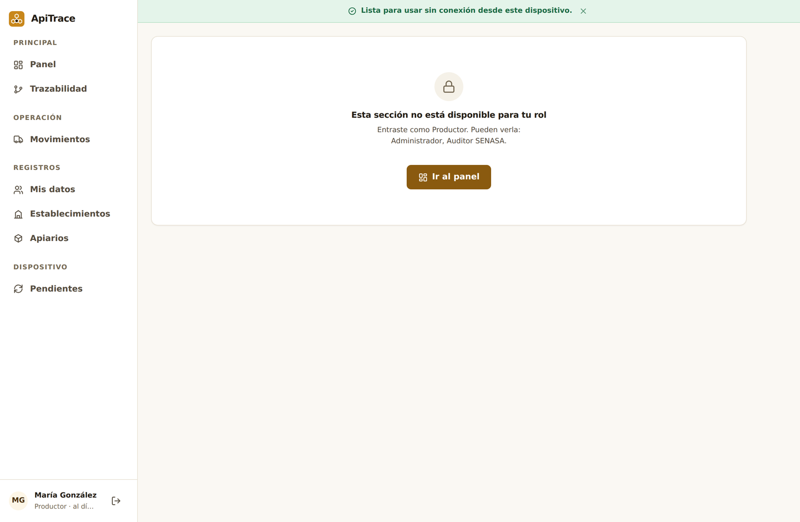

> El alcance de **datos** es adicional al de pantallas: cada usuario ve solamente las
> entidades de su organización. `ADMIN` y `AUDITOR` no tienen organización asignada y ven
> el conjunto completo.

---

## 6. Catálogo de pantallas

### 6.1 Iniciar sesión — `/login`

**Propósito.** Autenticar. Es la única operación que **no** funciona sin conexión: hace falta
llegar al servidor al menos una vez. Una vez dentro, la sesión se guarda en el dispositivo y la
aplicación abre sin señal.

| Elemento | Detalle |
|---|---|
| Correo | `inputMode="email"`, sin autocapitalización |
| Contraseña | Con botón *Mostrar* / *Ocultar*: escribir a ciegas en el campo es la causa más común de un intento fallido en el campo |
| Entrar | **Nunca se deshabilita por campos vacíos.** Valida al enviar y el mensaje aparece junto al campo que falta |
| Sin red | «No llegamos al servidor. Para entrar por primera vez hace falta conexión. Una vez adentro, la app funciona sin señal.» |

| Escritorio | Móvil |
|---|---|
|  | 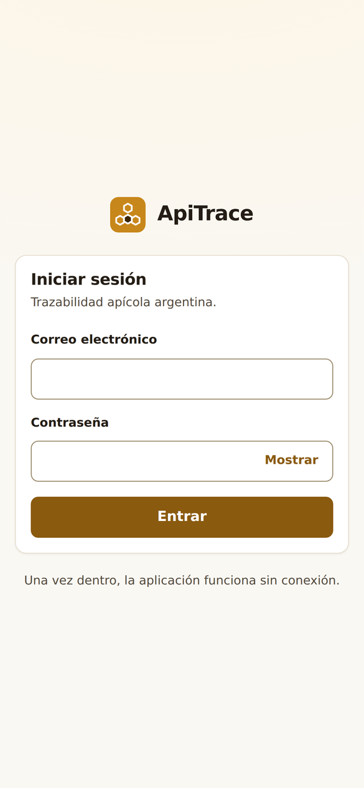 |

---

### 6.2 Panel — `/`

**Propósito.** Responder **«¿qué tengo que hacer hoy?»**, no «cuántos registros hay».

El panel se organiza en tres bloques, en este orden:

1. **Tarjetas de tarea** — aparecen **solo si hay algo pendiente** y llevan directo a resolverlo:
   - operaciones rechazadas por el servidor (rojo);
   - traslados despachados que nadie recibió todavía (ámbar);
   - movimientos creados sin despachar (azul).
2. **Cifras** del ámbito del usuario, distintas según el rol.
3. **Últimos movimientos** y **últimos lotes** (o *mis apiarios*, para el productor).

| Rol | Cifras que ve |
|---|---|
| PRODUCTOR | Movimientos · Apiarios · Establecimientos · Por enviar |
| SALA | Movimientos · Extracciones · Lotes · Por enviar |
| ACOPIADOR / FRACCIONADOR / EXPORTADOR | Movimientos · Lotes · Tambores · Por enviar |
| Resto | Movimientos · Lotes · Apiarios · Por enviar |

| Escritorio (sala) | Móvil (sala) |
|---|---|
|  | 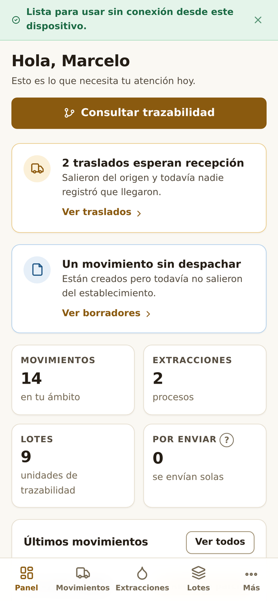 |

| Productor | Auditor |
|---|---|
| 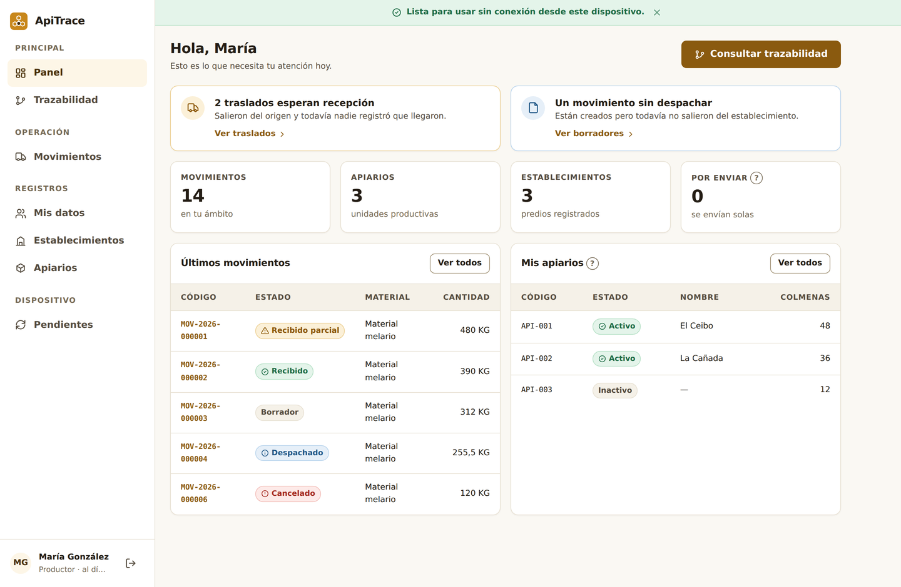 |  |

---

### 6.3 Productores — `/producers`

**Propósito.** El productor es el actor responsable de la actividad. Su RENAPA se registra
aparte, porque son cosas distintas: un productor puede existir sin RENAPA vigente.

| Columna | Contenido |
|---|---|
| Nombre | Razón social o nombre, en negrita (título de la tarjeta en móvil) |
| Estado | Sello traducido (sello de la tarjeta en móvil) |
| Tipo | Persona física / Persona jurídica |
| CUIT | Monoespaciada |
| Ubicación | Localidad, provincia |

**Para el rol PRODUCTOR** la pantalla se titula *Mis datos de productor* y el alta solo está
disponible si todavía no cargó los suyos.

**Alta.** Tres campos a la vista (nombre, tipo de persona, CUIT) y el resto —contacto y
ubicación— en un bloque plegado.

**Asociar RENAPA.** Número, estado y fecha de alta. El aviso deja constancia de que, sin
integración con SENASA, el registro queda *Sin verificar*.

| Listado | Alta |
|---|---|
| 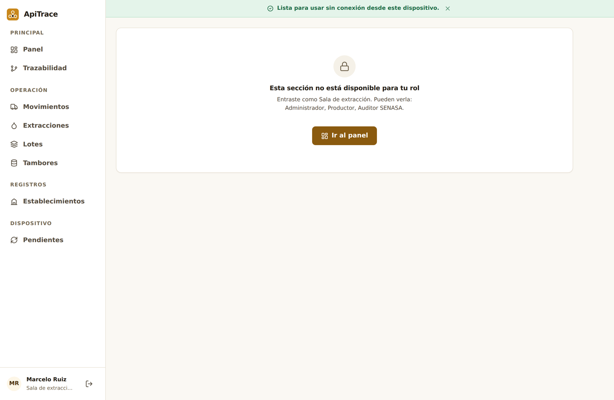 | 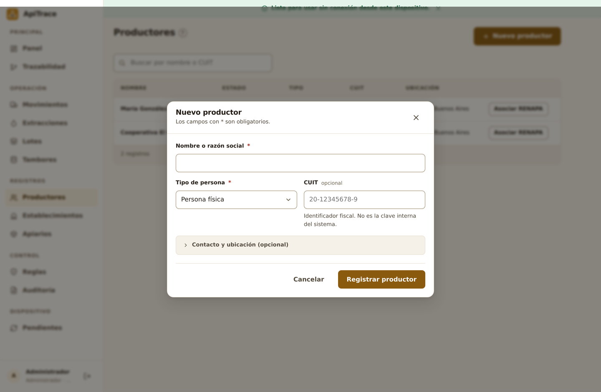 |

| Solo lectura (auditor) | Listado móvil |
|---|---|
| 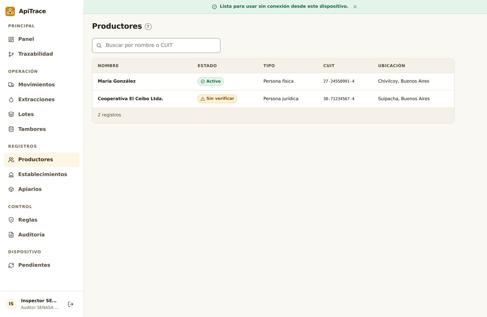 | 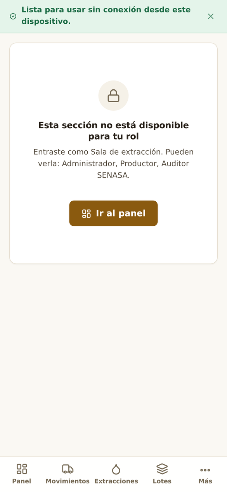 |

---

### 6.4 Establecimientos — `/establishments`

**Propósito.** El establecimiento es la unidad territorial: un predio, una sala, un acopio. No
debe confundirse con el apiario, que es una unidad productiva dentro de un predio.

| Columna | Contenido |
|---|---|
| Nombre · Estado · Tipo · Ubicación · RNE | Tipos traducidos: *Predio apícola*, *Sala de extracción*, *Acopio*, *Fraccionadora*, *Depósito*, *Laboratorio*, *Otro* |

**Acciones por registro.** *Trazar* (consulta hacia adelante desde el establecimiento) y
*Asociar RENSPA*.

**Alta.** Nombre, tipo y productor responsable a la vista; ubicación, domicilio, RNE y
coordenadas en un bloque plegado.

**Asociar RENSPA.** El número, el titular del predio —que puede no ser quien trabaja las
colmenas—, la actividad y el estado.

| Listado | Alta |
|---|---|
| 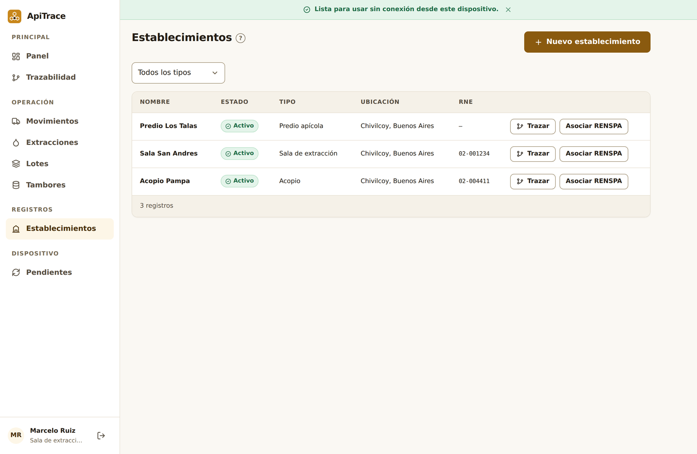 | 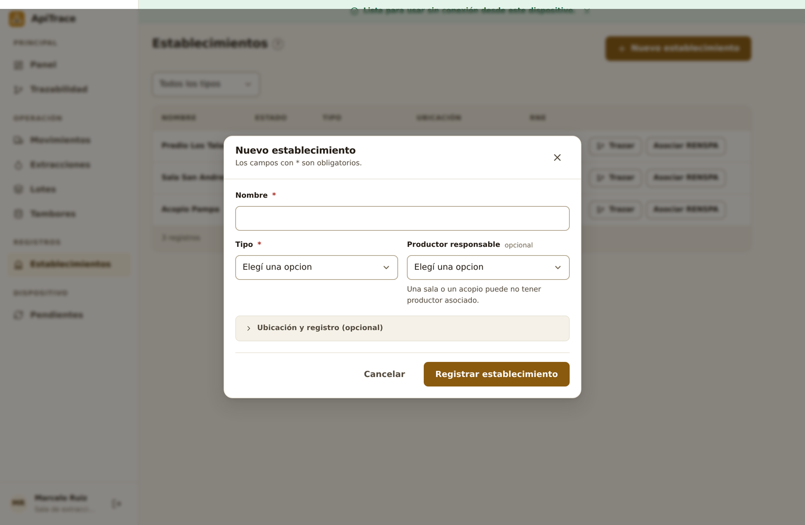 |

| Listado móvil |
|---|
| 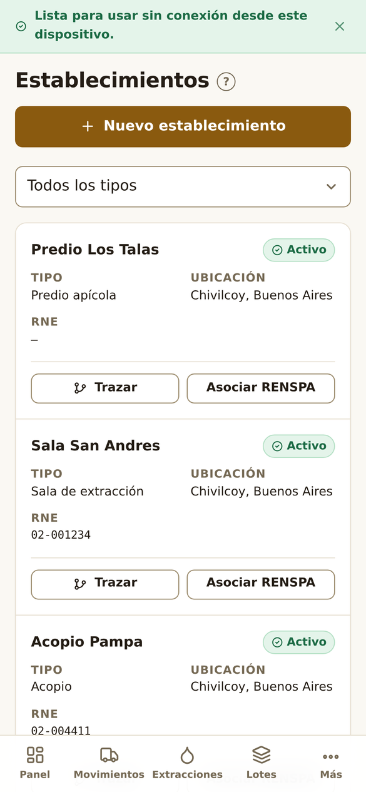 |

---

### 6.5 Apiarios — `/apiaries`

**Propósito.** Unidad productiva donde están las colmenas. Pertenece a un establecimiento y es
el punto de partida real de la trazabilidad hacia adelante.

**Orden obligatorio, explicado antes del error.** Un apiario necesita un establecimiento de tipo
*Predio apícola* que lo contenga. Si no existe ninguno, el botón *Nuevo apiario* queda
deshabilitado y un aviso explica qué falta — antes, el error aparecía recién al intentar
guardar, con el formulario lleno.

| Columna | Contenido |
|---|---|
| Código · Estado · Nombre · Establecimiento · Colmenas | Las coordenadas solo se muestran en escritorio |

**Acciones por registro.** *Colmenas* (alta rápida encadenada, pensada para cargar varias
seguidas) y *Dónde terminó* (trazabilidad hacia adelante).

**Alta.** Incluye **Usar mi ubicación actual**, que toma la posición del dispositivo: estando
parado en el apiario es la forma natural de cargar las coordenadas. Si el permiso se deniega,
lo dice y deja cargarlas a mano.

| Listado | Alta |
|---|---|
| 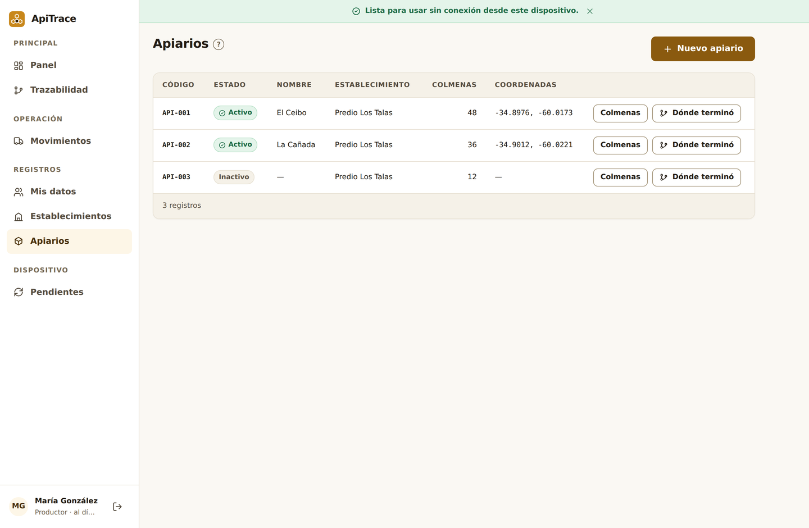 | 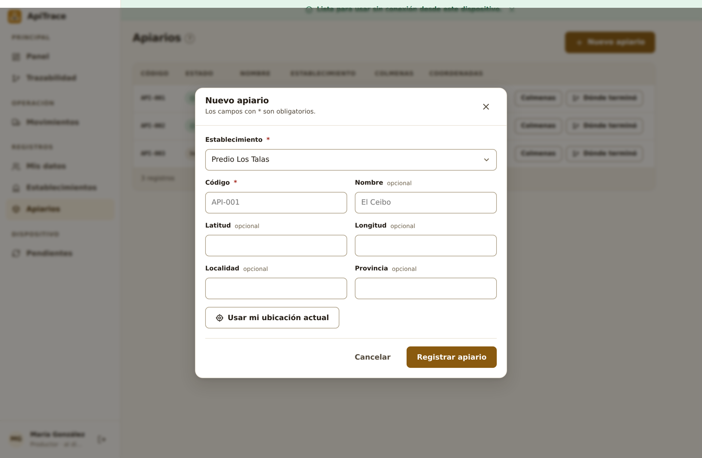 |

| Listado móvil | Alta móvil |
|---|---|
| 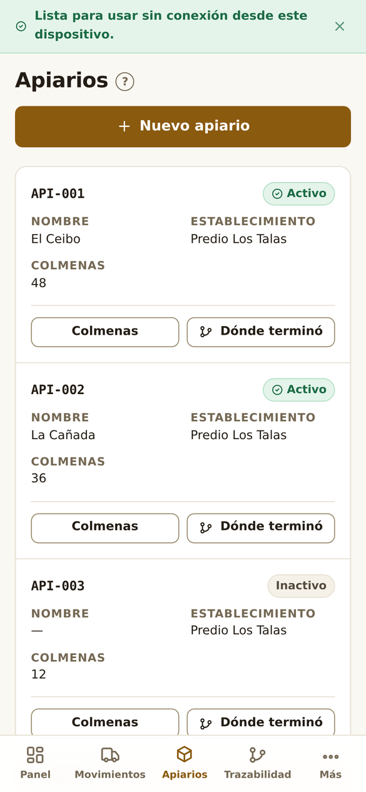 | 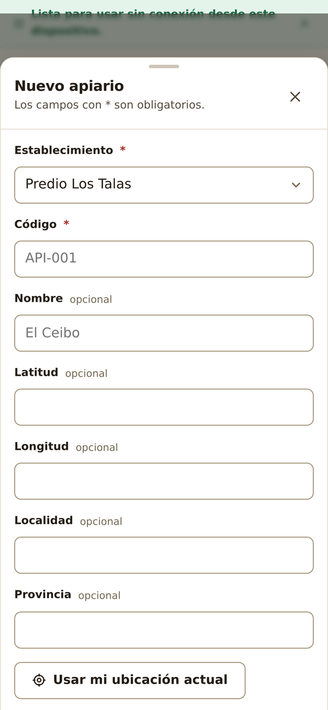 |

---

### 6.6 Movimientos — `/movements`

**Propósito.** El movimiento es el **evento de dominio** que conecta un origen con un destino.
El DT-e es un documento asociado al movimiento, no el movimiento en sí — la distinción es
deliberada y estructura todo el modelo.

| Columna | Contenido |
|---|---|
| Código · Estado · Material · Cantidad · Traslado · Documento | *Exige DT-e* o *No exige*, según la regla aplicada |

El filtro de estado se refleja en la URL (`/movements?status=DISPATCHED`), de modo que las
tarjetas de tarea del panel enlazan directamente a la lista ya filtrada.

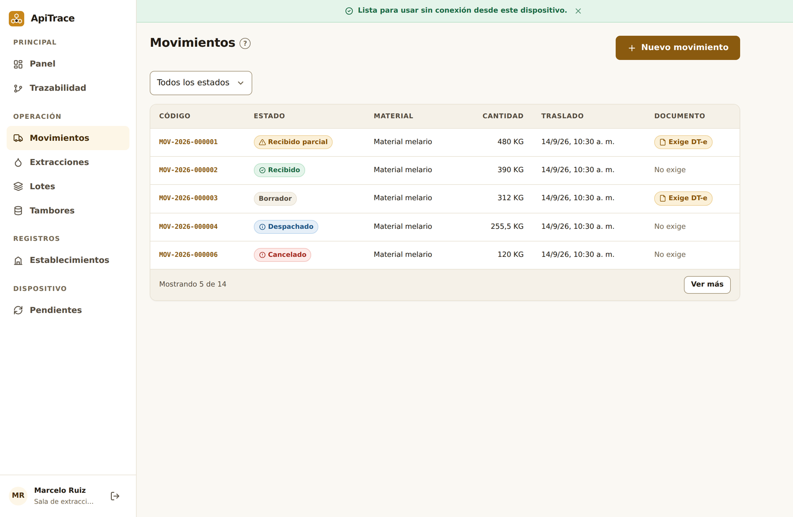

#### Alta: asistente de tres pasos

Los doce campos del formulario anterior se reparten en tres etapas. **Ningún campo
desapareció**: se agrupan por la pregunta que responden, se valida cada tramo antes de seguir y
el paso 3 muestra todo antes de confirmar.

| Paso | Contenido |
|---|---|
| **1 · Qué se traslada** | Tipo de traslado, cantidad y unidad. El **material se deduce** del tipo de traslado y queda plegado para ajustarlo: antes eran dos selectores casi idénticos donde *Material melario* aparecía en ambos |
| **2 · Origen y destino** | Sale de, apiario de origen (opcional pero decisivo), llega a, fecha del traslado. Valida que el destino sea distinto del origen |
| **3 · Confirmar** | Resumen de lo cargado, transporte y observaciones en bloque plegado, y *Crear movimiento* |

Si el servidor rechaza un dato, el asistente **vuelve al paso donde está el problema** en lugar
de dejar el error en una etapa que ya no se ve.

| Paso 1 | Paso 2 | Paso 3 |
|---|---|---|
| 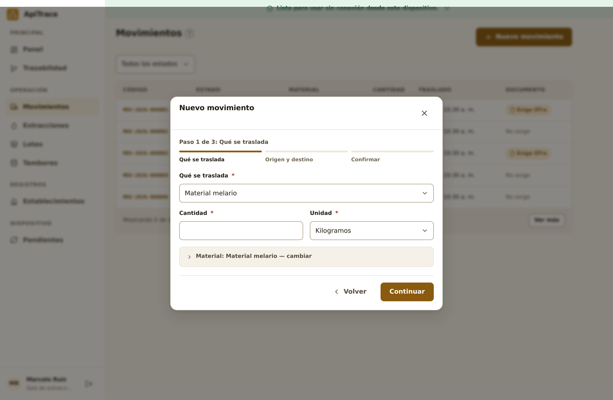 | 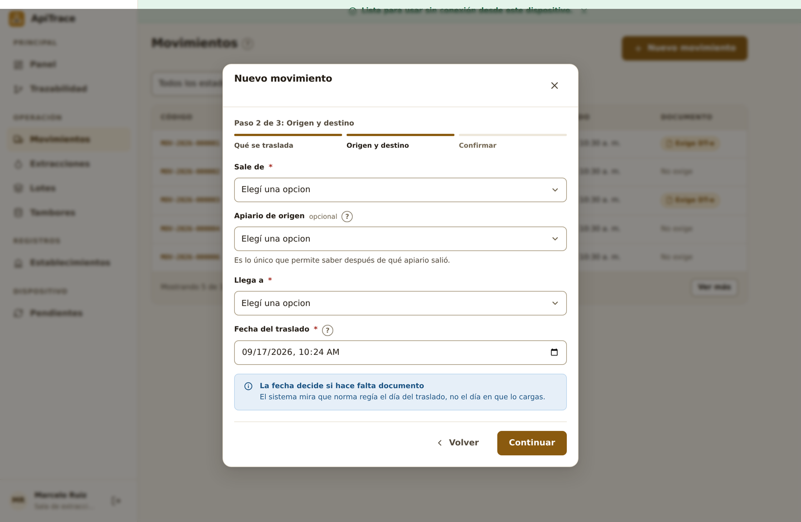 | 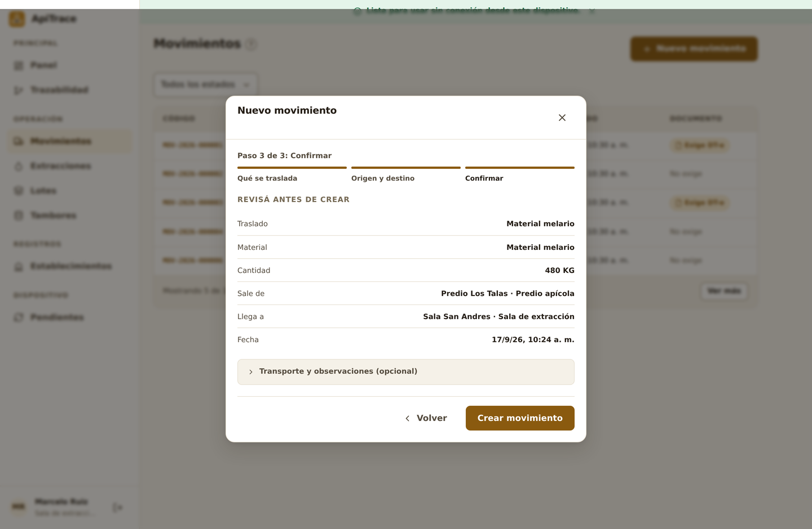 |

| Paso 1 (móvil) | Paso 3 (móvil) |
|---|---|
| 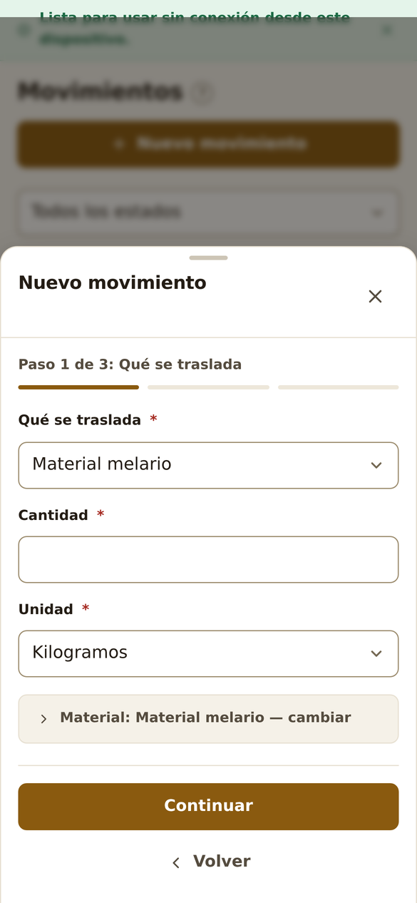 | 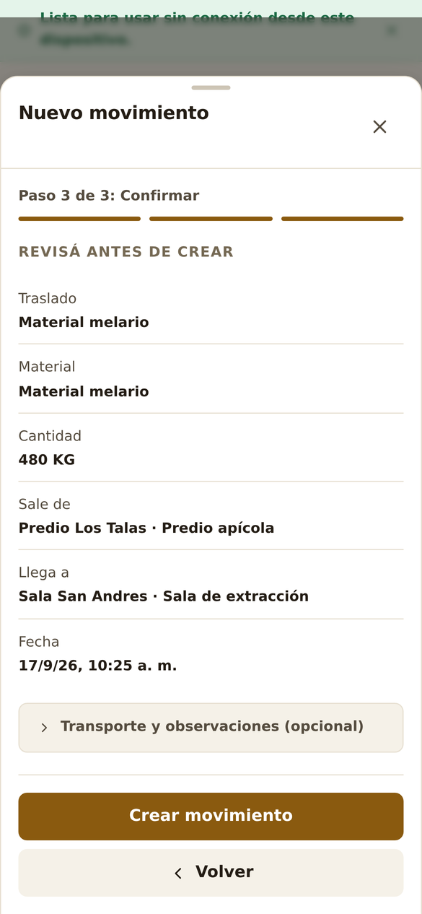 |

---

### 6.7 Detalle de movimiento — `/movements/:id`

**Propósito.** Concentra el ciclo de vida completo de un traslado: datos, documento sanitario,
recepción e historial de eventos.

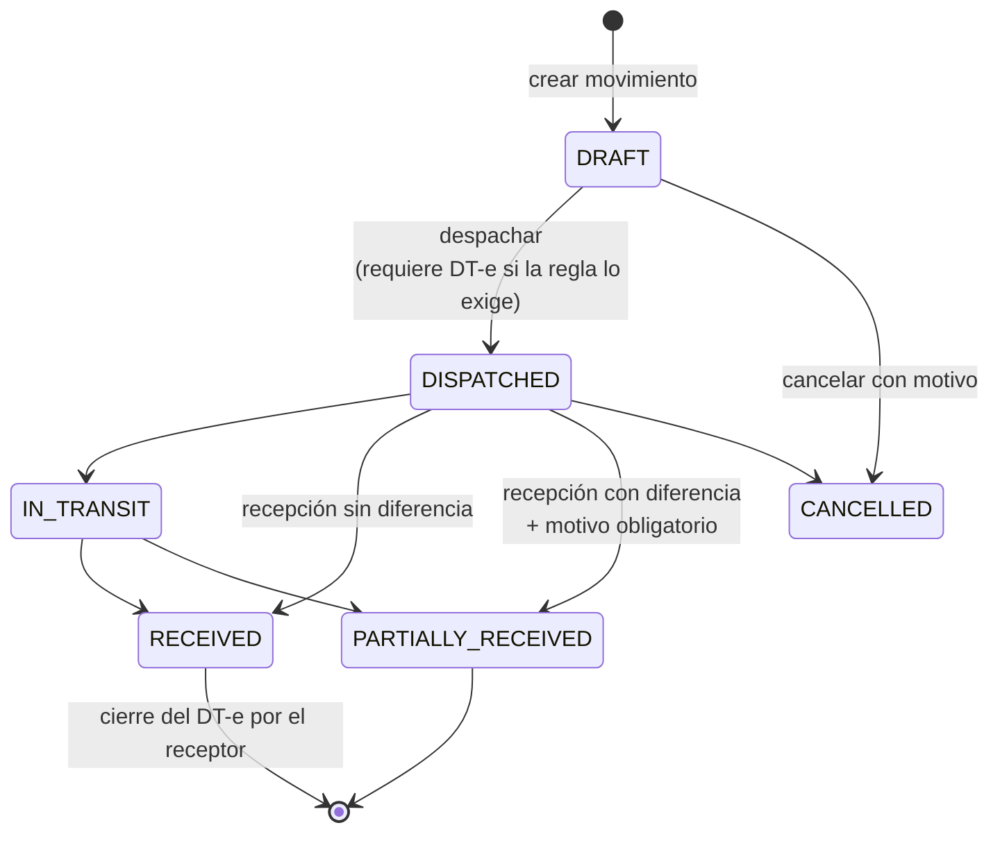
```mermaid
stateDiagram-v2
    [*] --> DRAFT: crear movimiento
    DRAFT --> DISPATCHED: despachar<br/>(requiere DT-e si la regla lo exige)
    DISPATCHED --> IN_TRANSIT
    DISPATCHED --> RECEIVED: recepción sin diferencia
    IN_TRANSIT --> RECEIVED
    DISPATCHED --> PARTIALLY_RECEIVED: recepción con diferencia<br/>+ motivo obligatorio
    IN_TRANSIT --> PARTIALLY_RECEIVED
    RECEIVED --> [*]: cierre del DT-e por el receptor
    PARTIALLY_RECEIVED --> [*]
    DRAFT --> CANCELLED: cancelar con motivo
    DISPATCHED --> CANCELLED
```

#### Una acción principal por estado

La pantalla anterior mostraba hasta cinco botones, casi todos con el mismo peso visual. Ahora
una tarjeta **Siguiente paso** nombra la continuación natural —derivada de la misma máquina de
estados— y explica en una línea qué implica. El resto queda disponible, pero secundario.

| Estado | Acción principal | Secundarias |
|---|---|---|
| `DRAFT` **que exige documento y no lo tiene** | Registrar DT-e | Cancelar |
| `DRAFT` con documento o sin exigencia | Despachar | Registrar DT-e · Cancelar |
| `DISPATCHED` / `IN_TRANSIT` | Registrar recepción | Registrar DT-e · Cancelar |
| `RECEIVED` / `PARTIALLY_RECEIVED` con DT-e emitido | Cerrar DT-e | — |
| `CANCELLED` / `REJECTED` | — | — |

**Cancelar pide confirmación explícita** antes de abrir el formulario: es una acción
irreversible.

| Movimiento recibido con diferencia | Borrador que exige DT-e |
|---|---|
| 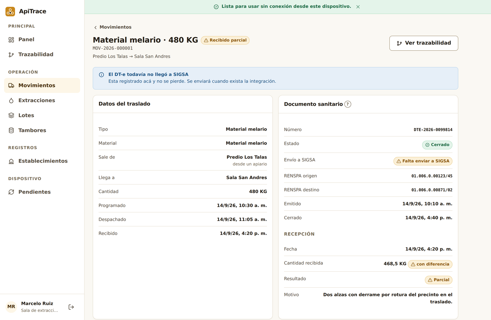 | 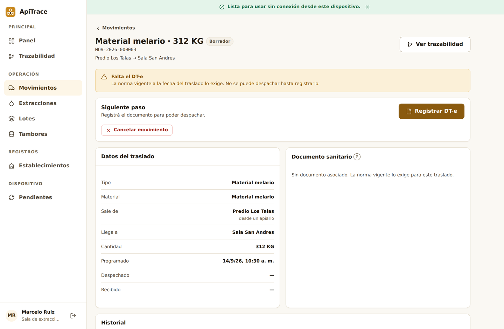 |

| Registrar DT-e | Confirmar cancelación |
|---|---|
| 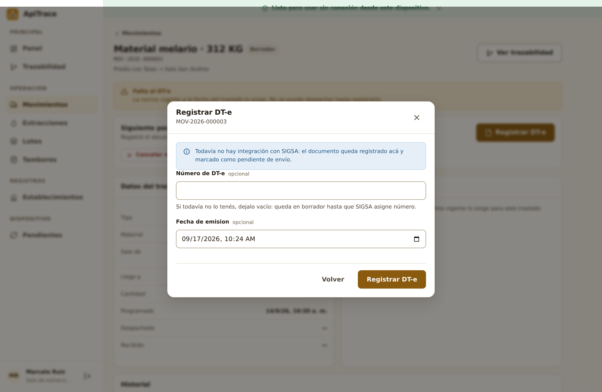 | 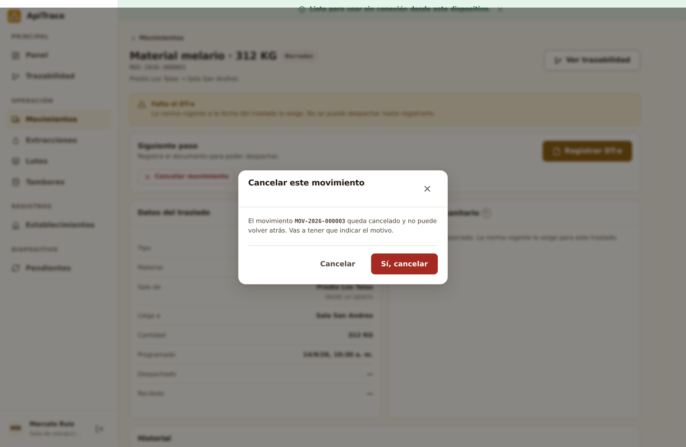 |

**Registrar recepción.** El aviso recuerda la cantidad declarada en origen. Si la recibida
difiere, **el motivo pasa a ser obligatorio** y se valida en el cliente antes de enviar; el
movimiento queda *Recibido parcial* con la marca *con diferencia*.

| Detalle (móvil) | Borrador (móvil) |
|---|---|
| 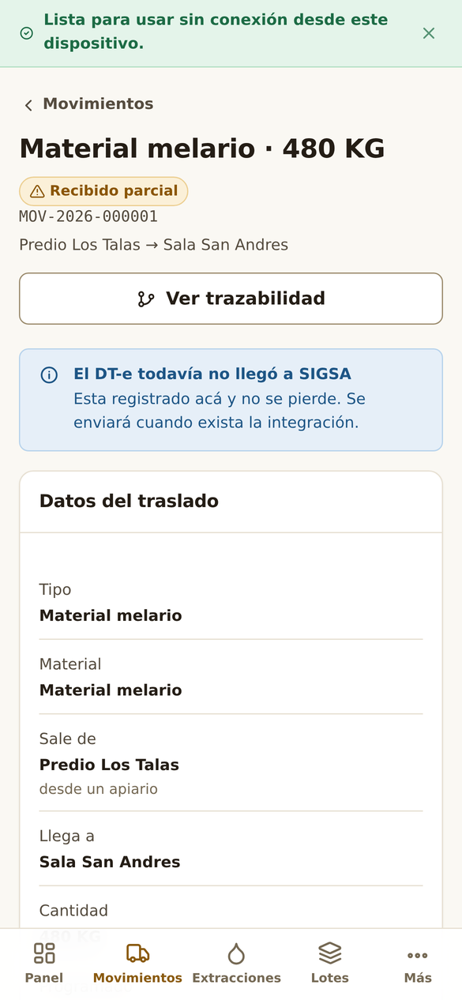 | 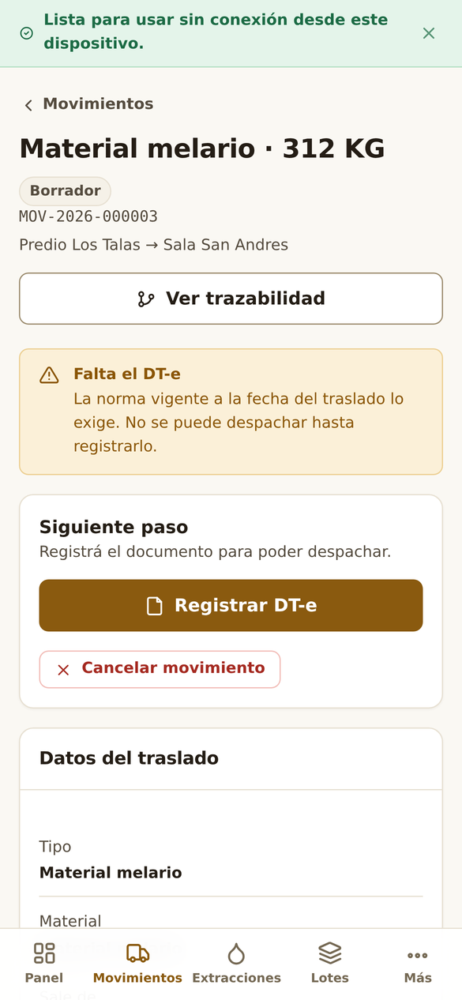 |

---

### 6.8 Extracciones — `/extractions`

**Propósito.** La extracción consume los movimientos recibidos en la sala y los convierte en
miel loteada. Un movimiento no puede alimentar dos extracciones distintas.

| Columna | Contenido |
|---|---|
| Código · Estado · Inicio · Ingreso · Obtenido · Rendimiento | El rendimiento se calcula solo: obtenido sobre ingresado |

#### Alta: asistente de dos pasos

| Paso | Contenido |
|---|---|
| **1 · Qué se procesa** | Sala y selección de movimientos recibidos. Cada movimiento es una **opción grande y tocable**, no una casilla de 13 px dentro de una tabla. Un aviso verde confirma cuántos se eligieron y cuánto suman |
| **2 · Datos del proceso** | Resumen de lo elegido, inicio, fin, operario y miel obtenida. La cantidad obtenida **no puede superar lo ingresado** y se valida en el cliente; el rendimiento se muestra en vivo |

Si la sala no tiene movimientos recibidos sin procesar, se explica qué hacer antes en lugar de
mostrar una lista vacía.

| Listado | Paso 1 |
|---|---|
|  |  |

| Paso 1 (móvil) |
|---|
| 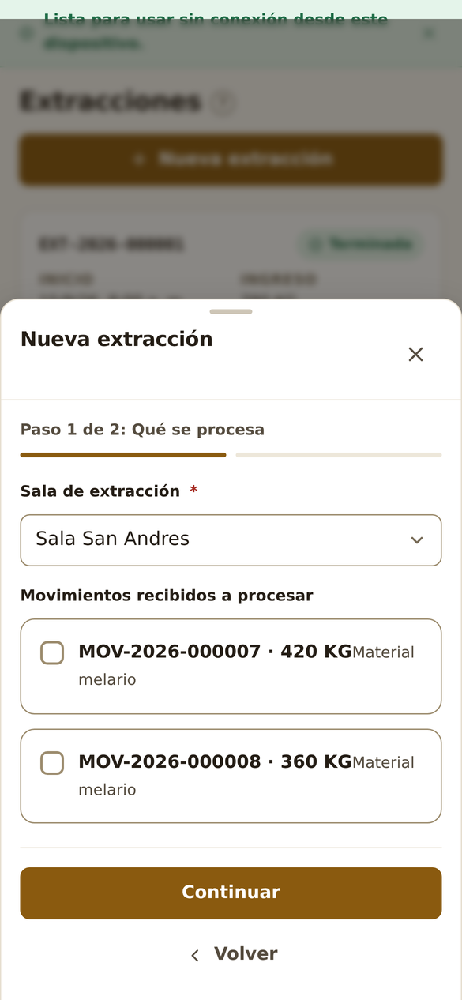 |

---

### 6.9 Lotes — `/lots`

**Propósito.** El lote es la unidad lógica de trazabilidad. Sus entradas definen de qué se
compone y son la arista que permite reconstruir el origen.

| Columna | Contenido |
|---|---|
| Código · Estado · Tipo · Producción · Cantidad · Disponible | *Disponible* es lo que queda sin consumir por otros lotes |

#### El origen como elección explícita

Antes eran dos selectores que el código excluía entre sí pero que en pantalla parecían campos
independientes. Ahora es una elección de tres opciones grandes:

| Opción | Qué pide |
|---|---|
| **De una extracción** | La extracción terminada de la que proviene |
| **De otro lote** | El lote origen y, opcionalmente, cuánto consumir de él |
| **Sin origen declarado** | Nada — y muestra un aviso ámbar advirtiendo que la trazabilidad hacia atrás va a quedar incompleta y el sistema lo reportará como hueco |

Los datos de calidad (tipo de miel, humedad, color) van en un bloque plegado.

| Listado | Alta con elección de origen |
|---|---|
|  |  |

---

### 6.10 Detalle de lote — `/lots/:id`

**Propósito.** Muestra de qué se compone el lote, en qué tambores se envasó y qué pasó con él.

| Cifra | Contenido |
|---|---|
| Cantidad | Total del lote |
| Disponible | Lo no consumido por otros lotes (con ayuda `?`) |
| Tambores | Cantidad, peso envasado y **porcentaje del lote ya envasado** |
| Humedad | Si está cargada |

**Composición.** Cada entrada indica su tipo de origen —movimiento recibido, otro lote,
extracción o carga manual— con enlace al registro correspondiente. Si no hay entradas, un aviso
advierte que el origen no puede reconstruirse.

**Registrar tambor.** El aviso informa **cuánto queda sin envasar** y el campo de peso neto
valida contra ese remanente antes de enviar.

**Registrar muestra.** Fecha de toma, quién la tomó, análisis solicitado y observaciones.

| Detalle | Registrar tambor |
|---|---|
|  |  |

| Detalle (móvil) |
|---|
| 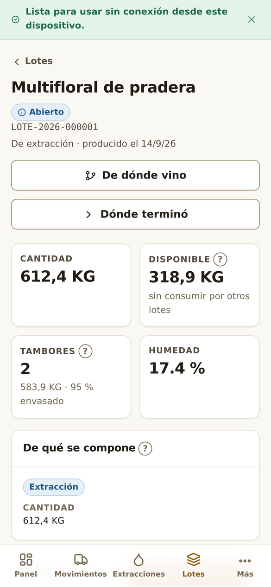 |

---

### 6.11 Tambores — `/drums`

**Propósito.** Unidad física asociada a un lote. Cambiar su ubicación deja rastro en el
historial de inventario, de modo que la trazabilidad no se pierde al moverlo.

| Columna | Contenido |
|---|---|
| Código · Estado · Neto · Ubicación · Llenado | |

**Acciones por registro.** *De dónde vino* (trazabilidad hacia atrás desde el tambor) y
*Trasladar*, disponible mientras el tambor no esté consumido.

Los tambores **se crean desde el detalle del lote**, no desde acá; el estado vacío lo explica y
**enlaza a Lotes**, en lugar de dejar al usuario sin acción.

| Listado | Listado móvil |
|---|---|
|  | 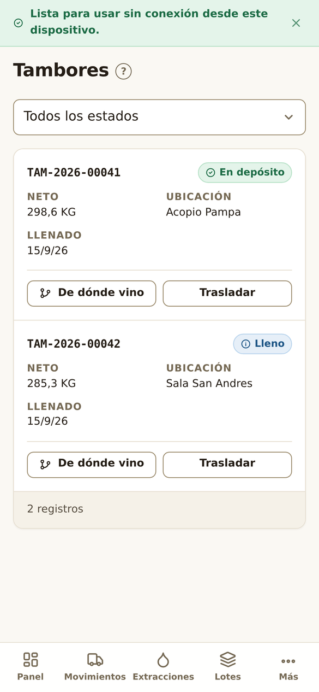 |

---

### 6.12 Trazabilidad — `/trace`

**Propósito.** Reconstruir la cadena. Es la pantalla que justifica el sistema entero.

**El sentido es una elección explícita**, con dos opciones grandes:

| Opción | Punto de partida posible |
|---|---|
| **De dónde vino** | Lote o tambor |
| **Dónde terminó** | Apiario, lote, productor, establecimiento o movimiento |

Al cambiar de sentido, si el punto de partida elegido no sirve para el nuevo, se limpia en lugar
de fallar con un pedido inválido.

**Resultado.** Cuatro cifras (nodos, productores, apiarios y estado de la cadena), la lista de
huecos, el grafo y dos tarjetas de resumen.

**Los huecos se explican.** Cada uno muestra el mensaje del backend y, debajo, qué significa en
lenguaje llano. El texto al pie es deliberado: *la trazabilidad real rara vez está completa; el
sistema prefiere decir qué falta antes que mostrar la cadena como si estuviera cerrada.*

**El grafo.** Columnas en el orden natural de la cadena, del productor al tambor. Se ajusta al
ancho disponible por defecto y tiene controles de acercamiento. Al tocar un nodo se abre su
detalle **con las etiquetas y los estados en español** (hallazgo H-04, resuelto).

| Pantalla inicial | Resultado con huecos |
|---|---|
|  |  |

| Detalle de nodo |
|---|
|  |

| Inicial (móvil) | Resultado (móvil) |
|---|---|
| 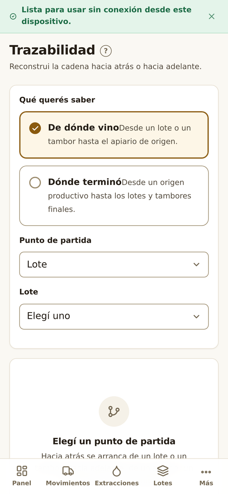 | 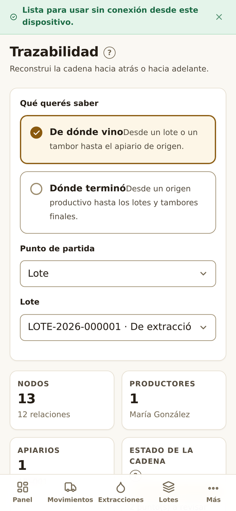 |

---

### 6.13 Reglas documentales — `/rules`

**Propósito.** Determinan qué traslados exigen DT-e u otro documento. Son datos con vigencia,
no código: un cambio normativo se carga, no se despliega. Pantalla de solo lectura, accesible a
`ADMIN` y `AUDITOR`.

| Columna | Contenido |
|---|---|
| Regla · Vigencia · Se aplica a · Exige · Desde/hasta · Prioridad | *Vigente hoy* se calcula en el cliente con la fecha actual |

La tarjeta al pie explica **qué regla gana**: entre las activas y vigentes a la fecha del
traslado cuyos criterios coincidan, gana la de menor número de prioridad —la más específica—;
ante empate, la de vigencia más reciente. El movimiento guarda cuál se le aplicó, así que la
decisión queda auditable aunque después se modifique la regla.


---

### 6.14 Auditoría — `/audit`

**Propósito.** Registro independiente de las tablas operativas: quién hizo qué, sobre qué
entidad y cuándo. Se escribe automáticamente y nunca hace fallar la operación de negocio.
Accesible a `ADMIN` y `AUDITOR`.

| Columna | Contenido |
|---|---|
| Acción · Entidad · Momento · Quién | Las acciones y los tipos de entidad se muestran traducidos |

Filtros por tipo de registro y por acción, con búsqueda retardada para no consultar en cada
tecla.


---

### 6.15 Pendientes de enviar — `/pending`

**Propósito.** Ver y gobernar la cola de operaciones registradas sin conexión.

| Cifra | Contenido |
|---|---|
| En espera | Se envían solas al recuperar la señal |
| Rechazadas | Necesitan revisión humana |
| Último envío | Momento de la última sincronización |

| Columna | Contenido |
|---|---|
| Operación · Estado · Registrada · Intentos | Las rechazadas muestran el motivo debajo del nombre |

**Acciones.** *Reintentar* (solo en las rechazadas y con conexión) y *Descartar*, que pide
confirmación explícita: es **la única acción irreversible de la aplicación**. El diálogo lo
dice con todas las letras.

Cuando no hay nada en cola, el botón *Enviar ahora* **no se muestra** en lugar de aparecer
apagado.

| Cola vacía | Cola con operaciones |
|---|---|
| 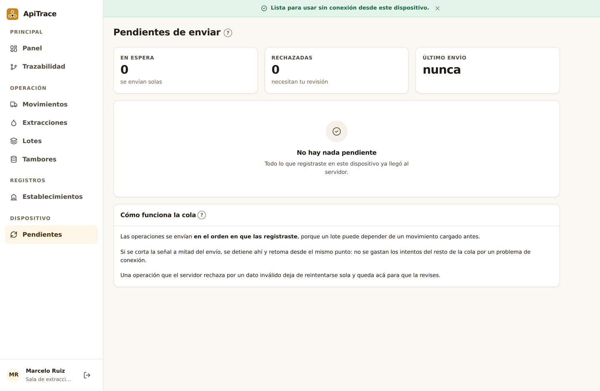 |  |

| Cola con operaciones (móvil) |
|---|
| 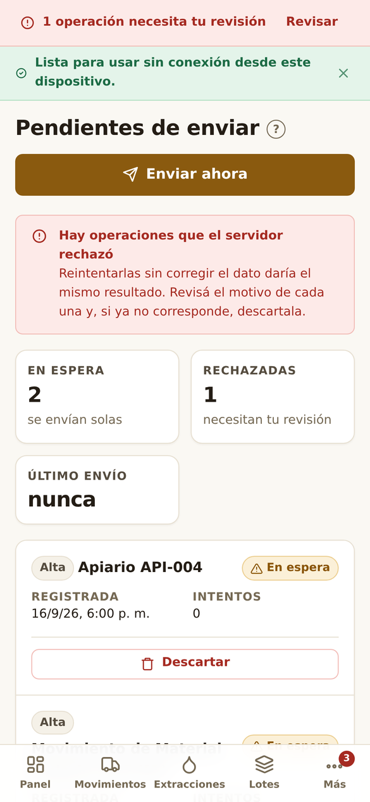 |

---

## 7. Modo offline y sincronización

El modo offline no es un accesorio: es el requisito que define la arquitectura del frontend,
porque el registro ocurre en el campo, donde no hay señal.

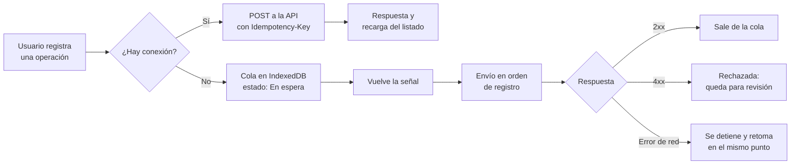
```mermaid
flowchart LR
    A["Usuario registra<br/>una operación"] --> B{"¿Hay conexión?"}
    B -->|Sí| C["POST a la API<br/>con Idempotency-Key"]
    B -->|No| D["Cola en IndexedDB<br/>estado: En espera"]
    C --> E["Respuesta y<br/>recarga del listado"]
    D --> F["Vuelve la señal"]
    F --> G["Envío en orden<br/>de registro"]
    G --> H{"Respuesta"}
    H -->|2xx| I["Sale de la cola"]
    H -->|4xx| J["Rechazada:<br/>queda para revisión"]
    H -->|Error de red| K["Se detiene y retoma<br/>en el mismo punto"]
```

| Capa | Responsabilidad |
|---|---|
| Service worker (Workbox) | Precachea el *app shell*; la app arranca sin red desde la primera visita. **No** cachea la API |
| IndexedDB (`idb`) | Guarda las respuestas de la API de forma estructurada y la cola de envío |
| `Idempotency-Key` | Generada en el dispositivo por operación; el backend la respeta para evitar duplicados |

> Esta capa **no se tocó en el rediseño**. `lib/db.ts`, `lib/sync.tsx`, `lib/outbox.ts` y
> `lib/auth.tsx` quedaron con cero diferencias, y las 15 pruebas automatizadas de la cola
> siguen pasando sin cambios.

### Cuatro estados, una sola franja

Antes el estado se comunicaba en tres lugares a la vez —barra, insignia del encabezado y
contador del menú— y aun así no quedaba claro qué pasaba con lo registrado. Ahora hay una sola
franja, y **solo el último caso interrumpe**, porque es el único que necesita a una persona:

| Estado | Señal | Texto |
|---|---|---|
| En línea, al día | Sin franja | — |
| Operaciones por enviar | Franja azul con acción | «3 operaciones por enviar» · *Enviar ahora* |
| Sincronizando | Franja azul con indicador | «Enviando lo que quedó pendiente…» |
| Sin conexión | Franja ámbar, con ayuda `?` | «Sin conexión. Podés seguir trabajando.» |
| Con rechazos | **Franja roja con acción** | «2 operaciones necesitan tu revisión» · *Revisar* |


**Al encolar una operación**, el aviso lo dice sin dramatismo y **enlaza a la cola**: «Guardado
en el dispositivo. El movimiento se enviará al recuperar la señal. → Ver pendientes».

---

## 8. Comportamiento en móvil y PWA

**Navegación.** Ya no hay cajón hamburguesa ni barra superior. La barra de pestañas al pie
mantiene los cuatro destinos del rol siempre al alcance del pulgar y responde
permanentemente «¿dónde estoy?».

| Elemento | En móvil |
|---|---|
| Navegación | Barra de pestañas fija al pie + hoja «Más» |
| Barra superior | **No existe**: el título lo da el encabezado de la pantalla. Devuelve 56 px de alto útil |
| Listados | **Tarjetas, no tablas.** Ninguna lista obliga a desplazarse en horizontal |
| Acciones por registro | Debajo de la tarjeta, repartidas a lo ancho |
| Hojas y diálogos | Suben desde abajo, con asa y desplazamiento interno |
| Formularios | Una sola columna; la acción principal ocupa el ancho completo |
| Campos numéricos | Abren teclado numérico; el tamaño de fuente evita el zoom automático de iOS |
| Área de seguridad | Respetada arriba y abajo, para uso instalado con notch |
| Geolocalización | *Usar mi ubicación actual* cobra sentido pleno estando en el apiario |

**Instalación.** El manifiesto declara nombre, tema, orientación vertical, íconos
192/512/512-maskable y tres accesos directos. El botón *Instalar* aparece sólo cuando el
navegador emite `beforeinstallprompt`; en iOS, donde ese evento no existe, la instrucción
manual vive detrás de un botón de ayuda para no ocupar espacio permanente.

**Avisos del service worker.** *Lista para usar sin conexión* y *Hay una versión nueva* se
muestran como franja en el flujo de la página, **no flotando sobre ella**: son estado del
sistema, no confirmación de algo que el usuario acaba de hacer, y aparecen sin que nadie los
pida. La actualización se ofrece en lugar de aplicarse sola, para no interrumpir una carga en
curso.

---

## 9. Flujo completo del circuito

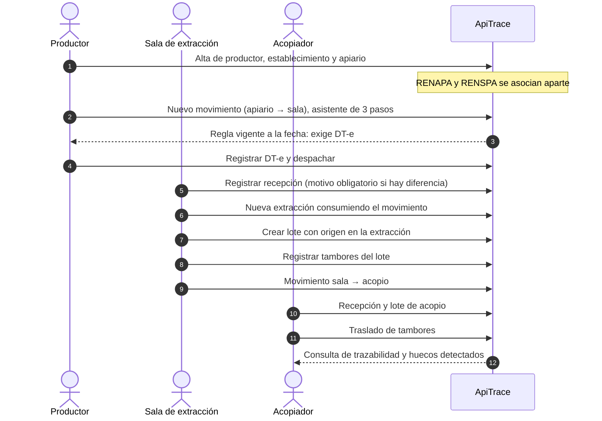
```mermaid
sequenceDiagram
    autonumber
    actor P as Productor
    actor S as Sala de extracción
    actor A as Acopiador
    participant AT as ApiTrace

    P->>AT: Alta de productor, establecimiento y apiario
    Note over AT: RENAPA y RENSPA se asocian aparte
    P->>AT: Nuevo movimiento (apiario → sala), asistente de 3 pasos
    AT-->>P: Regla vigente a la fecha: exige DT-e
    P->>AT: Registrar DT-e y despachar
    S->>AT: Registrar recepción (motivo obligatorio si hay diferencia)
    S->>AT: Nueva extracción consumiendo el movimiento
    S->>AT: Crear lote con origen en la extracción
    S->>AT: Registrar tambores del lote
    S->>AT: Movimiento sala → acopio
    A->>AT: Recepción y lote de acopio
    A->>AT: Traslado de tambores
    AT-->>A: Consulta de trazabilidad y huecos detectados
```

| # | Paso | Pantalla | Captura de referencia |
|---:|---|---|---|
| 1 | Alta de productor | `/producers` | `21-productores-alta` |
| 2 | Alta de establecimiento | `/establishments` | `31-establecimientos-alta` |
| 3 | Alta de apiario y colmenas | `/apiaries` | `41-apiarios-alta` |
| 4 | Nuevo movimiento | `/movements` | `51`, `52`, `53` |
| 5 | Registrar DT-e | `/movements/:id` | `57-movimiento-registrar-dte` |
| 6 | Despachar y recibir | `/movements/:id` | `54`, `55` |
| 7 | Nueva extracción | `/extractions` | `62-extraccion-paso-1` |
| 8 | Crear lote | `/lots` | `71-lote-alta-origen` |
| 9 | Registrar tambores | `/lots/:id` | `73-lote-registrar-tambor` |
| 10 | Trasladar tambor | `/drums` | `80-tambores-listado` |
| 11 | Consultar trazabilidad | `/trace` | `91`, `96` |
| 12 | Verificar auditoría | `/audit` | `101-auditoria-listado` |

---

## 10. Hallazgos y estado de resolución

### 10.1 Hallazgos de la versión 1.0

| ID | Severidad | Hallazgo | Estado |
|---|---|---|---|
| **H-01** | 🔴 Alta | El usuario `ADMIN` no tiene organización asignada y el backend responde 403 al crear productores o establecimientos | **Abierto** — es del backend. La interfaz ahora lo explica en lenguaje claro: «Tu usuario todavía no puede operar. No tiene una organización asignada» |
| **H-02** | 🔴 Alta | El alta de movimiento sólo ofrece establecimientos de la organización del usuario: el circuito inter-organización no se puede registrar | **Abierto** — requiere un endpoint de destinos válidos en el backend |
| **H-03** | 🟡 Media | El error del servidor filtra el nombre del campo de la API (`discrepancyNotes`) | **Resuelto** — los mensajes de validación se reparten por campo y se traducen; el motivo de diferencia además se valida en el cliente antes de enviar |
| **H-04** | 🟡 Media | El detalle de nodo del grafo muestra las claves en inglés | **Resuelto** — diccionario de atributos en `lib/vocabulary.ts`; los estados también se traducen |
| **H-05** | 🟡 Media | Los sellos de estado muestran el enum crudo | **Resuelto** — 40 estados traducidos, con icono además de color |
| **H-06** | 🟡 Media | La validación nativa del navegador aparece en inglés | **Resuelto** — validación propia en español, al salir del campo y al enviar |
| **H-07** | 🔴 Alta | La pantalla de acceso expone los usuarios y la contraseña de demostración | **Resuelto** — condicionado a `import.meta.env.DEV`; no existe en el build de producción |
| **H-08** | 🟡 Media | El rol LABORATORIO no tiene bandeja de trabajo propia | **Abierto** — requiere una pantalla `/samples` y endpoints de resultados |
| **H-09** | 🟢 Baja | El manifiesto declara el acceso directo `/movements/new`, que no existe | **Resuelto** — apunta a `/movements` |
| **H-10** | 🟡 Media | No hay edición ni corrección auditada de registros ya cargados | **Abierto** — requiere definir el caso de uso antes de implementarlo |
| **H-11** | 🟢 Baja | Los listados no exponen paginación | **Parcial** — pie con «Mostrando N de M» y *Ver más*. Con volumen real conviene paginación del lado del servidor |
| **H-12** | 🟢 Baja | En trazabilidad hay que pegar el UUID a mano para productor, establecimiento y movimiento | **Parcial** — sigue siendo un campo de texto, pero ahora explica dónde conseguir el identificador |
| **H-13** | 🟢 Baja | Los tambores no se pueden crear desde `/drums` | **Parcial** — el estado vacío ahora enlaza a Lotes |
| **H-14** | 🟢 Baja | Los códigos internos se muestran sin glosario | **Resuelto** — estados traducidos, huecos explicados y 28 textos de ayuda contextual |

### 10.2 Hallazgos nuevos, detectados al regenerar este catálogo

| ID | Severidad | Hallazgo | Estado |
|---|---|---|---|
| **H-15** | 🔴 Alta | **El proxy de desarrollo capturaba las rutas de la aplicación.** La clave era el prefijo `/api`, y Vite compara por prefijo: `/apiaries` también coincidía. Recargar esa ruta en `npm run dev` devolvía una respuesta vacía en lugar de la aplicación | **Resuelto** — la clave pasó a ser la expresión regular `^/api/`, que exige la barra |
| **H-16** | 🔴 Alta | **Un aviso flotante podía tapar el botón principal.** El aviso de *lista para usar sin conexión* se dibujaba sobre la hoja abierta y el botón *Continuar* del asistente quedaba intocable hasta que el aviso se cerraba solo. El usuario no tenía forma de entender por qué su toque no hacía nada | **Resuelto** — los avisos flotantes dejan pasar el toque salvo en sus propios controles, y los avisos del service worker pasaron al flujo de la página |
| **H-17** | 🟡 Media | La matriz de pantallas por rol de la versión 1.0 **contradecía al enrutador**: daba por habilitadas a SALA y ACOPIADOR pantallas que `RoleRoute` no permite | **Resuelto** — matriz verificada campo por campo contra `App.tsx` (sección 5) |

### 10.3 Mejoras sugeridas, más allá de los defectos

| Prioridad | Mejora | Motivo |
|---|---|---|
| Alta | **Lectura de QR / código de barras** en tambores y movimientos | En el depósito se identifica el tambor por precinto; tipearlo es la principal fuente de error |
| Alta | **Ficha pública de trazabilidad** por lote o tambor (enlace o QR sin sesión) | Es el argumento comercial ante el comprador o exportador |
| Media | **Adjuntar fotos** al movimiento, a la recepción y a la muestra | La prueba fotográfica del precinto o de la diferencia sostiene la constancia |
| Media | **Exportar** la consulta de trazabilidad a PDF | Un auditor pide un documento, no una pantalla |
| Media | **Panel de excepciones** ampliado: lotes sin entradas y DT-e sin sincronizar | El panel ya muestra traslados pendientes y rechazos; faltan los huecos de trazabilidad |
| Media | **Pruebas de componente** para el sistema de diseño | Hoy sólo la cola offline tiene pruebas automatizadas |

---

## 11. Dependencias técnicas y riesgos

### 11.1 Dependencias de la interfaz

| Componente | Versión | Rol | Riesgo asociado |
|---|---|---|---|
| React | 19.1 | Interfaz | Bajo |
| React Router | 7.5 | Enrutamiento | Bajo |
| Vite | 6.2 | Build y servidor de desarrollo | Bajo |
| `vite-plugin-pwa` / Workbox | 1.0 | Service worker y manifiesto | Medio: el precacheo del *app shell* es la base del modo offline |
| `idb` | 8.0 | IndexedDB | Bajo |

> **El sistema visual no agrega dependencias.** No hay framework de CSS ni biblioteca de
> componentes: la hoja de estilos, los 34 iconos y las primitivas son propios. Es una decisión
> deliberada para una PWA que debe pesar poco y arrancar sin red.

### 11.2 Dependencias de la API

La interfaz consume el contrato descrito en `03-ArquitecturaTecnica`. El rediseño **no cambió
ninguna ruta, verbo ni cuerpo de petición**. Los puntos sensibles siguen siendo:

| Dependencia | Efecto si cambia |
|---|---|
| `meta.total` en los listados | El pie «Mostrando N de M» y *Ver más* dejan de funcionar |
| `appliedRule` en el alta de movimiento | Se pierde el aviso de qué documento exige la regla |
| `message` como lista en los errores 400/422 | Los errores dejan de repartirse por campo y caen al aviso general |
| `summary` y `gaps` en la consulta de trazabilidad | Las cifras y la lista de huecos quedan vacías |

### 11.3 Integraciones externas pendientes

| Integración | Estado | Cómo lo comunica la interfaz |
|---|---|---|
| SIGSA (DT-e) | No integrada | El DT-e queda *Falta enviar a SIGSA* y aparece como hueco `DTE_PENDING_SYNC` en la trazabilidad |
| SENASA (RENAPA / RENSPA) | No integrada | Los registros quedan *Sin verificar* |
| SIFeGA (RNE) | No integrada | El RNE se carga a mano |

### 11.4 Riesgos

| Riesgo | Mitigación actual |
|---|---|
| El precacheo del *app shell* falla y la app no abre sin red | El aviso *lista para usar sin conexión* confirma que el precacheo terminó |
| La cola crece sin control en un dispositivo que nunca recupera señal | La pantalla de pendientes muestra el volumen y permite descartar |
| Un rechazo del servidor pasa inadvertido | Franja roja persistente en toda la aplicación hasta resolverlo |
| Volumen real de datos supera el «Ver más» | Pendiente: paginación del lado del servidor (H-11) |

---

## 12. Inventario de capturas

73 capturas: 36 de escritorio y 37 de móvil. Se generan con `frontend/capturas.mjs`.

| Número | Nombre | Escritorio | Móvil |
|---|---|:--:|:--:|
| 01 | `01-acceso-login` | ✔ | ✔ |
| 05 | `05-ayuda-contextual` | ✔ | ✔ |
| 07 | `07-menu-mas` | — | ✔ |
| 10 | `10-panel-sala` | ✔ | ✔ |
| 12 | `12-panel-productor` | ✔ | ✔ |
| 15 | `15-panel-auditor` | ✔ | ✔ |
| 20 | `20-productores-listado` | ✔ | ✔ |
| 21 | `21-productores-alta` | ✔ | ✔ |
| 24 | `24-productores-solo-lectura` | ✔ | ✔ |
| 30 | `30-establecimientos-listado` | ✔ | ✔ |
| 31 | `31-establecimientos-alta` | ✔ | ✔ |
| 40 | `40-apiarios-listado` | ✔ | ✔ |
| 41 | `41-apiarios-alta` | ✔ | ✔ |
| 50 | `50-movimientos-listado` | ✔ | ✔ |
| 51 | `51-movimiento-paso-1` | ✔ | ✔ |
| 52 | `52-movimiento-paso-2` | ✔ | ✔ |
| 53 | `53-movimiento-paso-3` | ✔ | ✔ |
| 54 | `54-movimiento-detalle` | ✔ | ✔ |
| 55 | `55-movimiento-detalle-borrador` | ✔ | ✔ |
| 57 | `57-movimiento-registrar-dte` | ✔ | ✔ |
| 59 | `59-movimiento-cancelar` | ✔ | ✔ |
| 61 | `61-extracciones-listado` | ✔ | ✔ |
| 62 | `62-extraccion-paso-1` | ✔ | ✔ |
| 70 | `70-lotes-listado` | ✔ | ✔ |
| 71 | `71-lote-alta-origen` | ✔ | ✔ |
| 72 | `72-lote-detalle` | ✔ | ✔ |
| 73 | `73-lote-registrar-tambor` | ✔ | ✔ |
| 80 | `80-tambores-listado` | ✔ | ✔ |
| 90 | `90-trazabilidad-inicial` | ✔ | ✔ |
| 91 | `91-trazabilidad-resultado` | ✔ | ✔ |
| 96 | `96-trazabilidad-detalle-nodo` | ✔ | ✔ |
| 100 | `100-reglas-documentales` | ✔ | ✔ |
| 101 | `101-auditoria-listado` | ✔ | ✔ |
| 103 | `103-auditoria-sin-permiso` | ✔ | ✔ |
| 110 | `110-pendientes-vacio` | ✔ | ✔ |
| 111 | `111-offline-barra` | ✔ | ✔ |
| 113 | `113-pendientes-con-operaciones` | ✔ | ✔ |

---

*Documento generado como parte de la documentación de ApiTrace. Las capturas corresponden al
build de producción vigente al 17 de septiembre de 2026.*
