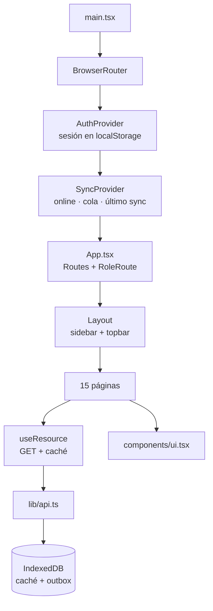
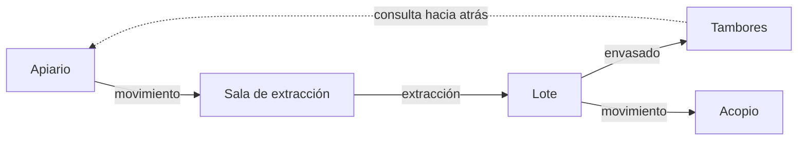
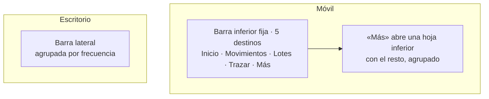
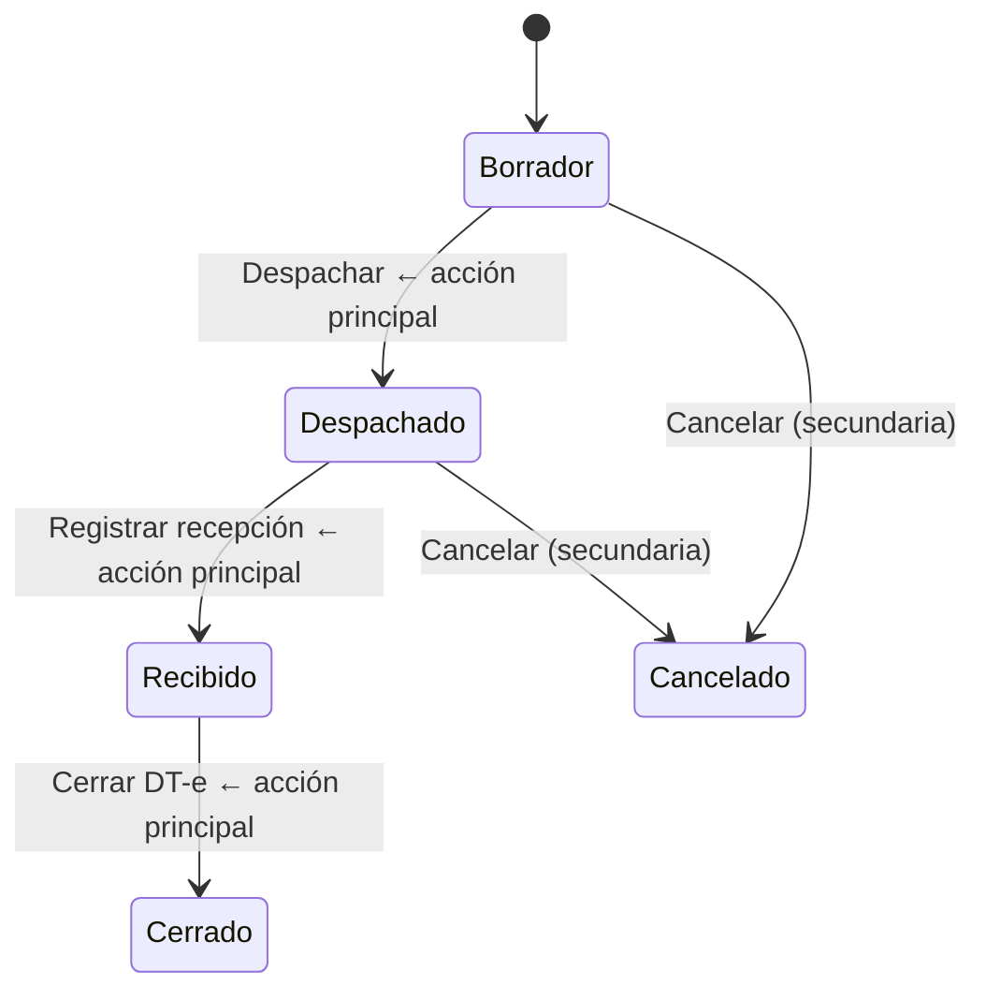

# 07 — Rediseño UX/UI — ApiTrace

> Diagnóstico de la experiencia actual, propuesta de rediseño y plan de implementación
> para la aplicación web instalable (PWA) de ApiTrace.

| | |
|---|---|
| **Estado** | Implementado y verificado |
| **Alcance** | `frontend/` (React 19 + Vite 6 + PWA). Sin cambios en el backend, la API ni el modelo de datos |
| **Documentos relacionados** | `03-ArquitecturaTecnica`, `04-MVP-ApiGestion`, `06-Guia-de-Pantallas-ApiGestion` |
| **Principio rector** | Simple por defecto, información adicional bajo demanda |

---

## 1. Resumen ejecutivo

La aplicación **no tiene un problema de estética, tiene un problema de densidad y de prioridad**. El sistema visual existente (tokens CSS, modo oscuro, componentes básicos) está bien construido; lo que falla es *qué* se muestra, *cuánto* se muestra a la vez y *en qué orden*.

Tres hallazgos concentran la mayor parte del daño:

1. **La aplicación no es mobile-first: es un escritorio reducido.** Las quince pantallas de listado usan `<table>` con scroll horizontal. En un teléfono, la tabla de movimientos mide ~700 px de ancho y obliga a desplazarse lateralmente para llegar a los botones de acción, que además miden 24 px de alto. Para una app de campo, esto es el problema número uno.
2. **La carga cognitiva está invertida.** Cada pantalla abre con un párrafo de definición de dominio que sirve la primera vez y estorba las siguientes cincuenta; mientras tanto, los estados del negocio se muestran en crudo (`PARTIALLY_RECEIVED`, `PENDING_VERIFICATION`) en una aplicación en español para apicultores.
3. **Hay fallos de contraste medibles, incluido el elemento que indica dónde está el usuario.** El ítem activo del menú tiene una relación de contraste de **2,74:1** sobre su fondo; el texto de los botones primarios, **3,03:1**. El mínimo AA para texto normal es 4,5:1.

La propuesta no reescribe la lógica de negocio: **ninguna llamada a la API, regla de dominio, máquina de estados ni comportamiento offline cambia**. Se reescribe la capa de presentación y se introduce un sistema de componentes que hoy no existe de forma consistente.

---

## 2. FASE 1 — Análisis del sistema actual

### 2.1 Arquitectura



| Capa | Archivo | Estado |
|---|---|---|
| Cliente HTTP | `lib/api.ts` | **Sólido.** Refresh de token único en vuelo, red primero con respaldo en caché, cola offline con clave de idempotencia por operación. No tocar. |
| Persistencia local | `lib/db.ts` | **Sólido.** Caché de respuestas + outbox + meta en IndexedDB. No tocar. |
| Sincronización | `lib/sync.tsx` | **Sólido.** Reintento cada 60 s porque el evento `online` del navegador es optimista. No tocar. |
| Lectura | `lib/useResource.ts` | Correcto. Distingue dato fresco / caché / ausencia. Le falta caché en memoria compartida. |
| Sistema visual | `styles.css` (572 líneas) | Tokens bien planteados, pero con fallos de contraste y sin escala de espaciado ni de tipografía. |
| Componentes | `components/ui.tsx` (284 líneas) | 11 primitivas. Faltan las que el producto realmente necesita. |
| Páginas | `pages/*.tsx` (15) | Patrón repetido 7 veces, copiado y pegado con variaciones. |

### 2.2 El patrón repetido

Siete páginas de listado son la misma estructura duplicada:

```
page-header (h1 + párrafo largo + botón primario)
  ↓
Notice de éxito  +  Notice de caché  +  Notice de error   ← apiladas
  ↓
toolbar (un filtro suelto)
  ↓
Card > table-wrap > table                                  ← scroll horizontal en móvil
  ↓
Modal > FormFields                                         ← hasta 12 campos seguidos
```

Cada copia introdujo variaciones. El mismo hecho —"estos datos vienen de la copia local"— se comunica con tres redacciones distintas:

| Página | Texto |
|---|---|
| Productores | «Datos locales guardados hace 5 min. Sin conexión al servidor.» |
| Establecimientos | «Datos locales guardados hace 5 min.» |
| Apiarios | «Datos locales guardados hace 5 min. Podés seguir consultando y registrando: lo nuevo se envía al recuperar señal.» |

Además conviven dos registros de tratamiento: **voseo** («Podés», «Registrá», «Elegí») y **usted** («Seleccione al menos un movimiento», «en su ámbito»), a veces en la misma pantalla.

---

## 3. FASE 2 — Mapa de flujos y problemas detectados

### 3.1 Los cinco flujos principales



| # | Flujo | Rol | Pasos hoy | Problema principal |
|---|---|---|---|---|
| F1 | Alta de estructura base (productor → establecimiento → apiario) | Productor | 3 altas en 3 pantallas distintas, sin guía de orden | Nada indica que hay una secuencia obligatoria. El error aparece recién al fallar el alta del apiario. |
| F2 | Traslado de melario con DT-e | Productor / Sala | Crear (12 campos) → registrar DT-e → despachar → recibir → cerrar DT-e | 5 acciones, todas presentadas con el mismo peso visual y a la vez |
| F3 | Extracción | Sala | Elegir sala → tildar movimientos en una tabla → 4 campos | Checkboxes de 13 px dentro de una tabla dentro de un modal |
| F4 | Lote y tambores | Sala / Acopio | Crear lote (11 campos + 2 selects de origen excluyentes) → registrar tambores | La elección de origen no se lee como una elección |
| F5 | Consulta de trazabilidad | Auditor / todos | 3 selects encadenados → grafo | El mejor flujo de la app. Se conserva casi tal cual. |

### 3.2 Problemas detectados

Cada problema lleva un identificador que se reutiliza en el plan de implementación.

#### A · Navegación y orientación

| ID | Problema | Impacto |
|---|---|---|
| **A1** | En móvil no hay navegación persistente: 14 destinos detrás de un botón hamburguesa, arriba a la izquierda (la esquina más lejana del pulgar) | Alto |
| **A2** | Las páginas de detalle (`/movements/:id`, `/lots/:id`) no tienen botón de volver ni migas. En móvil no hay forma visible de regresar a la lista | Alto |
| **A3** | «Pendientes» —lo que un usuario sin señal más necesita mirar— está al fondo del menú | Medio |
| **A4** | Los 14 ítems tienen idéntico peso visual; no se distingue lo diario de lo esporádico | Medio |
| **A5** | `RoleRoute` redirige en silencio al panel cuando el rol no alcanza: el usuario hace clic y «no pasa nada» | Medio |

#### B · Carga cognitiva y jerarquía

| ID | Problema | Impacto |
|---|---|---|
| **B1** | Definiciones de dominio largas y permanentes en el encabezado de cada página | Alto |
| **B2** | Hasta tres avisos apilados (éxito + caché + error) antes del primer dato | Alto |
| **B3** | El aviso de éxito no se cierra nunca: no tiene temporizador ni botón de cerrar | Medio |
| **B4** | El panel muestra recuentos («Movimientos: 12») en lugar de lo accionable: qué espera recepción, qué exige DT-e y no lo tiene, qué fue rechazado | Alto |
| **B5** | Estados en crudo: `PARTIALLY_RECEIVED`, `PENDING_VERIFICATION`, `DRAFT`. El historial imprime `MOVEMENT_DISPATCHED` | Alto |

#### C · Formularios

| ID | Problema | Impacto |
|---|---|---|
| **C1** | El alta de movimiento tiene **12 campos en un solo modal**, sin agrupar | Alto |
| **C2** | «Tipo de movimiento» y «Material» son selects casi idénticos: *Material melario* aparece en los dos | Alto |
| **C3** | Sin validación por campo. El error del servidor aparece arriba del formulario, lejos del campo que lo causó | Alto |
| **C4** | Errores técnicos crudos al usuario: `cause.message` sin traducir. El hallazgo H-01 de la guía de pantallas es literal: «403 · El usuario no tiene una organizacion asignada» | Alto |
| **C5** | 9 campos con 2 obligatorios, marcados sólo con un asterisco: parece que hay que llenar todo | Medio |
| **C6** | Sin `inputMode`: los campos de cantidad abren teclado alfanumérico en el teléfono | Medio |
| **C7** | Extracción: selección con checkboxes de 13 px en tabla con scroll horizontal | Alto |
| **C8** | Lote: los dos selects de origen se excluyen por código, pero se ven como campos independientes | Medio |
| **C9** | El aviso «un lote sin origen queda sin trazabilidad» está arriba, antes de que el usuario entienda a qué se refiere | Bajo |

#### D · Tablas y experiencia móvil

| ID | Problema | Impacto |
|---|---|---|
| **D1** | **Las 7 listas son `<table>` con scroll horizontal.** `th { white-space: nowrap }` fuerza anchos grandes | Crítico |
| **D2** | Las acciones por fila están en la última columna —la más lejana en el scroll— y miden ~24 px de alto (mínimo recomendado: 44 px) | Alto |
| **D3** | No hay paginación: se piden 50 o 100 registros y se muestran todos. `meta.total` se ignora | Medio |
| **D4** | Sin *skeletons*: al cambiar un filtro la pantalla parece congelada | Medio |
| **D5** | Sólo el código de cada fila es enlace (~60×20 px); la fila entera no es tocable | Medio |

#### E · Botones y acciones

| ID | Problema | Impacto |
|---|---|---|
| **E1** | El detalle de movimiento muestra hasta 5 botones, 4 de ellos primarios. La máquina de estados define **una** acción siguiente, pero la interfaz no lo refleja | Alto |
| **E2** | Botón primario de ~32 px de alto; variante `.small`, ~24 px | Alto |
| **E3** | En móvil el botón «Nuevo…» queda debajo del título y del párrafo largo, a veces fuera de la primera pantalla | Medio |
| **E4** | `window.confirm()` para descartar una operación pendiente: diálogo nativo sin estilo, para la única acción irreversible de la app | Alto |

#### F · Experiencia offline

| ID | Problema | Impacto |
|---|---|---|
| **F1** | El estado se comunica en tres lugares a la vez (barra, insignia del topbar, contador del menú) y aun así no hay un estado único y claro | Alto |
| **F2** | Cuatro situaciones reales —en línea, sin conexión, sincronizando, con rechazos— con dos colores y sin jerarquía. «Rechazada» (requiere acción humana) compite con «sin conexión» (no requiere nada) | Alto |
| **F3** | Tres redacciones distintas para el mismo aviso de datos locales | Medio |
| **F4** | Al encolar una operación, el mensaje no enlaza a dónde verla después | Medio |

#### G · Estados de carga, vacío y error

| ID | Problema | Impacto |
|---|---|---|
| **G1** | Sin *skeletons* en ninguna pantalla | Medio |
| **G2** | Estados vacíos inconsistentes: algunos ofrecen acción, otros describen qué hacer sin llevar ahí | Medio |
| **G3** | Los botones no cambian de texto al enviar («Guardar» no pasa a «Guardando…») | Bajo |
| **G4** | El detalle de movimiento en carga devuelve un spinner suelto sin estructura: la página salta | Bajo |

#### H · Accesibilidad

| ID | Problema | Medición |
|---|---|---|
| **H1** | Contraste del **ítem activo del menú** (`--accent` sobre `--accent-soft`) | **2,74:1** — requerido 4,5:1 |
| **H2** | Contraste del **texto de los botones primarios** (blanco sobre `#c8871b`) | **3,03:1** — requerido 4,5:1 |
| **H3** | Contraste de `--text-faint` (`#948872` sobre blanco), usado en marcas de tiempo y pistas | **3,49:1** — requerido 4,5:1 |
| **H4** | Contraste de la insignia de advertencia | **3,62:1** — requerido 4,5:1 |
| **H5** | El modal no atrapa el foco, no lo devuelve al cerrarse ni enfoca el primer campo | — |
| **H6** | Áreas táctiles por debajo del mínimo: botones `.small` ~24 px, checkboxes ~13 px | requerido ≥44 px |
| **H7** | El código en monoespaciada es el `<h1>`; el nombre legible queda en gris pequeño | — |

> Las relaciones de contraste se calcularon sobre los tokens reales del archivo `styles.css` con la fórmula WCAG 2.1.

#### I · Consistencia

| ID | Problema | Impacto |
|---|---|---|
| **I1** | Estilos incrustados salteando el sistema visual: `LoginPage` tiene ~40 líneas de `style={{…}}` y simula el *hover* con `onMouseEnter`/`onMouseLeave` | Medio |
| **I2** | El mismo dato se etiqueta distinto según la pantalla: «Cantidad» / «Neto» / «Peso neto (kg)»; «Programado» / «Fecha del traslado» / «Fecha y hora de salida» | Medio |
| **I3** | **El bloque «Acceso rápido (Modo Dev)» con seis usuarios y la contraseña real está en la pantalla de inicio de sesión**, visible en producción | Alto |

#### J · Deuda técnica con efecto en la experiencia

| ID | Problema |
|---|---|
| **J1** | Sin caché en memoria compartida: los selects de apoyo (`/establishments?pageSize=100`) se vuelven a pedir en cada pantalla, con parpadeo |
| **J2** | Sin división de código: un solo paquete para 15 páginas, en conexiones rurales |
| **J3** | Sin `ErrorBoundary`: un error de render deja la pantalla en blanco |

---

## 4. FASE 3 — Propuesta de rediseño

### 4.1 Sistema visual

Se conserva la identidad **ámbar sobre neutros cálidos** —es apropiada para el dominio y distingue al producto—, pero se recalibra para que cumpla contraste y gane orden.

#### Color

La paleta pasa de valores sueltos a **rampas** con roles definidos:

| Rol | Token | Claro | Uso |
|---|---|---|---|
| Marca | `--brand-500` | `#c8871b` | Logotipo, acentos decorativos, gráficos |
| Acción primaria | `--brand-700` | `#8a5a0f` | Relleno de botones primarios — **5,92:1** con texto blanco |
| Acción primaria (hover) | `--brand-800` | `#6f480c` | |
| Superficie de marca | `--brand-50` | `#fdf6e7` | Fondo del ítem activo de navegación |
| Texto sobre marca | `--brand-900` | `#4a3007` | Texto del ítem activo — **9,1:1** sobre `--brand-50` |
| Éxito / Aviso / Error / Info | `--success-*`, `--warning-*`, `--danger-*`, `--info-*` | | Cada uno con `-fg` (texto, ≥4,5:1), `-bg` (relleno suave) y `-border` |
| Texto | `--text-1` / `--text-2` / `--text-3` | `#241d15` / `#5c5245` / `#7a6a52` | 16,7:1 / 7,4:1 / **5,2:1** — los tres cumplen AA |

**Regla:** ningún par texto/fondo por debajo de 4,5:1; ningún borde o icono informativo por debajo de 3:1. El color nunca es el único portador de significado: cada estado lleva además icono y texto.

#### Escala de espaciado y tipografía

Base de 4 px (`--sp-1` … `--sp-12`) y escala tipográfica de seis pasos con `clamp()` para que el cuerpo crezca ligeramente en pantallas grandes. Hoy los valores están escritos a mano en `rem` con tres decimales (`0.46rem`, `0.85rem`, `1.05rem`), lo que hace imposible mantener un ritmo vertical.

#### Área táctil

Token `--tap: 44px` como altura mínima de todo control interactivo. Los controles «pequeños» conservan el aspecto compacto pero extienden su área activa con pseudo-elemento.

### 4.2 Navegación



- **Móvil: barra inferior fija** con los 5 destinos más usados según el rol. Es el cambio de navegación más importante: pone lo frecuente al alcance del pulgar y responde permanentemente «¿dónde estoy?» (A1, A4).
- **Botón de volver y migas** en toda página de detalle (A2).
- **Estado de datos** con lugar propio y fijo, no disperso en tres sitios (F1).
- **Acceso denegado**: pantalla que explica qué rol hace falta, en lugar de una redirección muda (A5).

### 4.3 Catálogo de componentes

Componentes nuevos o reescritos, todos en `components/`:

| Componente | Reemplaza | Resuelve |
|---|---|---|
| `Button` | clases sueltas | Variantes (primaria / secundaria / fantasma / peligro), tamaños con área ≥44 px, estado de carga **con cambio de texto** | E2, G3 |
| `DataList` | `<table>` en 7 páginas | **Tabla en escritorio, tarjetas en móvil**, con una sola definición de columnas. Fila entera tocable | D1, D2, D5 |
| `Sheet` | `Modal` | Hoja inferior en móvil, diálogo centrado en escritorio. Atrapa el foco, lo devuelve al cerrar, enfoca el primer campo | H5 |
| `ConfirmDialog` | `window.confirm()` | Confirmación con estilo, consecuencia explícita y verbo en el botón | E4 |
| `HelpTip` | — | **Botón `?`** que abre una explicación breve bajo demanda | B1 |
| `PageHeader` | bloque repetido | Título, acción principal, botón de volver y `HelpTip` en lugar del párrafo permanente | B1, E3, A2 |
| `Field` | `Field` | Añade error por campo, `inputMode`, `autoComplete`, y distinción visible obligatorio/opcional | C3, C5, C6 |
| `Wizard` + `Steps` | — | Indicador «paso 2 de 3», validación por etapa, retroceso sin pérdida de datos | C1, C7 |
| `Skeleton` | — | Silueta de carga con la forma del contenido real | D4, G1 |
| `EmptyState` | `Empty` | Estado vacío con una única acción clara | G2 |
| `StatusPill` | `StatusBadge` | Estado traducido, con icono y color | B5 |
| `SyncBadge` | 3 indicadores sueltos | Un solo indicador con cuatro estados | F1, F2 |
| `Toast` | `flash` | Aviso de éxito con cierre automático | B3 |
| `ErrorBoundary` | — | Evita la pantalla en blanco | J3 |

### 4.4 Vocabulario: el diccionario de estados y mensajes

Dos módulos nuevos concentran todo el lenguaje del sistema, hoy disperso:

**`lib/vocabulary.ts`** — traduce cada enum del dominio a español, con tono y descripción:

```ts
DRAFT              → «Borrador»          · neutro  · "Creado, todavía no despachado"
DISPATCHED         → «Despachado»        · info    · "Salió del origen, en camino"
PARTIALLY_RECEIVED → «Recibido parcial»  · aviso   · "Llegó menos de lo declarado"
PENDING_SYNC       → «Falta enviar a SIGSA»
```

**`lib/errors.ts`** — convierte cualquier fallo en un mensaje accionable:

| Situación | Antes | Después |
|---|---|---|
| 500 | «Internal Server Error» | «No pudimos guardar. Probá de nuevo en un momento.» |
| 403 sin organización | «403 · El usuario no tiene una organizacion asignada; no puede operar sobre el dominio» | «Tu usuario no tiene una organización asignada. Pedile a un administrador que te asigne una.» |
| Sin red | «Sin conexion con el servidor.» | «Sin conexión. Lo guardamos acá y lo enviamos cuando vuelva la señal.» |

Se unifica además el tratamiento en **voseo** (registro rioplatense, coherente con el público) y se acortan los textos según la regla del pedido: *«Completá este campo para continuar»*, no *«Debe ingresar correctamente la información…»*.

### 4.5 Formularios: dónde sí conviene un asistente por pasos

Se aplica el criterio de usar pasos **sólo cuando reducen complejidad real**:

| Formulario | Campos | Decisión |
|---|---|---|
| **Movimiento** | 12 | **Asistente de 3 pasos**: ① Qué se mueve → ② De dónde, a dónde y cuándo → ③ Revisar y confirmar. Además, «Material» se deriva del «Tipo de movimiento» y sólo se muestra si el usuario quiere cambiarlo (C2) |
| **Extracción** | 4 + selección múltiple | **Asistente de 2 pasos**: ① Elegir sala y movimientos (lista de tarjetas seleccionables, no checkboxes en tabla) → ② Datos del proceso, con el total a procesar siempre visible |
| **Lote** | 11 + origen | **Un paso, con el origen como elección explícita** (dos opciones grandes: «Viene de una extracción» / «Viene de otro lote») y los campos de calidad plegados en «Datos de calidad (opcional)» |
| Productor, Establecimiento, Apiario, Tambor, Muestra, DT-e, Despacho, Recepción | 2 – 9 | **Un paso**, con secciones y campos opcionales plegados |

En el detalle de movimiento se aplica **una sola acción principal por estado**, derivada de la máquina de estados que ya existe en el backend; el resto pasa a un menú secundario (E1):



### 4.6 Panel accionable

El panel deja de ser un tablero de recuentos y pasa a responder **«¿qué tengo que hacer hoy?»**, con tarjetas que sólo aparecen si hay algo que atender:

- Movimientos esperando recepción
- Movimientos que exigen DT-e y no lo tienen
- Operaciones rechazadas por el servidor
- Lotes sin origen declarado (huecos de trazabilidad)

Debajo, el acceso rápido a las dos o tres acciones del rol y, sólo entonces, los recuentos.

### 4.7 Estados offline

Cuatro estados, un solo lugar, con jerarquía:

| Estado | Señal | Texto |
|---|---|---|
| En línea, al día | Punto verde, discreto | «Al día» |
| Sin conexión | Barra ámbar persistente | «Sin conexión. Podés seguir trabajando.» |
| Sincronizando | Barra azul con progreso | «Enviando 3 operaciones…» |
| Con rechazos | **Barra roja con acción** | «2 operaciones necesitan tu revisión → Revisar» |

Sólo el último interrumpe, porque es el único que requiere una persona.

---

## 5. FASE 4 — Plan de implementación

| Orden | Trabajo | Archivos | Riesgo |
|---|---|---|---|
| 1 | Sistema visual: tokens, escalas, contraste | `styles.css` | Bajo |
| 2 | Vocabulario y errores | `lib/vocabulary.ts`, `lib/errors.ts` (nuevos) | Nulo |
| 3 | Componentes base | `components/ui.tsx` → varios archivos | Bajo |
| 4 | Navegación e infraestructura | `Layout.tsx`, `App.tsx`, `RoleRoute.tsx` | Medio |
| 5 | Listados con `DataList` | 7 páginas | Medio |
| 6 | Formularios y asistentes | 5 páginas | Medio |
| 7 | Panel accionable y detalle de movimiento | 2 páginas | Medio |
| 8 | Verificación: `tsc`, build, pruebas existentes | — | — |

### Invariantes — qué no se toca

1. Ninguna ruta, verbo ni cuerpo de petición a la API.
2. Ninguna regla de negocio ni máquina de estados.
3. `lib/api.ts`, `lib/db.ts`, `lib/sync.tsx`, `lib/outbox.ts`: sin cambios de comportamiento.
4. Las claves de idempotencia y el orden de la cola offline.
5. Los permisos por rol: se mantienen los mismos, sólo cambia cómo se comunica el rechazo.

### Riesgos

| Riesgo | Mitigación |
|---|---|
| Cambiar la navegación desorienta a quien ya usa la app | La barra inferior conserva las mismas rutas; no se renombra ningún destino |
| El asistente de movimiento oculta campos que algún usuario llenaba siempre | Ningún campo desaparece: se reparten en pasos, y el paso 3 muestra todo antes de confirmar |
| La vista de tarjetas en móvil muestra menos columnas | Cada tarjeta expone los 4 datos que hoy se consultan primero; el resto está en el detalle |
| Retirar el acceso rápido de demostración rompe el flujo de pruebas | Queda disponible sólo en desarrollo (`import.meta.env.DEV`) |

---

## 6. FASE 5 — Criterios de revisión

La implementación se revisa contra estas preguntas, desde la mirada de alguien que nunca usó el sistema:

- [ ] ¿Sé dónde estoy sin leer la URL?
- [ ] ¿Sé cuál es la acción siguiente sin pensarlo?
- [ ] ¿Entiendo cada campo, o tengo cómo averiguarlo sin salir de la pantalla?
- [ ] ¿Puedo completar una alta con una sola mano, en un teléfono?
- [ ] ¿Ningún mensaje de error menciona un código HTTP?
- [ ] ¿Entiendo qué pasa con mis datos cuando no hay señal?
- [ ] ¿Todo control interactivo mide al menos 44 px?
- [ ] ¿Todo par texto/fondo supera 4,5:1?
- [ ] ¿Ninguna lista obliga a desplazarse en horizontal en un teléfono?
- [ ] ¿`tsc` y el build pasan sin error?

---

## 7. Resultado de la implementación

### 7.1 Qué se construyó

**Archivos nuevos (9)**

| Archivo | Qué resuelve |
|---|---|
| `lib/vocabulary.ts` | Diccionario único: estados, tipos, roles, eventos y huecos traducidos, más los 28 textos de ayuda contextual |
| `lib/errors.ts` | Traducción de fallos a lenguaje humano, con reparto de errores por campo |
| `lib/nav.ts` | Definición única de navegación, compartida por la barra lateral y la de pestañas |
| `lib/useDebounced.ts` | Buscadores que no consultan en cada tecla |
| `components/Icon.tsx` | 34 iconos en una sola familia visual |
| `components/DataList.tsx` | Tabla en escritorio, tarjetas en teléfono |
| `components/Form.tsx` | Campos, validación, secciones plegables, opciones grandes y asistente por pasos |
| `components/ErrorBoundary.tsx` | Evita la pantalla en blanco |
| `components/ResourceNotices.tsx` | Un solo aviso de copia local y de error, para las 15 pantallas |

**Archivos reescritos (28)** — hoja de estilos, cáscara de la aplicación, 6 componentes y las 15 pantallas.

**Sin tocar** — `lib/db.ts`, `lib/sync.tsx`, `lib/outbox.ts`, `lib/auth.tsx`, `lib/format.ts`, `lib/config.ts`, `lib/types.ts`: cero diferencias. `lib/api.ts` cambia una sola cadena (una tilde en un mensaje interno). La cola offline, las claves de idempotencia y el contrato con el backend quedaron intactos.

### 7.2 Problemas resueltos

| ID | Cómo se resolvió |
|---|---|
| A1, A4 | Barra de pestañas fija con los 4 destinos que cada rol usa a diario; el resto en una hoja «Más» |
| A2 | Botón de volver y contexto en las dos pantallas de detalle |
| A3 | El estado de la cola está en la barra de estado y con contador en «Más» |
| A5 | Pantalla que explica qué rol hace falta, en lugar de redirigir en silencio |
| B1 | 28 textos movidos a botones `?`; los encabezados perdieron los párrafos permanentes |
| B2, B3, F3 | Un solo componente de avisos + avisos flotantes con cierre automático |
| B4 | Panel con tarjetas de tarea: qué espera recepción, qué está sin despachar, qué fue rechazado |
| B5 | Los 40 estados del dominio traducidos, con icono además de color |
| C1 | Alta de movimiento en 3 pasos, con resumen antes de confirmar |
| C2 | El material se deduce del tipo de traslado y queda plegado para ajustarlo |
| C3, C4 | Validación al salir del campo, errores del servidor repartidos por campo, ningún mensaje con código HTTP |
| C5 | Campos obligatorios marcados; los opcionales agrupados en bloques plegados |
| C6 | `inputMode` en todos los campos numéricos; `font-size: 16px` para que iOS no haga zoom |
| C7 | Selección de movimientos como opciones grandes, no casillas en una tabla |
| C8, C9 | El origen del lote es una elección explícita entre tres alternativas |
| **D1, D2, D5** | `DataList`: **ninguna lista obliga a desplazarse en horizontal en un teléfono** |
| D3 | Pie con «Mostrando N de M» y «Ver más» |
| D4, G1 | Siluetas de carga con la forma del contenido |
| E1 | Una acción principal por estado, derivada de la máquina de estados; el resto, secundarias |
| E2, H6 | `--tap: 44px` como mínimo; los controles compactos extienden su área activa |
| E3 | La acción principal ocupa el ancho completo en teléfono |
| E4 | `ConfirmDialog` propio en lugar de `window.confirm()` |
| F1, F2 | Una sola barra de estado con cuatro situaciones; solo los rechazos interrumpen |
| F4 | El aviso de operación encolada enlaza a la cola |
| G2 | Estados vacíos con una acción clara y textos distintos para «sin datos» y «sin resultados» |
| G3 | «Guardar» pasa a «Guardando…» |
| H1–H4 | Paleta recalibrada: **todos los pares texto/fondo superan 4,5:1** en claro y oscuro |
| H5 | El foco entra en la hoja, queda atrapado y vuelve al control que la abrió |
| H7 | El nombre legible es el título; el código va debajo |
| I1 | Estilos en línea reemplazados por clases del sistema |
| I3 | **El acceso rápido con usuarios y contraseña ya no existe en producción** (`import.meta.env.DEV`) |
| J2 | Cada pantalla viaja en su propio paquete: entre 2 y 11 kB |
| J3 | `ErrorBoundary` en la raíz |

### 7.3 Decisiones tomadas durante la implementación

Tres cosas se resolvieron distinto de lo planeado, al ver el resultado real:

1. **Se eliminó la barra superior.** En el teléfono repetía el título que ya daba el encabezado de la pantalla; en escritorio quedaba vacía. Quitarla devuelve 56 px de alto en cada pantalla móvil. La invitación a instalar pasó a la barra lateral y a la hoja «Más».
2. **El botón «Entrar» ya no se deshabilita con los campos vacíos.** Un control apagado no explica qué falta. Ahora valida al enviar y el mensaje aparece junto al campo. Se agregó además un botón para ver la contraseña: escribir a ciegas en el campo es la causa más común de un intento fallido.
3. **Se hizo una corrección ortográfica completa.** El código escrito durante la implementación había perdido las tildes en los textos visibles. Se corrigieron unas 200 apariciones en los 37 archivos, manteniendo el voseo rioplatense de forma consistente. Los comentarios del código conservan el estilo sin tildes que ya tenía el proyecto.

### 7.4 Verificación

| Comprobación | Resultado |
|---|---|
| `tsc --noEmit` | Sin errores |
| `vitest run` | **15 de 15 pruebas** de la cola offline pasan |
| `vite build` | Correcto — 447 KiB precacheados, 15 paquetes de página |
| Contraste WCAG | Todos los pares verificados con la fórmula 2.1, en claro y oscuro |
| Revisión visual | Capturas reales a 390 px y 1360 px, en tema claro y oscuro |

### 7.5 Lo que queda pendiente

- **Traducción de los estados que devuelve el backend en los mensajes de error de validación**: se cubren los casos frecuentes de `class-validator`; un mensaje nuevo cae en un texto genérico correcto pero poco específico.
- **Paginación real**: el pie ofrece «Ver más» aumentando el tamaño de página. Con miles de registros convendría paginación del lado del servidor.
- **Hallazgo H-01** de la guía de pantallas (el rol `ADMIN` sin organización no puede dar de alta registros base) sigue abierto: es un problema del backend, no de la interfaz. La interfaz ahora lo explica en lenguaje claro en lugar de mostrar el error 403 crudo.

---

*Documento generado como parte del rediseño UX/UI de ApiTrace. Las mediciones de contraste corresponden a los tokens del archivo `frontend/src/styles.css`.*
