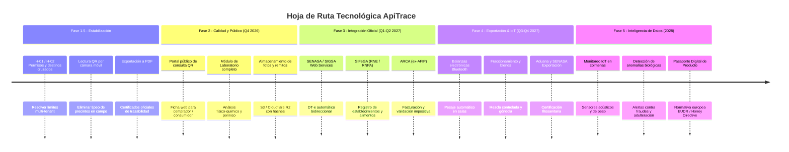
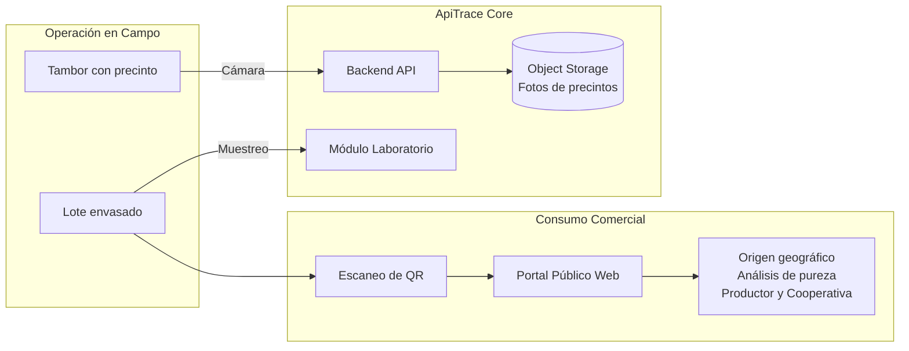
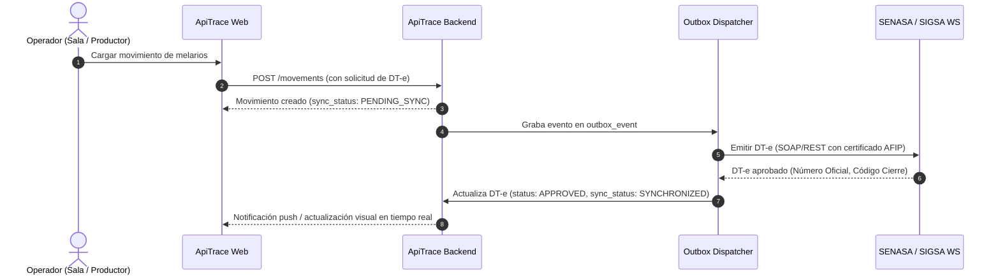

# 08 — Iteraciones Futuras y Roadmap Tecnológico — ApiTrace

> Plan maestro de evolución funcional, integración regulatoria y maduración técnica
> de la plataforma ApiTrace tras la validación del MVP y su rediseño UX/UI.

| Campo | Valor |
|---|---|
| **Documento** | 08 — Iteraciones Futuras y Roadmap Tecnológico |
| **Versión** | 1.0 |
| **Fecha** | 17 de septiembre de 2026 |
| **Estado** | Vigente y priorizado para planificación técnica y de producto |
| **Punto de partida** | MVP operativo (Backend NestJS + Frontend React 19 PWA offline) verificado sobre Neon PostgreSQL |
| **Documentos precedentes** | `00-Documento_de_Vision`, `01-Mapa_del_Dominio`, `02-Casos_de_Uso`, `03-ArquitecturaTecnica`, `04-MVP-ApiTrace`, `05-ADR-Decisiones-Tecnicas`, `06-Guia-de-Pantallas-ApiTrace`, `07-Rediseno-UX-UI-ApiTrace` |

---

## 1. Contexto y Balance del MVP

El MVP de ApiTrace demostró con éxito la viabilidad técnica y operativa de la trazabilidad apícola:
1. **La columna vertebral del negocio está modelada y probada**: El ciclo completo Productor → Apiario → Movimiento con DT-e obligatorio → Recepción con discrepancia → Extracción → Lote → Tambores → Lote de acopio se ejecuta de forma determinista y auditable.
2. **Resiliencia operativa garantizada**: La aplicación web instalable (PWA) permite operar en zonas rurales sin conectividad mediante IndexedDB, claves de idempotencia UUID v4 y sincronización optimista en segundo plano.
3. **Usabilidad de campo**: El rediseño UX/UI (Documentos 06 y 07) resolvió la ergonomía táctil en teléfonos móviles con el componente `DataList`, barras de navegación contextuales por rol y unificación del vocabulario del dominio en español claro.

Con el núcleo funcionando y verificado, este documento establece **cómo transformar este MVP en una plataforma comercial y regulatoria de escala nacional e internacional**.

---

## 2. Mapa Estratégico de Evolución (Horizontes Temporales)

---

## 3. Fase 1.5 — Estabilización Inmediata y Cerrado de Cabos Sueltos

Antes de abrir integraciones con organismos gubernamentales, es indispensable resolver los hallazgos operativos identificados durante el rediseño y las pruebas de usuario (Documento 06, sección 10):

### 3.1 Resoluciones de Arquitectura Multi-Tenant

- **H-02: Destinos entre organizaciones distintas en movimientos**
  - *Problema actual*: Un productor perteneciente a la Organización A solo ve sus propios establecimientos en el selector de destino. No puede enviar miel a una sala de extracción operada por la Organización B.
  - *Solución*: Implementar el endpoint `GET /establishments/receivers` que liste todas las salas de extracción y acopios habilitados en la plataforma, filtrando únicamente establecimientos activos con RNE/RENSPA vigente.
- **H-01: Auto-asignación contextual del usuario Administrador**
  - *Problema actual*: El usuario con rol `ADMIN` de plataforma no posee `organizationId`, lo que provocaba rechazos en endpoints que asumen un tenant activo.
  - *Solución*: Permitir que el administrador seleccione una «organización activa» mediante un selector en la barra superior (*Tenant Switcher*), o que opere con permisos de bypass en la capa de servicio.

### 3.2 Usabilidad de Campo Inmediata

- **Lectura de códigos QR / Barra mediante cámara en la PWA**:
  - Implementar escáner de cámara nativa usando la API estándar del navegador (`BarcodeDetector` o biblioteca ligera sin dependencias de red como `html5-qrcode`).
  - *Casos de uso clave*:
    1. Escaneo del código de tambor o precinto SENASA en el depósito de la sala o acopio.
    2. Escaneo del número de DT-e desde el formulario impreso o PDF.
  - Elimina el ingreso manual de cadenas alfanuméricas de 14 dígitos en condiciones de baja iluminación o con guantes de trabajo.
- **Exportación de certificados de trazabilidad a PDF**:
  - Incorporar generación de documento PDF estructurado tanto del lado del cliente como del servidor.
  - *Contenido*: Resumen del lote, diagrama del árbol genealógico de la miel, lista de apiarios y productores intervinientes, kilogramos consolidados, estado del DT-e y hash criptográfico verificador.

---

## 4. Fase 2 — Portal Público, Laboratorio y Evidencia Digital

Esta fase convierte a ApiTrace en una herramienta comercial para productores y exportadores, agregando valor directo frente a compradores y auditores.

### 4.1 Portal Público de Trazabilidad por QR (CU-20)

- **Propósito**: Cualquier persona (auditor internacional, comprador en destino, consumidor final) escanea el QR impreso en un tambor o en un frasco y accede a una vista pública, estilizada y optimizada para SEO, **sin necesidad de iniciar sesión**.
- **Componentes**:
  - Identificadores cortos y amigables (ej: `https://apitrace.ar/t/TAM-2026-000001` o `https://apitrace.ar/l/LOTE-2026-000001`).
  - Ficha pública con:
    - Nombre del productor o cooperativa y provincia/localidad de origen.
    - Mapa esquemático del origen botánico y geográfico.
    - Resultados de los análisis de laboratorio (pureza, humedad, botánica).
    - Sellos de certificación (Orgánico, Comercio Justo, Indicación Geográfica).
  - *Restricciones de seguridad*: Ocultamiento de datos fiscales privados (CUIT, teléfonos personales, datos comerciales de facturación).

### 4.2 Módulo de Laboratorio y Control de Calidad (CU-21, CU-22, CU-23)

- **Propósito**: Vincular formalmente la calidad físico-química y biológica con el lote o tambor, permitiendo bloquear automáticamente partidas no conformes.
- **Entidades a extender**:
  - Tabla `sample` (ya creada en el MVP) vinculada a `lab_analysis`:
    - *Parámetros físico-químicos*: Humedad (%), HMF (hidroximetilfurfural, mg/kg), Color (escala Pfund), Acidez libre, Actividad diastásica.
    - *Análisis de pureza y adulteración*: C3/C4 (azúcares agregados), conductividad eléctrica.
    - *Residuos*: Límites máximos de residuos (LMR) para antibióticos, acaricidas y glifosato.
    - *Origen botánico*: Análisis polínico (miel monofloral de pradera, eucalipto, monte nativo, etc.).
- **Regla de negocio crítica**:
  - Si un análisis resulta `RECHAZADO`, el estado del lote cambia automáticamente a `BLOCKED`, impidiendo que el lote sea consumido en extracciones, despachado o fraccionado.

### 4.3 Almacenamiento de Documentos y Evidencia Fotográfica

- Integración con almacenamiento de objetos compatible con S3 (ej: Cloudflare R2 o AWS S3).
- Carga de imágenes de remitos de transporte firmados, fotos del precinto numerado del tambor y actas de inspección.
- Almacenamiento del hash SHA-256 en la tabla `document` para garantizar la no adulteración de la evidencia digital.

---

## 5. Fase 3 — Integraciones Regulatorias Oficiales (SENASA, SIFeGA, ARCA)

Esta fase transforma a ApiTrace de un sistema de registro privado a una pasarela de cumplimiento normativo oficial en la Argentina.

### 5.1 Integración con SENASA / SIGSA (CU-10, CU-12 Avanzados)

- **Adaptador de Web Services de SIGSA**:
  - Implementación del adaptador SOAP/XML con firma criptográfica mediante certificado digital de AFIP/SENASA.
  - **Emisión automática de DT-e**:
    - Validación previa de RENSPA de origen y destino contra la base oficial.
    - Envío de declaración jurada electrónica.
    - Recepción y almacenamiento del número oficial de DT-e y su código de barra reglamentario.
  - **Cierre oficial del DT-e por la sala receptora**:
    - Cierre en línea en el momento en que la sala confirma la recepción de los melarios, evitando el doble registro manual en el portal de SIGSA.
  - **Cola de reintentos y tolerancia a caídas**:
    - Aprovechamiento del patrón `OutboxDispatcher` ya existente en `backend/src/common/services/outbox-dispatcher.service.ts` para reintentar sincronizaciones ante caídas de los servidores de SENASA.

### 5.2 Integración con SIFeGA (Sistema de Información Federal para la Gestión del Control de Alimentos)

- Verificación en línea de los números de RNE (Registro Nacional de Establecimiento) para salas y acopios.
- Validación de RNPA (Registro Nacional de Producto Alimenticio) para los números de lote destinados a fraccionamiento y venta directa al público.

### 5.3 Integración con ARCA (ex-AFIP)

- Verificación automática de CUITs y condición fiscal de productores, transportistas y compradores.
- Emisión de comprobantes fiscales asociados al movimiento comercial de la miel:
  - Liquidación primaria de compra de miel a productores.
  - Remitos electrónicos cárnicos/agropecuarios si la normativa lo extiende al sector apícola.

---

## 6. Fase 4 — Industrialización, Balanzas IoT y Fraccionamiento

Orientada a cooperativas medianas, grandes acopiadores y empresas exportadoras.

### 6.1 Automatización en Sala: Balanzas y Básculas Electrónicas (IoT)

- **Problema**: El ingreso manual del peso de tambores y melarios es lento y susceptible a errores de tipeo o adulteración intencional.
- **Solución técnica**:
  - Conexión del frontend PWA con balanzas electrónicas mediante la **Web Serial API** o **Web Bluetooth API** (disponibles en Chrome y navegadores modernos sobre Android y PC).
  - Al apoyar el tambor en la balanza de la sala, el peso estabilizado se captura automáticamente en el formulario de `Registrar tambor`, fijando los kilogramos con sello de tiempo del hardware.

### 6.2 Fraccionamiento y Mezcla de Lotes (Blends / CU-26)

- **Modelo de mezcla**:
  - Creación de lotes de tipo `FRACCIONAMIENTO` que consumen porciones de múltiples lotes de sala o tambores de acopio para lograr un color o perfil botánico específico (blends).
  - El grafo de trazabilidad recursivo (`CTE`) ya soporta esta relación n-a-n mediante la tabla `lot_input`.
- **Envasado final**:
  - Salida a presentaciones minoristas (frascos de 250 g, 500 g, 1 kg).
  - Asignación de lote comercial y código de barras GS1 (EAN-13 / DataMatrix).

### 6.3 Módulo de Comercio Exterior y Exportación

- Consolidación de tambores en contenedores marítimos (FCL - *Full Container Load*).
- Precintado de contenedores y vinculación con despacho aduanero.
- Generación del dossier de exportación (certificados de análisis, trazabilidad retrospectiva y certificaciones kosher/halal/orgánico).

---

## 7. Fase 5 — Inteligencia Artificial, Detección de Anomalías e IoT en Colmena

### 7.1 Algoritmo de Detección Temprana de Inconsistencias (CU-35 Avanzado)

Aprovechando el historial unificado de eventos de trazabilidad (`traceability_event`), implementar un motor de reglas heurísticas y modelos analíticos para alertar sobre:
1. **Rendimientos biológicamente inverosímiles**: Producción declarada por colmena que supera ampliamente la media histórica de la región biogeográfica.
2. **Desvíos sistemáticos de peso**: Diferencias reiteradas entre el peso despachado en apiario y el recibido en sala atribuidas a un mismo transportista o establecimiento.
3. **Miel "fantasma"**: Tambores declarados con origen en apiarios que carecen de registros de floración o con distancias de traslado incompatibles con los tiempos de viaje registrados.

### 7.2 Sensores en Apiario (Smart Apiaries)

- Integración de básculas de colmena inteligentes con conectividad satelital o LoRaWAN.
- Monitoreo de flujo de néctar en tiempo real: permite anticipar el momento óptimo de cosecha y estimar el volumen de extracción antes de despachar el material a la sala.

### 7.3 Pasaporte Digital de Producto (Normativa Internacional)

- Adaptación a las exigencias de la **Unión Europea (Directiva de la Miel 2024/2026 y Reglamento EUDR)**:
  - Declaración del porcentaje exacto de miel proveniente de cada país en caso de mezclas.
  - Coordenadas geográficas auditadas de los apiarios para certificar que la producción no proviene de áreas deforestadas después de 2020.

---

## 8. Matriz de Priorización (Impacto vs. Esfuerzo)

| Iniciativa | Fase | Valor para el Negocio | Esfuerzo Técnico | Dependencias Externas | Prioridad |
|---|:---:|:---:|:---:|:---:|:---:|
| **Destinos cruzados entre organizaciones (H-02)** | 1.5 | 🔴 Crítico | 🟢 Bajo (2 días) | Ninguna (código interno) | **Inmediata** |
| **Escaneo QR por cámara en la PWA** | 1.5 | 🔴 Crítico | 🟢 Bajo (3 días) | Ninguna (API web nativa) | **Inmediata** |
| **Exportación a PDF de la Trazabilidad** | 1.5 | 🟡 Alto | 🟢 Bajo (3 días) | Ninguna | **Inmediata** |
| **Portal Público de Consulta por QR** | 2 | 🔴 Crítico | 🟡 Medio (1 semana) | Configuración de dominio | **Alta** |
| **Módulo de Calidad y Laboratorio (Fase 2)** | 2 | 🟡 Alto | 🟡 Medio (2 semanas) | Ninguna | **Alta** |
| **Almacenamiento de Fotos en Cloudflare R2** | 2 | 🟡 Alto | 🟢 Bajo (4 días) | Cuenta S3/R2 | **Alta** |
| **Integración Oficial SENASA / SIGSA** | 3 | 🔴 Crítico | 🔴 Alto (4-6 semanas) | Homologación SENASA / Certificado AFIP | **Estratégica** |
| **Integración SIFeGA (RNE / RNPA)** | 3 | 🟡 Alto | 🟡 Medio (2 semanas) | Acceso al servicio federal | **Media** |
| **Balanzas Industriales en Sala (Web Serial/BT)** | 4 | 🟡 Alto | 🟡 Medio (2 semanas) | Hardware de balanza para pruebas | **Media** |
| **Fraccionamiento minorista y Blends** | 4 | 🟡 Alto | 🟡 Medio (3 semanas) | Ninguna | **Media** |
| **Exportación y Aduana** | 4 | 🟡 Alto | 🔴 Alto (4 semanas) | Normativa exportadora | **Media** |
| **Detección de Anomalías / Antifraude** | 5 | 🟢 Diferenciador | 🔴 Alto (4 semanas) | Volumen de datos históricos | **Futura** |
| **Monitoreo IoT en Colmenas** | 5 | 🟢 Innovación | 🔴 Alto (I+D) | Sensores físicos LoRaWAN | **Futura** |

---

## 9. Próximos Pasos Recomendados (Plan de Ejecución Inmediato)

Para maximizar el impacto comercial y técnico en el corto plazo, se recomienda avanzar en el siguiente orden:

1. **Sprint de Cierre Fase 1.5 (2 semanas)**:
   - Implementar el selector de establecimientos receptores cruzados (H-02) para habilitar el circuito multi-empresa real.
   - Añadir el botón de escaneo con cámara en los campos de entrada de precintos y códigos.
   - Agregar el botón «Descargar Certificado PDF» en la pantalla de trazabilidad.
2. **Sprint Comercial Fase 2 (3 semanas)**:
   - Crear la ruta pública `/trace/public/:code` con diseño pulido para celulares y sin barrera de autenticación.
   - Habilitar la subida y compresión de fotos de precintos y remitos desde el celular.
3. **Mesa de Enlace Regulatoria**:
   - Iniciar las gestiones formales ante SENASA para solicitar el acceso a ambiente de pruebas (staging) del webservice de SIGSA (DT-e apícola).

---

*Documento aprobado como guía directriz de desarrollo y producto para el ciclo 2026–2027 de ApiTrace.*
