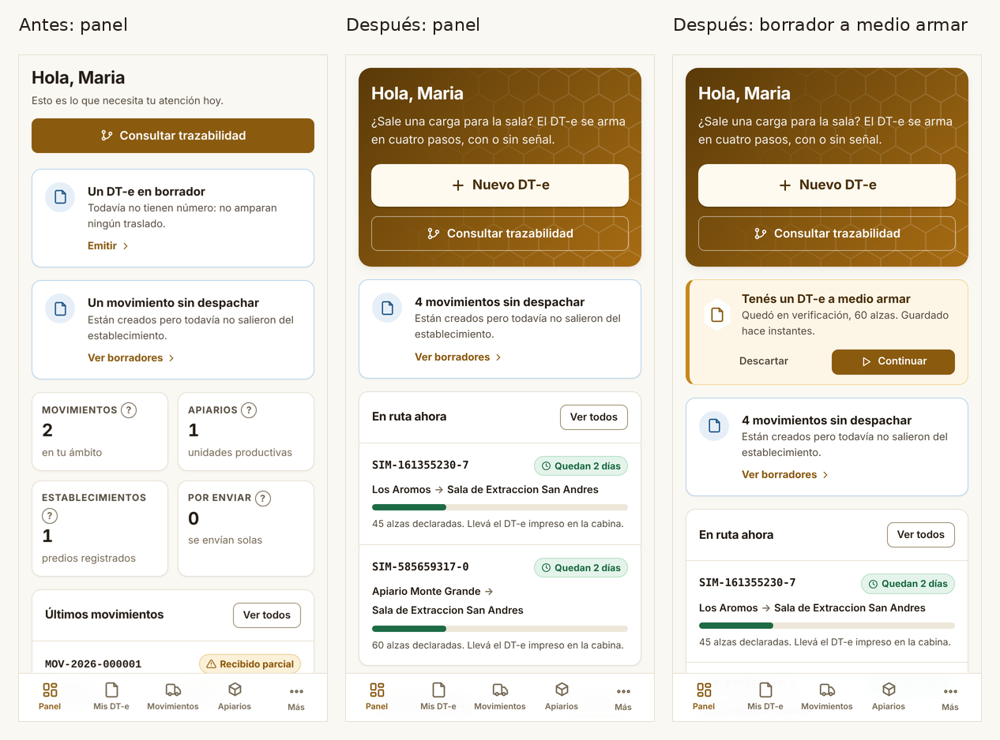
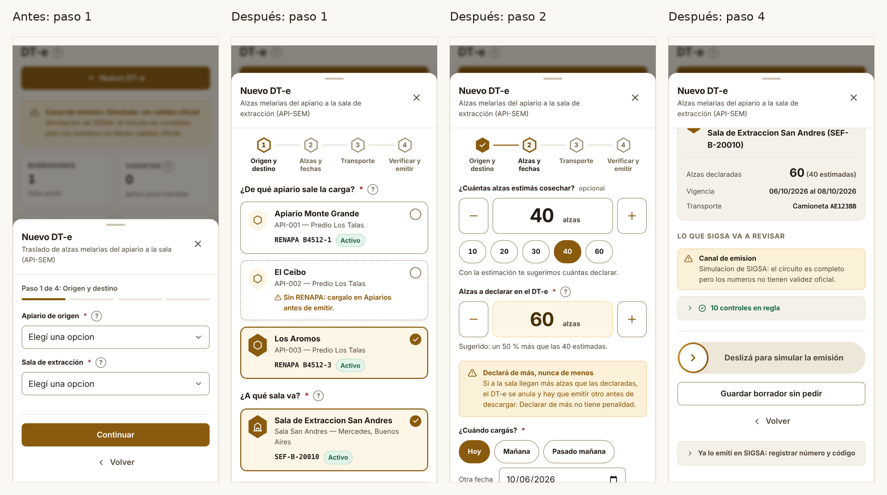
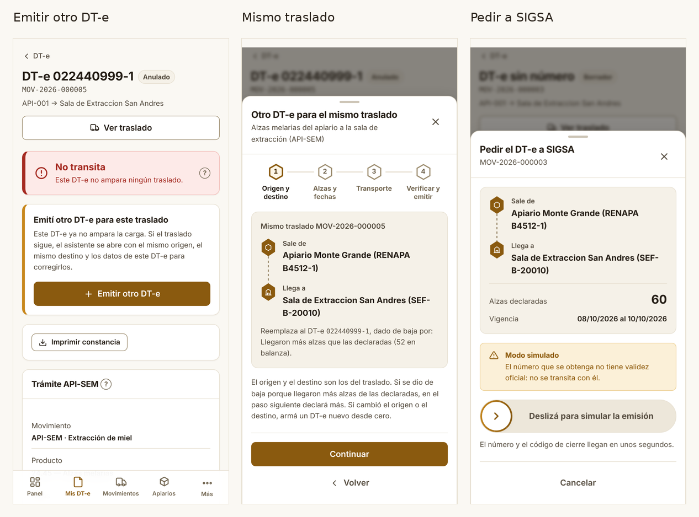
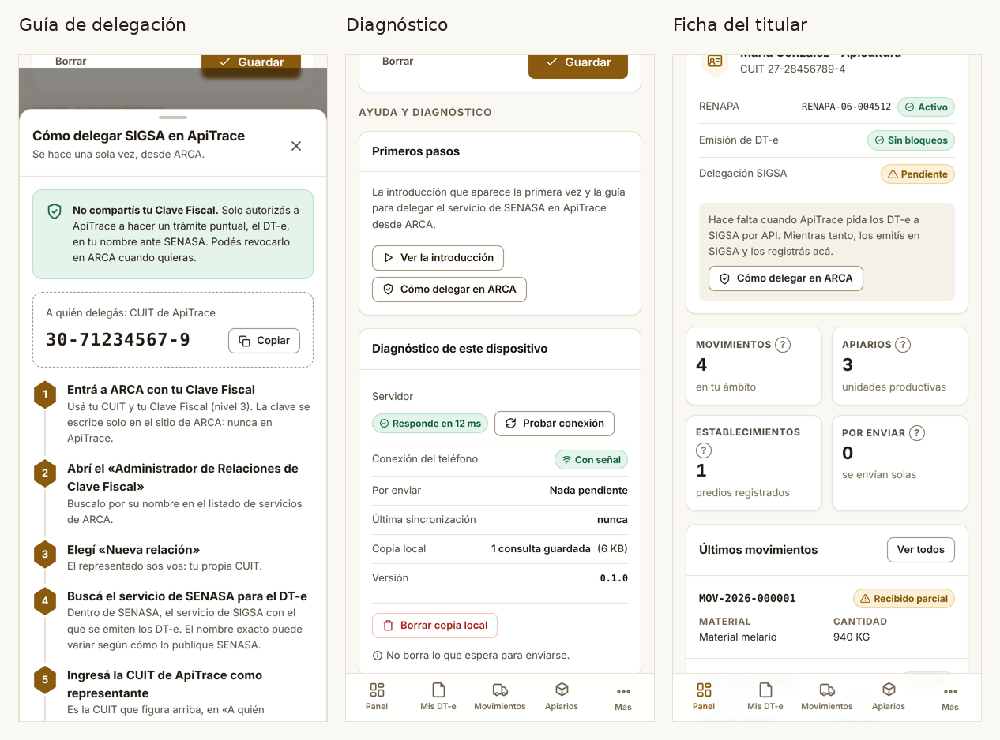
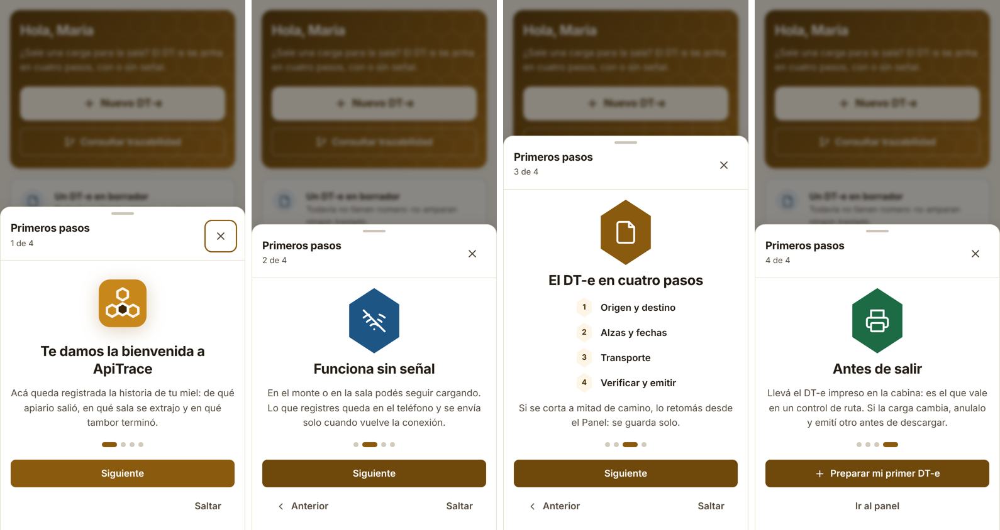
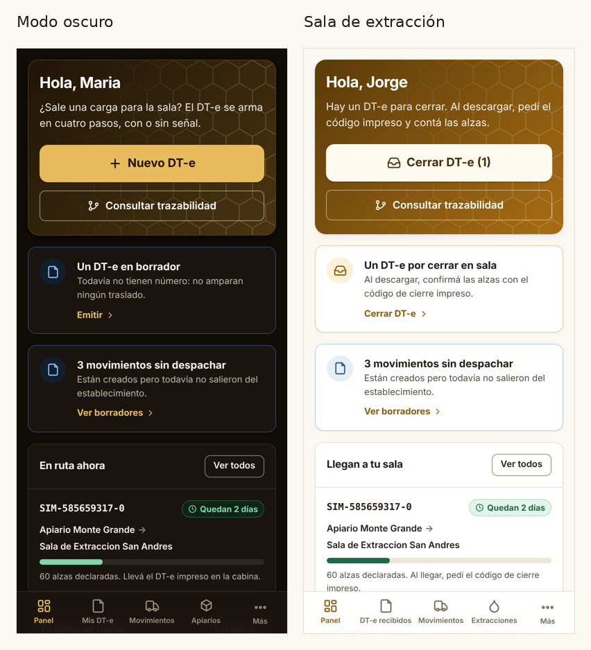
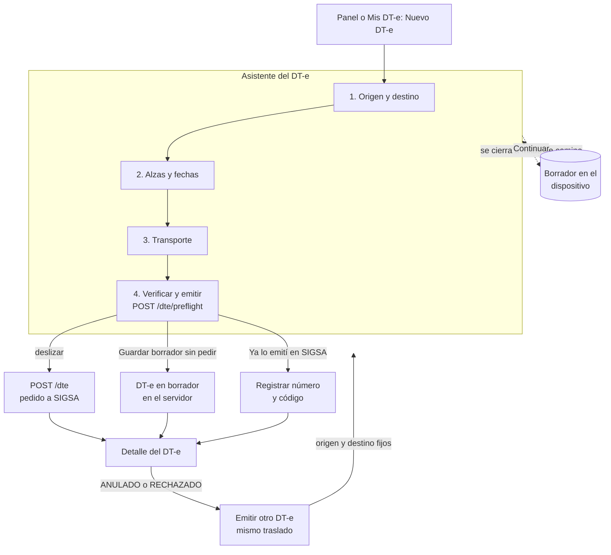
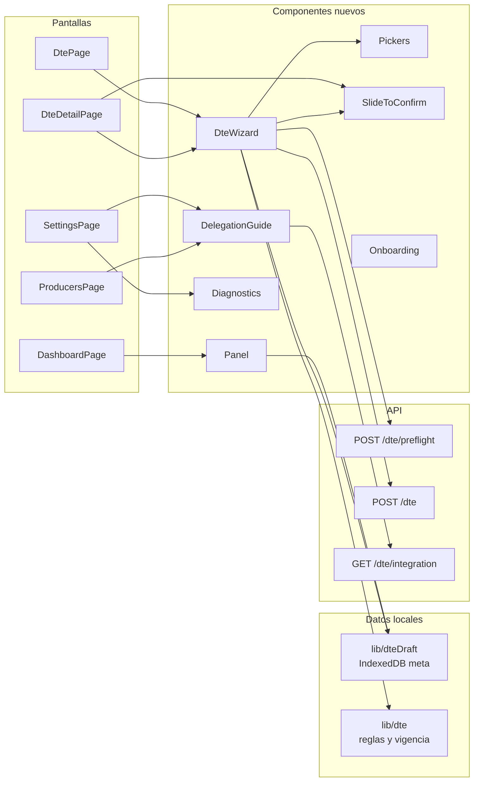

# 12 · Lo mejor de ApiAsistente en ApiTrace

**Proyecto:** ApiTrace · **Fecha:** 2026-10-06
**Base:** rama `correccion/dte-integral` en `1dd41f3` (la que está en `C:\github\ApiTrace`).
**Resultado:** commit `313ea1f` *feat(ux): lo mejor de ApiAsistente (apiDte) en ApiTrace*: 31 archivos, 21 modificados y 10 nuevos (+3958 / −617 líneas).
**Origen:** prototipo ApiAsistente DT-e en `C:\github\apicDte` (app Flutter `api_asistente` y backend Laravel `api_asistente_backend`).
**Relacionados:** 07 (rediseño UX/UI), 08 (iteraciones futuras), 09 (reglas del DT-e), 10 (API SENASA), 11 (plan de corrección).

---

## 0. En pocas palabras

ApiAsistente se sentía fácil: un asistente a pantalla completa, botones grandes, un contador de
alzas que se maneja con el pulgar, un borrador que no se pierde y una confirmación que no se
dispara sin querer. ApiTrace tiene las reglas correctas del DT-e (doc 09), la trazabilidad completa
y un backend probado, pero el DT-e se armaba como un formulario con listas desplegables.

La decisión fue **quedarse con las reglas y el backend de ApiTrace y traer la forma de trabajar de
ApiAsistente**. Lo que en ApiAsistente contradecía las reglas (cerrar el DT-e con un GPS simulado,
imprimir un ticket que parece el DT-e oficial, corregir un trámite anulado editándolo) se dejó
afuera o se rehízo respetándolas.

Lo que cambia para quien usa ApiTrace:

- El DT-e se arma en cuatro pasos con tarjetas y contadores grandes, y se pide **deslizando**.
- Lo cargado se guarda solo. Si se cierra la app a mitad de camino, el panel ofrece **Continuar**.
- Un DT-e anulado o rechazado ofrece **Emitir otro DT-e** para el mismo traslado, con los datos
  precargados y el motivo de la baja a la vista.
- El panel del productor abre con **Nuevo DT-e**, muestra lo que está en ruta con su vigencia y el
  estado del titular (RENAPA, bloqueos, delegación). El de la sala abre con **Cerrar DT-e**.
- Hay primeros pasos por rol, una guía para delegar en ARCA con la CUIT de ApiTrace lista para
  copiar y un diagnóstico del dispositivo.

De **28 ideas** revisadas en ApiAsistente: **16 entraron** (7 tal cual y 9 adaptadas),
**3 ya estaban** en ApiTrace, **2 se descartaron** por chocar con las reglas del DT-e y **7 pasan a
la hoja de ruta**.

---

## 1. Las dos aplicaciones, lado a lado

| | ApiAsistente (apiDte) | ApiTrace antes de este cambio |
| :--- | :--- | :--- |
| Qué es | Prototipo para emitir fácil el DT-e de cosecha | Sistema de trazabilidad apícola con el DT-e integrado |
| Plataforma | App Flutter (Android/iOS), Riverpod, sqflite | PWA React 19 + Vite, IndexedDB |
| Backend | Laravel; `WsaaService` (login WSAA de ARCA) y cliente SENASA simulado | NestJS + Drizzle + PostgreSQL (Neon); canal SENASA `manual`, `simulado` o `sigsa` |
| Alcance | DT-e de cosecha, material vivo, documento de fraccionamiento, tambores | Apiarios, extracciones, lotes, tambores, movimientos, DT-e, trazabilidad en los dos sentidos, auditoría |
| Asistente del DT-e | 6 pasos a pantalla completa: sanidad, apiario, sala, alzas, transporte, resumen | 4 pasos en una hoja, con listas desplegables y campos |
| Cantidades | Un solo número de alzas, con atajos 30, 60, 100 y 200 | Alzas estimadas y declaradas (declaradas ≥ estimadas) |
| Confirmación | Deslizar para confirmar | Botón |
| Borrador | Automático, con aviso en el panel | Solo el DT-e en borrador del servidor |
| Cierre del DT-e | Lo cierra el productor al "llegar", con un GPS simulado | Lo cierra el destino con el código de verificación |
| Impresión | Ticket térmico Bluetooth de 58 mm | Constancia con la leyenda "no reemplaza al DT-e oficial emitido por SENASA" |
| Sin conexión | Cola en sqflite + `workmanager` | Cola (outbox) en IndexedDB con `Idempotency-Key` |
| Ayuda | Introducción, tutorial de delegación, ajustes y diagnóstico | Ayudas contextuales (`HelpTip`) |

---

## 2. Veredicto

**Dónde ganaba ApiAsistente — y por eso se trajo:**

1. **Pensado para el campo.** Una pregunta por pantalla, objetivos grandes, el número de alzas en
   tipografía gigante. Se usa con una mano y con guantes.
2. **No hace perder trabajo.** El borrador se guarda solo y el panel ofrece retomarlo.
3. **No se emite sin querer.** Deslizar es un gesto deliberado; un toque accidental no pide un DT-e.
4. **Acompaña el primer uso.** Introducción, tutorial de delegación con la CUIT para copiar y una
   pantalla de diagnóstico para cuando algo no se envía.

**Dónde gana ApiTrace — y por eso se mantuvo:**

1. **Las reglas del DT-e** (doc 09): estimado y declarado, vigencia de 2 a 4 días, un DT-e en
   juego por movimiento, el anulado queda en el historial, el destino cierra.
2. **La trazabilidad completa**, no solo el trámite.
3. **El backend probado**: 43 pruebas unitarias y 68 de punta a punta, y un preflight
   (`POST /dte/preflight`) con los controles que SIGSA va a revisar.
4. **Honestidad del modo simulado**: los números `SIM-` se ven como lo que son.

---

## 3. Matriz de adopción

Decisiones: **Adoptado** (la idea tal cual), **Adaptado** (la idea, reescrita para respetar las
reglas o el modelo de ApiTrace), **Ya estaba**, **Descartado**, **Hoja de ruta**.

| # | Idea | En ApiAsistente | Decisión | Cómo quedó en ApiTrace |
| :--- | :--- | :--- | :--- | :--- |
| 1 | Asistente por pasos | `wizard_screen.dart` (6 pasos) | Adaptado | 4 pasos: *Origen y destino*, *Alzas y fechas*, *Transporte*, *Verificar y emitir*. Indicador hexagonal; el lector de pantalla anuncia "Paso X de 4". |
| 2 | Elegir apiario y sala con tarjetas | `wizard_step_2_apiario.dart`, `wizard_step_3_sala.dart` | Adoptado | `PickCards`: RENAPA o código SENASA y su estado en la tarjeta, aviso si falta el RENAPA, búsqueda con más de 6 opciones, lo último elegido primero ("La última vez"), selección automática si hay una sola. Se recorre con flechas. |
| 3 | Diagnóstico de sanidad como paso 1 | `wizard_step_1_sanidad.dart` | Adaptado | Deja de ser un paso: los controles del preflight están en el paso 4, los pendientes a la vista y los cumplidos plegados ("10 controles en regla"). El estado del titular también se ve en el panel. |
| 4 | Contador gigante de alzas | `wizard_step_4_alzas.dart` | Adaptado | `QuantityStepper` para estimadas y declaradas: botones de 60 px, número grande, atajos 10 a 60. Al cargar las estimadas se sugieren las declaradas con el factor 1,5. Las fechas siguen el mismo estilo: Hoy, Mañana o Pasado mañana y vigencia de 2, 3 o 4 días. |
| 5 | "Declarar de más es seguro" | `wizard_step_4_alzas.dart` | Adoptado | Aviso **Declará de más, nunca de menos** junto a los contadores, más la validación declaradas ≥ estimadas. |
| 6 | Deslizar para confirmar | `slide_to_confirm_button.dart` | Adoptado | `SlideToConfirm`: confirma al 90 % del recorrido, vuelve si se suelta antes, funciona con Enter o Espacio, muestra "Enviando a SIGSA…" y queda deshabilitado, con el motivo, si el preflight no pasa. Se usa en el asistente y en **Pedir el DT-e a SIGSA**. |
| 7 | Borrador automático | `wizard_provider.dart`, `dashboard_screen.dart` | Adoptado | `lib/dteDraft.ts`: cada cambio se guarda en el dispositivo (IndexedDB, por usuario). Aviso **Tenés un DT-e a medio armar** con *Continuar* y *Descartar* en el Panel y en Mis DT-e. Se borra al enviar y al cerrar sesión. |
| 8 | "Resolver conflicto" de un trámite anulado | `history_screen.dart` (edita el mismo trámite y lo reenvía) | Adaptado | **Emitir otro DT-e** para el mismo traslado: el anulado queda en el historial, el asistente abre con origen y destino fijos, el motivo de la baja y los datos precargados (`POST /dte` con `movementId`). |
| 9 | Botón principal "Nuevo viaje" | `dashboard_screen.dart` | Adaptado | Encabezado por rol: el productor ve **Nuevo DT-e**; la sala y el acopio, **Cerrar DT-e (n)**. |
| 10 | DT-e en tránsito con barra | `dashboard_screen.dart` (distancia del GPS simulado) | Adaptado | **En ruta ahora**: la barra mide la vigencia ("Quedan 2 días", "Vence hoy a las 23:59"), no la distancia. Recuerda llevar el DT-e impreso. |
| 11 | Tarjeta del productor | `producer_profile_card.dart` | Adaptado | Ficha del titular: RENAPA, bloqueo por DT-e caducados, estado de la delegación SIGSA según el canal, acceso a la guía. |
| 12 | Introducción | `onboarding_screen.dart` (4 pantallas) | Adoptado | **Primeros pasos** por rol (productor, sala o acopio, el resto); aparece una vez por usuario y dispositivo y se vuelve a ver desde Ajustes. |
| 13 | Tutorial de delegación con CUIT para copiar | `delegacion_tutorial_screen.dart` | Adoptado | **Cómo delegar SIGSA en ApiTrace**: 7 pasos en ARCA y la CUIT de la plataforma, que ahora sirve el backend (`platformTaxId`, de `SENASA_PLATFORM_CUIT`), con botón *Copiar*. Se abre desde la ficha del titular, Productores, Ajustes y el paso 4 si falta la delegación. |
| 14 | Ajustes y diagnóstico | `settings_diagnostics_screen.dart` | Adaptado | **Diagnóstico de este dispositivo**: prueba del servidor en ms, señal, cola, última sincronización, copia local y versión. *Borrar copia local* no toca lo que espera para enviarse; en ApiAsistente *Limpiar todo* borraba también los trámites sin enviar. |
| 15 | Pantalla de arranque | `splash_screen.dart` | Adoptado | Logo con pulso y estado mientras se restaura la sesión. |
| 16 | Favoritos ("Mis cargas") | `favorites_screen.dart` | Adaptado | Sin pantalla aparte: lo último elegido aparece primero y la patente se guarda como "vehículo habitual" desde el paso 3. |
| 17 | Tema miel, claro y oscuro | `app_theme.dart` | Ya estaba | La paleta miel y el modo oscuro existían (doc 07). Se suman la textura de panal del encabezado y los hexágonos de los pasos. |
| 18 | Cola sin conexión | `sync_manager.dart` | Ya estaba | Outbox en IndexedDB con `Idempotency-Key`. |
| 19 | Banners de alerta | `alert_banner_widget.dart` | Ya estaba | `Notice` y una sola barra de estado. |
| 20 | Ticket térmico | `thermal_print_service.dart` | Descartado | El ticket se titula "Documento de Transito (DT-e)" y, sin número, imprime "PRE-EMISION OFFLINE": puede pasar por el DT-e oficial. Se mantiene la constancia con leyenda; el que viaja es el DT-e de SENASA, impreso. |
| 21 | Cierre por geocerca | `dashboard_screen.dart` ("Simulando movimiento GPS…", "Forzar llegada", "Registrar arribo y cerrar") | Descartado | En API-SEM cierra el destino con el código de verificación. Un GPS simulado no prueba nada, y un botón "Forzar llegada" lo anula. |
| 22 | Aviso local "llegada detectada" | `local_notification_service.dart` | Hoja de ruta, con otro disparador | Avisar sí sirve, pero por vencimiento del DT-e y no por una llegada simulada (ver §11). |
| 23 | Escaneo de etiquetas de tambores | `asignar_tambores_screen.dart` (`mobile_scanner`) | Hoja de ruta | Cámara en la PWA (`BarcodeDetector`). |
| 24 | Biometría | `local_auth`, `flutter_secure_storage` | Hoja de ruta | Passkeys (WebAuthn). |
| 25 | Envío en segundo plano | `workmanager` | Hoja de ruta | Background Sync del service worker. |
| 26 | DT-e de material vivo y documento de fraccionamiento | migraciones `…000002` y `…000003` | Hoja de ruta | Nuevos trámites sobre el mismo modelo de DT-e. |
| 27 | Login WSAA con certificado | `WsaaService.php` | Hoja de ruta | Base para `sigsa.gateway` cuando SENASA habilite la homologación. |
| 28 | Trasvase y baja de tambores, aceptación parcial, remito PDF | `TamborService.php`, `MovimientoTamborService.php` | Hoja de ruta | Iteración de tambores. |

---

## 4. Pantalla por pantalla

Las capturas están en `capturas/`, al lado de este documento. Son de la app corriendo con el
backend real en modo `simulado`, en un teléfono de 390 × 844 salvo las de escritorio.

### 4.1 Panel



- **Encabezado por rol** con la acción del día: *Nuevo DT-e* para el productor, *Cerrar DT-e (n)*
  para la sala y el acopio, y *Consultar trazabilidad* para todos. El panal de fondo se atenúa
  detrás del texto para no restarle lectura.
- **Tenés un DT-e a medio armar**: dice en qué paso quedó, cuántas alzas y hace cuánto se guardó.
  *Descartar* pide confirmación.
- **En ruta ahora**: los DT-e vigentes con una barra de vigencia y el recordatorio de llevarlo
  impreso. Para la sala se titula *Llegan a tu sala* y recuerda pedir el código de cierre.
- **Ficha del titular** (captura 04): RENAPA, bloqueos y delegación.

### 4.2 Asistente del DT-e



| Paso | Qué se ve | Regla que cuida |
| :--- | :--- | :--- |
| 1 · Origen y destino | Tarjetas de apiarios con RENAPA y estado; salas con código SENASA. Un apiario sin RENAPA se puede elegir, pero muestra el aviso "cargalo en Apiarios antes de emitir" y el preflight no deja pedir el DT-e hasta que se cargue. | No inventar datos (doc 11) |
| 2 · Alzas y fechas | Dos contadores (estimadas y declaradas) con la sugerencia del 50 % más, el aviso *Declará de más, nunca de menos*, Hoy, Mañana o Pasado mañana, y vigencia de 2, 3 o 4 días con la ventana "transita desde … 00:00 hasta … 23:59". | Declaradas ≥ estimadas; anticipación 4 días; vigencia 2 a 4 |
| 3 · Transporte | Tipo de vehículo en botones y patente en mayúsculas; opción de guardarla como vehículo habitual. | Patente con formato válido |
| 4 · Verificar y emitir | Recorrido (sale de, llega a), alzas, vigencia, transporte; lo que SIGSA va a revisar; deslizar para pedir el DT-e; *Guardar borrador sin pedir*; *Ya lo emití en SIGSA: registrar número y código*. | Preflight antes de pedir; modo simulado visible |

Si el asistente se cierra, aparece "Guardamos el DT-e a medio armar". Al volver a abrirlo sigue
en el paso donde quedó ("Seguís donde lo dejaste", con la opción *Empezar de cero*). Si se abre una
reemisión mientras hay otro borrador guardado, avisa *Tenías otro DT-e a medio armar*: seguir
reemplaza ese borrador.

### 4.3 DT-e anulado o rechazado y "Pedir a SIGSA"



- El DT-e anulado sigue con su número, su estado y su historial. Debajo de *No transita* aparece
  **Emití otro DT-e para este traslado**, solo si el usuario puede emitir, el traslado sigue abierto
  y todos sus DT-e están dados de baja.
- El asistente abre como **Otro DT-e para el mismo traslado**: recorrido fijo, "Reemplaza al DT-e
  … dado de baja por: …" y la indicación de qué corregir. Si cambió el origen o el destino, se arma
  un DT-e nuevo.
- **Pedir el DT-e a SIGSA** desde un borrador pasó de un diálogo de confirmación a una hoja con el
  recorrido, el aviso de modo simulado y el deslizador.

### 4.4 Ayuda: delegación, diagnóstico y ficha del titular



- **Cómo delegar SIGSA en ApiTrace**: primero la tranquilidad ("No compartís tu Clave Fiscal"),
  después la CUIT a la que se delega con *Copiar* y los 7 pasos en ARCA. Si el servidor no tiene la
  CUIT cargada, lo dice y pide consultarla a quien administra ApiTrace.
- **Diagnóstico de este dispositivo** en Ajustes, junto a *Ver la introducción* y *Cómo delegar en
  ARCA*.

### 4.5 Primeros pasos



Cuatro pantallas para el productor: bienvenida, funciona sin señal, el DT-e en cuatro pasos, y
antes de salir (llevar el DT-e impreso; si la carga cambia, anularlo y emitir otro). La última
termina en *Preparar mi primer DT-e*. La sala y el acopio ven *Cerrá el DT-e al descargar*; los
demás roles, *Seguí la miel en los dos sentidos*. El enlace a la delegación aparece solo con el
canal `sigsa`.

### 4.6 Modo oscuro, sala y escritorio



En escritorio el encabezado pone el texto y las acciones lado a lado, *En ruta ahora* y la ficha
del titular comparten fila, y el asistente se abre como ventana centrada con las tarjetas en dos
columnas (`capturas/07-escritorio-*.png`, con una toma del deslizador a mitad de recorrido).

---

## 5. El nuevo recorrido del DT-e



*Continuar* reabre el asistente en el paso donde quedó. La reemisión termina en el mismo
`POST /dte`, con el `movementId` del traslado. El DT-e en borrador del servidor sigue existiendo
como antes: es un DT-e sin número que se puede pedir más tarde.

**Dónde vive cada pieza:**



---

## 6. Reglas del DT-e que se mantienen

| Regla (doc 09) | Cómo la respeta la nueva interfaz |
| :--- | :--- |
| Declaradas ≥ estimadas | Dos contadores separados, sugerencia del 50 % más y validación antes de seguir. |
| Vigencia de 2 a 4 días; anticipación de hasta 4 | Solo se ofrecen fechas y vigencias dentro del rango; la ventana se muestra de 00:00 a 23:59 (hora de Argentina). |
| Un DT-e en juego por movimiento | *Emitir otro DT-e* aparece solo cuando todos los DT-e del traslado están dados de baja; el backend lo controla con el índice `dte_movement_active_uq`. |
| El DT-e no se borra ni se edita después de dado de baja | La reemisión crea un DT-e nuevo; el anterior queda con su motivo en el historial. |
| Cierra el destino | No hay cierre por GPS. La sala ve *Cerrar DT-e (n)* y el recordatorio de pedir el código impreso. |
| El DT-e viaja impreso | Recordatorios en el panel, en *En ruta ahora* y en Primeros pasos. No hay ticket que imite al oficial. |
| El modo simulado se ve | "Deslizá para **simular** la emisión", aviso *Modo simulado* y números `SIM-`. |
| No inventar datos | Un apiario sin RENAPA no se completa con relleno: la tarjeta lo avisa y el preflight frena el pedido hasta que se cargue. |

---

## 7. Qué cambió en el código

**Backend (3 archivos)**

| Archivo | Cambio |
| :--- | :--- |
| `backend/src/modules/movement/dte-query.service.ts` | `GET /dte/integration` devuelve `platformTaxId` (CUIT de la plataforma) para la guía de delegación. |
| `backend/test/env-setup.ts` | `SENASA_PLATFORM_CUIT` de prueba. |
| `backend/test/dte.e2e-spec.ts` | Comprueba que `platformTaxId` llega sin guiones. |

**Frontend, archivos nuevos (10)**

| Archivo | Qué hace |
| :--- | :--- |
| `components/DteWizard.tsx` | El asistente del DT-e: nuevo, continuación del borrador y reemisión. Exporta `RouteLine`. |
| `components/Pickers.tsx` | `PickCards`, `Chips` y `QuantityStepper`. |
| `components/SlideToConfirm.tsx` | Deslizar para confirmar, accesible por teclado. |
| `components/Panel.tsx` | `Hero`, `DraftBanner`, `OnRouteCard` y `HolderCard`. |
| `components/DelegationGuide.tsx` | Guía de delegación en ARCA. |
| `components/Onboarding.tsx` | Primeros pasos por rol. |
| `components/Diagnostics.tsx` | Diagnóstico del dispositivo. |
| `lib/dteDraft.ts` | Borrador y últimas elecciones, por usuario, en IndexedDB. |
| `lib/dteDraft.test.ts` | 5 pruebas del borrador. |
| `globals.d.ts` | Tipo de `__APP_VERSION__`. |

**Frontend, archivos modificados (18)**

| Archivo | Cambio |
| :--- | :--- |
| `pages/DtePage.tsx` | El asistente viejo sale de la página (−540 líneas); `?nuevo=1` abre el nuevo; aviso de borrador. |
| `pages/DteDetailPage.tsx` | *Emitir otro DT-e* y la hoja *Pedir el DT-e a SIGSA* con deslizador. |
| `pages/DashboardPage.tsx` | Encabezado por rol, borrador, *En ruta ahora* y ficha del titular. |
| `pages/SettingsPage.tsx` | Sección *Ayuda y diagnóstico*. |
| `pages/ProducersPage.tsx` | Enlace a la guía desde la delegación. |
| `components/DteChecks.tsx` | Opción para plegar los controles cumplidos. |
| `components/Form.tsx` | `Steps` hexagonal con anuncio para lectores de pantalla. |
| `components/ui.tsx` | `Sheet`: con una hoja encima, Escape cierra solo la de arriba. |
| `components/Icon.tsx` | Íconos nuevos (copiar, reloj, escudo, colmena, imprimir, recorrido, credencial, reproducir, menos). |
| `components/Layout.tsx` | Monta Primeros pasos. |
| `App.tsx` | Pantalla de arranque. |
| `lib/dte.ts` | Ventana de vigencia, atajos de fecha y opciones de vigencia. |
| `lib/dte.test.ts` | 5 pruebas nuevas (11 en total). |
| `lib/db.ts` | `deleteMeta` y `countCache`. |
| `lib/format.ts` | `formatCuit`. |
| `lib/types.ts` | `platformTaxId` en `DteIntegration`. |
| `styles.css` | Estilos de todo lo anterior, con variantes oscuras y de escritorio. |
| `vite.config.ts` | Inyecta la versión de `package.json` como `__APP_VERSION__`. |

---

## 8. Pruebas

| Dónde | Comando | Resultado |
| :--- | :--- | :--- |
| Frontend | `npx vitest run` | **31 pasan** (eran 21; 10 nuevas: borrador y vigencia) |
| Frontend | `npm run build` | Compila sin errores de tipos |
| Backend | `npm test` | **43 pasan** |
| Backend | `npm run test:e2e` | **68 pasan** (incluye `platformTaxId`) |

Recorridos verificados en el navegador (Playwright, con backend y PostgreSQL reales):

- Un toque sobre el deslizador **no** emite; un arrastre corto vuelve; uno completo emite y lleva
  al detalle con número `SIM-`.
- Con teclado, Enter sobre el deslizador confirma.
- Cerrar a mitad de camino deja el aviso en el panel; *Continuar* vuelve al paso guardado.
- Reemisión de un DT-e anulado sobre el mismo traslado.
- Primeros pasos, guía con la CUIT `30-71234567-9`, diagnóstico, modo oscuro, panel de la sala y
  escritorio.

Con esto, la definición de "terminado" del doc 11 (§4) pasa de 21 a **31** pruebas de frontend.

---

## 9. Cómo aplicarlo

Los 31 archivos **ya están copiados en `C:\github\ApiTrace`**, sin commit, sobre la rama
`correccion/dte-integral`. Antes de copiarlos se comprobó que los 21 que cambian eran idénticos a
`1dd41f3`, y después, que los 31 quedaron idénticos a `313ea1f`. Este documento y sus capturas
están en `docs\apiasistente\`.

```powershell
cd C:\github\ApiTrace
git status    # 21 modificados en backend\ y frontend\; sin seguimiento: 10 archivos nuevos y docs\apiasistente\
git switch -c mejora/lo-mejor-de-apidte
git add backend\src backend\test frontend\src frontend\vite.config.ts
git commit -m "feat(ux): lo mejor de ApiAsistente (apiDte) en ApiTrace"
git add docs\apiasistente
git commit -m "docs: 12 · lo mejor de ApiAsistente en ApiTrace"

cd frontend; npx vitest run; npm run build
cd ..\backend; npm test; npm run test:e2e
```

**Alternativa con el parche**, para otra copia del repositorio (un clon nuevo, otra máquina) que
esté en `1dd41f3` sin cambios. Trae el commit con su mensaje. En `C:\github\ApiTrace` no hace
falta: los archivos ya están.

```powershell
git switch correccion/dte-integral
git switch -c mejora/lo-mejor-de-apidte
git am "C:\github\BeeTrace\Claude outputs\12-apiasistente\0001-feat-ux-lo-mejor-de-ApiAsistente-apiDte-en-ApiTrace.patch"
```

**En Render**, cargar `SENASA_PLATFORM_CUIT` en el servicio de la API. Hasta ahora era obligatoria
solo con `SENASA_MODE=sigsa`; ahora la usa también la guía de delegación en cualquier canal. No
está declarada en `render.yaml`: se puede agregar como `- key: SENASA_PLATFORM_CUIT` con
`sync: false` para que Render la pida (ver T06 del doc 11).

---

## 10. Riesgos y dependencias

| # | Riesgo o dependencia | Impacto | Qué hacer |
| :--- | :--- | :--- | :--- |
| 1 | El asistente usa `POST /dte/preflight`, `GET /dte/integration` y `POST /dte` con `movementId`, que llegan con `correccion/dte-integral` (doc 11, T03). | Contra el backend de `main` anterior a esa corrección, el asistente no funciona. | Desplegar backend y frontend juntos, después de T03. |
| 2 | `SENASA_PLATFORM_CUIT` sin cargar en Render. | La guía no muestra la CUIT para copiar; lo explica y deriva a quien administra ApiTrace. | Cargar la variable (§9). |
| 3 | El borrador vive en el dispositivo y se borra al cerrar sesión. | No pasa de un teléfono a otro. | Es a propósito: no dejar datos de un usuario a otro. El DT-e en borrador del servidor sigue disponible desde cualquier equipo. |
| 4 | `Steps` cambió de aspecto para todos los asistentes. | Afecta también a *Nuevo movimiento* y *Nueva extracción*. | Revisados los dos, con 3 y 2 pasos. |
| 5 | Cambio en `Sheet`: con una hoja abierta sobre otra, Escape cierra solo la de arriba. | Comportamiento nuevo en hojas anidadas (guía de delegación sobre la de productores, por ejemplo). | Probado; es lo esperable. |
| 6 | El nombre del servicio de SENASA en ARCA puede variar. | El paso 4 de la guía podría no coincidir con lo que ve el productor. | La guía ya lo advierte. Confirmar el nombre exacto con SENASA antes de publicarla. |
| 7 | Primeros pasos aparece una vez por usuario y dispositivo. | En una demo con una cuenta compartida se ve solo la primera vez. | *Ajustes → Ver la introducción*. |
| 8 | Deslizar con guantes o en pantallas chicas. | Puede costar al principio. | Manija de 52 px, umbral del 90 %, alternativa con teclado. Conviene probarlo en el campo. |
| 9 | Algunos textos del backend están sin tildes ("Canal de emision", "Simulacion de SIGSA…") y ahora se leen en el paso 4. | Detalle de presentación. | Corregirlos en `dte-checks.service.ts` y en los gateways de SENASA, ajustando las pruebas que los comparen. Quedó fuera de este cambio. |
| 10 | La versión que muestra el diagnóstico sale de `frontend/package.json` (hoy `0.1.0`). | Si no se actualiza, soporte no sabe qué versión tiene cada teléfono. | Subir la versión en cada publicación. |
| 11 | El cambio todavía no está en GitHub: no hubo acceso de escritura a `josephred/apitrace` al prepararlo. | Solo existe en `C:\github\ApiTrace` (sin commit) y en el parche. | Hacer el commit y el push desde esa máquina (§9). |

---

## 11. Hoja de ruta: lo que queda de ApiAsistente

| Idea | Para qué | Dependencia técnica | Prioridad |
| :--- | :--- | :--- | :--- |
| Aviso de vencimiento del DT-e | Evitar DT-e caducados, que bloquean al titular | Web Push con VAPID y permiso del usuario; en iOS requiere la PWA instalada | Alta |
| Escanear etiquetas de tambores | Menos errores al asignar tambores | `BarcodeDetector` (Chrome en Android) y una alternativa en JavaScript para el resto | Alta, con la iteración de tambores |
| Login WSAA con certificado | Base del canal `sigsa` real | Portar `WsaaService.php` a `sigsa.gateway`; certificado de homologación de ARCA y acuerdo con SENASA (doc 10) | Alta cuando SENASA habilite |
| Trasvase y baja de tambores, aceptación parcial, remito PDF | Completar el ciclo del tambor | Modelo de tambores de ApiTrace (doc 08) | Media |
| DT-e de material vivo y documento de fraccionamiento | Otros trámites del productor | Reglas propias de SENASA para cada uno | Media |
| Envío en segundo plano | Que la cola salga aunque se cierre la app | Background Sync (solo Chromium); hoy se envía al volver a abrir | Media |
| Passkeys | Entrar sin contraseña en el campo | WebAuthn en el backend | Baja |

---

## 12. Archivos entregados

| Dónde | Qué |
| :--- | :--- |
| `C:\github\ApiTrace\backend\…` y `C:\github\ApiTrace\frontend\…` | Los 31 archivos del cambio, sin commit. |
| `C:\github\ApiTrace\docs\apiasistente\` | Este documento y sus capturas, para versionarlos con el código. |
| `C:\github\BeeTrace\Claude outputs\12-apiasistente\` | Este documento, el parche y las capturas. |
| Proyecto ApiTrace en claude.ai | `claude/12-Lo-mejor-de-ApiAsistente-en-ApiTrace.md`. |
