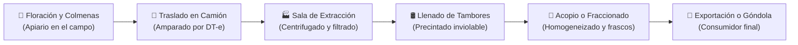
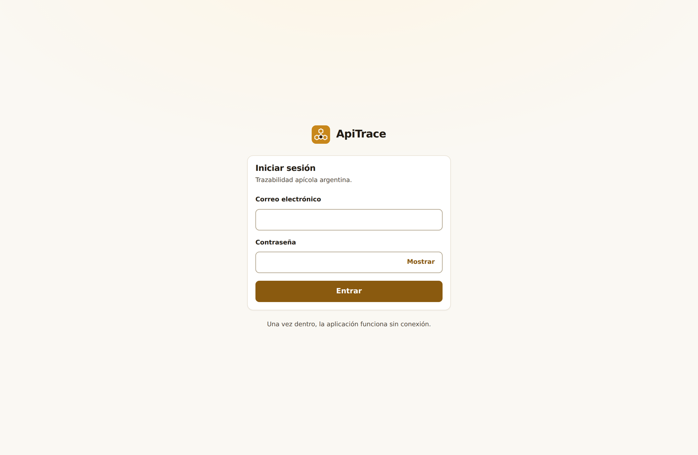
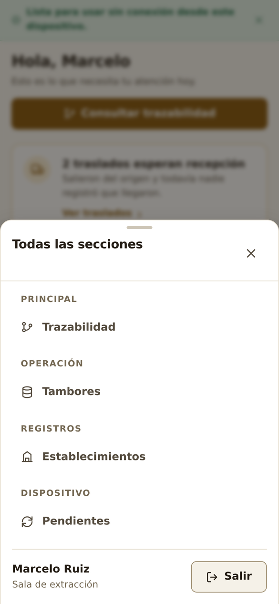
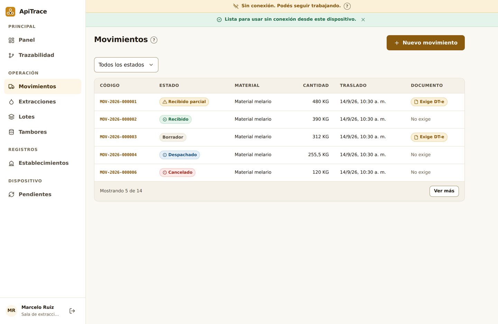
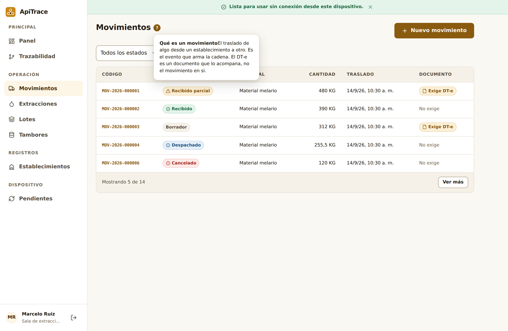

# Manual de Usuario ApiTrace — 00. Introducción y Conceptos Básicos

¡Bienvenido a **ApiTrace**! Este manual ha sido escrito para que cualquier persona, incluso sin conocimientos previos del negocio apícola ni experiencia en sistemas complejos, pueda comprender para qué sirve la plataforma, cómo funciona la cadena de la miel y cómo utilizar cada una de sus herramientas con total confianza.

---

## 1. ¿Qué es ApiTrace y por qué es tan importante?

Imaginá que estás en un supermercado en Alemania, Japón o Buenos Aires comprando un frasco de miel pura. Si escaneás la etiqueta, querés tener la seguridad absoluta de que esa miel no está adulterada con jarabes de maíz, que no tiene antibióticos prohibidos y que proviene de colmenas sanas cuidadas por apicultores responsables.

**ApiTrace** es el sistema digital que hace eso posible: permite **reconstruir toda la película de la miel**, desde la flor en el campo hasta el consumidor final. A esto se lo conoce técnicamente como **Trazabilidad Alimentaria**.

---

## 2. Glosario Apícola para Principiantes: "El Negocio en Palabras Simples"

Si recién empezás en el sector, es común escuchar palabras que suenan complicadas. Acá te las explicamos de forma simple y gráfica:

| Término | ¿Qué significa en la vida real? | ¿Cómo se usa en ApiTrace? |
| :--- | :--- | :--- |
| **Apiario o Colmenar** | El conjunto de cajones (colmenas) ubicados en un punto exacto del campo donde trabajan las abejas. | Es el punto de partida de la trazabilidad. En el sistema registrás su nombre, cantidad de colmenas y coordenadas GPS. |
| **Melario o Alza** | La caja de madera superior de la colmena donde las abejas almacenan la miel limpia que luego se cosecha. | Es la unidad que se carga en el camión. Un traslado típico lleva entre 40 y 120 alzas cosechadas. |
| **Desoperculado** | Retirar con un cuchillo o máquina la fina capa de cera ("opérculo") con la que las abejas sellan la miel madura. | Primer paso dentro de la sala de extracción antes de pasar a la centrífuga. |
| **Extracción** | Hacer girar los cuadros a gran velocidad en una centrífuga metálica para que la miel líquida salga sin romper los panales. | En ApiTrace se registra como un proceso que consume melarios recibidos y genera kilos netos de miel líquida. |
| **Rendimiento** | Cuántos kilos de miel se obtuvieron por cada alza ingresada (lo habitual son 18 a 24 kg por alza). | ApiTrace calcula el porcentaje automáticamente para detectar si hubo mermas o pérdidas inusuales. |
| **Lote** | Una partida homogénea de miel obtenida en una misma tirada o día de trabajo. | Es la unidad lógica que se analiza en laboratorio y se envía a los clientes. |
| **Tambor Apícola** | Un barril metálico estandarizado de 200 litros con pintura sanitaria interior, que lleno pesa entre 300 y 330 kg netos. | El envase físico donde la miel se acopia y se exporta al mundo. |
| **Tara del Tambor** | Lo que pesa el tambor metálico completamente vacío con su aro y su tapa (habitualmente entre 17,5 y 19,5 kg). | Se resta del peso total en báscula para conocer los kilos exactos de miel comercializable. |
| **Precinto de Seguridad** | Una tira plástica o metálica numerada e irrepetible que sella el tambor. Si se rompe, se nota de inmediato. | Garantiza que nadie abrió, diluyó ni adulteró la miel durante el viaje en ruta. |

---

## 3. El Marco Oficial: SENASA, ARCA y el Documento DT-e

En Argentina, la miel es un alimento de origen animal y está estrictamente controlada por el **SENASA** (Servicio Nacional de Sanidad y Calidad Agroalimentaria) y **ARCA / AFIP**. Para mover mercadería apícola por las rutas se exigen registros oficiales:

* **RENAPA**: Registro Nacional de Productores Apícolas. Es como el "DNI del apicultor". Es obligatorio y se renueva cada dos años.
* **RENSPA**: Registro Sanitario del Predio. Identifica al campo o estancia física donde están los cajones (ej: `01.002.0.00123/00`).
* **RNE**: Registro Nacional de Establecimiento. Habilita a las salas de extracción y depósitos para manipular alimentos.
* **DT-e (Documento de Tránsito Electrónico)**: Es el **"pasaporte de viaje"** de la carga. Sin este documento oficial emitido por SENASA, ningún camión con miel puede circular por las rutas del país.

> [!IMPORTANT]
> **El Semáforo de Tránsito de ApiTrace**:
> En ApiTrace verás un semáforo visual que te indica si el camión puede viajar:
> * 🟢 **VERDE (Habilitado)**: El DT-e está vigente y autorizado por SENASA.
> * 🟡 **AMARILLO (Por vencer)**: Faltan menos de 24 horas para que caduque el permiso; el camión debe llegar a destino urgente.
> * 🔴 **ROJO (Prohibido circular)**: El documento venció, fue anulado o rechazado. Gendarmería o la Policía retendrán la carga en ruta.

---

## 4. Primeros Pasos: Acceso al Sistema

### A. Inicio de Sesión
1. Abrí tu navegador de internet (Chrome, Safari, Edge, Firefox) e ingresá a la dirección de tu cooperativa o empresa (ej: `https://apitrace.tudominio.com` o en pruebas `http://localhost:5173`).
2. Escribí tu correo electrónico y tu contraseña asignada.

> [!TIP]
> **Cuentas de prueba para capacitación**:
> Si estás en un entorno de prueba o demostración, podés ingresar con las siguientes cuentas (contraseña común: `ApiTrace2026!`):
> * Administrador: `admin@apitrace`
> * Productor Apícola: `productor@apitrace`
> * Sala de Extracción: `sala@apitrace`
> * Acopiador: `acopiador@apitrace`
> * Transportista: `transportista@apitrace`
> * Auditor / Inspector: `auditor@apitrace`

---

## 5. Navegación en Computadora y en Teléfono Móvil

ApiTrace está diseñado para verse de forma óptima tanto en una pantalla grande de oficina como en la pantalla de un teléfono en medio del campo.

### En la Computadora (Escritorio)
A la izquierda tenés la **Barra Lateral de Navegación** dividida por tareas claras:
* **Principal**: Panel de resumen y Gráfico de Trazabilidad.
* **Operación**: Movimientos, DT-e oficial, Extracciones, Lotes y Tambores.
* **Registros**: Productores, Establecimientos y Apiarios.
* **Control**: Reglas normativas y Auditoría inmutable.
* **Sistema**: Configuración general y Operaciones pendientes fuera de línea.

### En el Celular (Móvil)
En la parte inferior de la pantalla tenés una **Barra de Pestañas táctil** con las funciones que más usás todos los días. Al tocar el botón **"Más"** se despliega una cortina con el resto de las pantallas del sistema.

---

## 6. Trabajar en el Campo Sin Señal de Celular (Modo Fuera de Línea)

En muchas zonas rurales donde están las colmenas no hay señal 4G ni WiFi. **Con ApiTrace esto no es un problema**:

1. **La app sigue funcionando**: Podés consultar apiarios, cargar salidas de camiones y anotar tambores aunque estés completamente desconectado.
2. **Cola de Pendientes**: Cada operación que hacés sin señal se guarda de forma segura dentro de la memoria de tu teléfono.
3. **Envío Automático**: Cuando subís a la camioneta y volvés a tener señal en la ruta o en el pueblo, ApiTrace envía automáticamente todas las operaciones en orden.
4. **Cero duplicados (Garantía de Idempotencia)**: Cada carga lleva una clave única generada por tu celular. Si la señal titila y la app reintenta el envío tres veces, el servidor reconoce la clave y **nunca duplica** el registro.

---

## 7. Ayudas Contextuales y el Nuevo Módulo de Configuración

### Botones de Ayuda «?» en Cada Pantalla
Al lado de títulos y casilleros complicados vas a ver un botón marrón con un signo de interrogación `?`. Al tocarlo, se abre una tarjeta explicativa con:
* **Definición clara** sin tecnicismos innecesarios.
* **Ejemplo práctico de campo** con datos reales (kilos, tambores, patentes).
* **Cita normativa** que respalda la exigencia.

### Nuevo Módulo de Configuración (`/settings`)
Ingresando desde el menú lateral a **Configuración**, podés adaptar el sistema a tus preferencias:
* **Tema Claro vs Oscuro**: Si vas a usar el teléfono bajo el sol pleno del apiario, elegí el **Modo Claro** (alto contraste). Si estás de noche en la oficina de la sala, podés pasar a **Modo Oscuro**.
* **Activar o Desactivar Ayudas**: Si ya sos un usuario experimentado y no necesitás ver los signos `?`, podés activar el *Modo Experto* para tener una pantalla totalmente despejada.
* **Parámetros por Rol**: Cada perfil tiene opciones exclusivas (por ejemplo, el productor configura su patente habitual y la sala su tara de tambores estándar).

---

## 8. ¿Qué manual tenés que leer según tu trabajo?

Para no abrumarte con pantallas que no vas a usar, cada integrante de la cadena tiene su propio manual especializado:

1. **Si sos apicultor o manejás colmenas** ➡️ Leer el **[Manual 01: Perfil Productor](01-manual-productor.md)**.
2. **Si trabajás o administrás una sala de extracción** ➡️ Leer el **[Manual 02: Perfil Sala de Extracción](02-manual-sala-extraccion.md)**.
3. **Si comprás miel en tambores, acopiás o fraccionás en frascos** ➡️ Leer el **[Manual 03: Perfil Acopiador y Fraccionador](03-manual-acopiador-fraccionador.md)**.
4. **Si manejás el camión o coordinás los fletes** ➡️ Leer el **[Manual 04: Perfil Transportista](04-manual-transportista.md)**.
5. **Si sos inspector de SENASA, certificador o técnico de laboratorio** ➡️ Leer el **[Manual 05: Perfil Auditor y Laboratorio](05-manual-auditor-laboratorio.md)**.
6. **Si administrás los usuarios, permisos y reglas de la empresa** ➡️ Leer el **[Manual 06: Perfil Administrador](06-manual-administrador.md)**.
