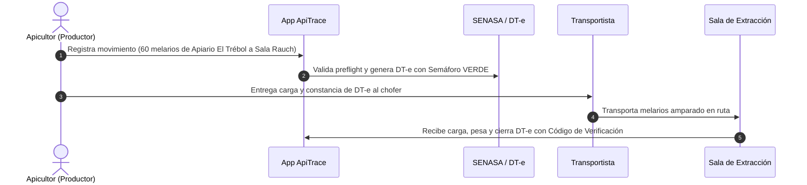

# Manual de Usuario ApiTrace — 01. Perfil Productor Apícola

Este manual está destinado a los **apicultores y productores apícolas** responsables del manejo de las colmenas en el campo, la cosecha de melarios y el despacho de las cargas hacia las salas de extracción habilitadas.

---

## 1. Tu Misión en la Cadena Apícola

Como productor apícola, vos sos el **eslabón inicial y el más importante** de toda la trazabilidad. Lo que hacés en el campo define la calidad y el origen de la miel:
1. Identificás exactamente de qué **apiario** provienen los panales cosechados.
2. Garantizás que tus cajones y colmenas estén asentados en predios con **RENSPA** oficial.
3. Declarás el **traslado de melarios** antes de que el camión salga a la ruta, amparado por el **DT-e de SENASA**.

---

## 2. Tu Panel Principal de Inicio (Dashboard)

Cuando iniciás sesión como Productor, la pantalla principal te muestra de un vistazo el estado de tu explotación:

En las tarjetas superiores vas a ver:
* **Movimientos**: Cantidad de traslados registrados en tu ámbito.
* **Apiarios**: Número de colmenares activos que tenés declarados.
* **Establecimientos**: Los campos o estancias donde tenés asentadas tus colmenas.
* **Por enviar**: Si estuviste cargando datos sin señal en el monte, acá ves cuántas operaciones están esperando volver a tener conexión para enviarse solas.

---

## 3. Gestión de tus Apiarios (Colmenares)

El apiario es el conjunto de colmenas ubicado en un punto geográfico concreto. Para que la miel sea 100% trazable, cada alza cosechada debe saber de qué apiario salió.

### Cómo dar de alta un nuevo Apiario
1. En el menú lateral hacé clic en **Apiarios**.
2. Presioná el botón azul **"Nuevo apiario"**.

3. Completá los datos del formulario:
   * **Código de apiario**: Una identificación corta y clara (ej: `AP-TREBOL-01` o `API-SUR`).
   * **Nombre**: Nombre descriptivo para que lo reconozcas fácilmente (ej: `Apiario El Trébol - Lote Bajo`).
   * **Establecimiento**: Seleccioná el predio rural (RENSPA) donde está ubicado. *(Nota: El predio debe estar previamente registrado en la sección Establecimientos)*.
   * **Cantidad de colmenas**: Número de cajones activos en ese colmenar (ej: `65`).
   * **Coordenadas GPS (Latitud y Longitud)**: Podés copiarlas desde Google Maps en tu teléfono (ej: Latitud `-37.3214`, Longitud `-59.1345`). Esto demuestra la pureza del entorno ambiental ante compradores extranjeros.
4. Presioná **"Guardar apiario"**.

---

## 4. Tu RENAPA y la Delegación ante SENASA / ARCA

Para que el sistema pueda tramitar automáticamente los permisos de tránsito (DT-e) en tu nombre, necesitás tener cargado tu RENAPA y haber realizado la delegación digital en la página de AFIP/ARCA.

### A. Asociar tu número de RENAPA
1. En el menú lateral hacé clic en **Mis datos** (o **Productores**).
2. Buscá tu nombre y presioná el botón **"RENAPA"**.
3. Ingresá el número oficial otorgado por la Secretaría de Bioeconomía (ej: `BA-12049`) y la fecha de vencimiento que figura en tu constancia.

### B. Delegación Fiscal (Formulario 3283/E)
El DT-e se emite ante SENASA con tu CUIT apícola. Para que ApiTrace pueda conectarse en tu nombre, debés ingresar a la página web de ARCA/AFIP con tu Clave Fiscal y delegar el servicio **"SIGSA - Trámites en Línea"** a la CUIT de la cooperativa o proveedor tecnológico.
* En ApiTrace podés consultar el estado de tu delegación haciendo clic en **"Delegación SENASA"** en tu ficha de productor.

---

## 5. Cómo Despachar una Carga de Melarios (Paso a Paso)

Este es el proceso cotidiano más importante que vas a realizar durante la cosecha.

### Paso 1: Datos de lo que se traslada
1. En el menú hacé clic en **Movimientos** y luego en **"Nuevo movimiento"**.
2. **Qué se traslada**: Seleccioná `Material melario` (alzas con cuadros operculados).
3. **Cantidad**: Indicá la cantidad de alzas cosechadas (ej: `80`).
4. **Unidad**: Seleccioná `ALZA` o `KG`.

### Paso 2: Origen, Destino y Fechas
1. **Sale de**: Elegí el establecimiento rural donde están las colmenas.
2. **Apiario de origen**: Seleccioná el apiario específico (ej: `Apiario El Trébol`). *¡Esto es fundamental para que la miel conserve su trazabilidad de origen!*
3. **Llega a**: Seleccioná la **Sala de Extracción** habilitada a la que vas a enviar los melarios.
4. **Fecha del traslado**: Indicá el día y la hora en que el camión o camioneta va a salir a la ruta.

### Paso 3: Chofer y Vehículo
1. **Conductor**: Nombre y apellido del chofer (ej: `Roberto Gómez`).
2. **Documento del conductor**: DNI del chofer.
3. **Observaciones**: Anotaciones útiles (ej: *"Carga cubierta con lona sanitaria limpia"*).
4. Presioná **"Crear movimiento"**.

---

## 6. Control del Semáforo de Tránsito en Ruta

Una vez creado el movimiento, la pantalla te muestra el **Detalle del Movimiento**:

* Si la normativa exige DT-e oficial, el sistema lo emite automáticamente o te permite cargarlo.
* Verás el **Semáforo de Tránsito**:
  * 🟢 **Verde**: El vehículo tiene autorización plena para circular. Podés imprimir la constancia o mostrarla en la pantalla del celular si te detiene un control caminero.
  * 🟡 **Amarillo**: El documento vence pronto. Avisale al chofer que debe ingresar a la sala antes del horario límite.

---

## 7. Consejos de Oro para el Productor

> [!TIP]
> **Consejo 1: Guardá tus patentes en Configuración**
> Ingresá al menú **Configuración** (`/settings`) y cargá la patente de tu camioneta y de tu carro habitual. De esa forma, cada vez que hagas un traslado, esos campos se completarán solos sin que tengas que escribirlos de nuevo.

> [!TIP]
> **Consejo 2: No esperes a tener señal para anotar**
> Cuando termines de cargar las alzas en el campo, abrí la app y cargá el movimiento inmediatamente. No importa que no haya señal: la app lo guarda en tu teléfono y lo enviará en cuanto pises la ruta asfaltada.

> [!CAUTION]
> **Consejo 3: No mezcles alzas de apiarios distintos en el mismo viaje sin avisar**
> Si vas a cosechar dos apiarios distintos en la misma jornada, hacé dos movimientos separados en la app. Eso permite demostrar la pureza botánica y garantiza que no se corte la trazabilidad.

---

## 8. Preguntas Frecuentes del Productor

### ¿Qué pasa si cosecho menos o más alzas de las que había calculado?
No te preocupes. La sala de extracción pesa la carga al recibirla en báscula. Si declaraste 80 alzas y llegaron 78, la sala registrará una *Recepción con diferencia* anotando el peso real exacto.

### ¿Puedo anular un traslado si el camión no pudo salir por lluvia?
Sí. Mientras el movimiento esté en estado *Borrador* o *Despachado* sin haber llegado a destino, podés entrar al detalle del movimiento y presionar el botón rojo **"Cancelar movimiento"**, indicando el motivo (ej: *"Caminos de tierra intransitables por temporal"*).

### ¿Por qué la app me dice que el RENSPA está sin verificar?
Significa que el número fue cargado en el sistema local pero todavía no se cruzó con la base central de SENASA. La mercadería puede registrarse normalmente, pero asegurate de que el número esté bien escrito tal como figura en tu constancia papel.
