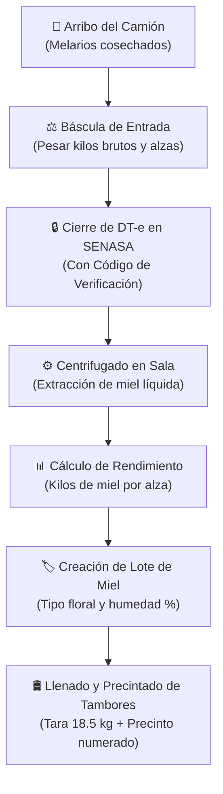
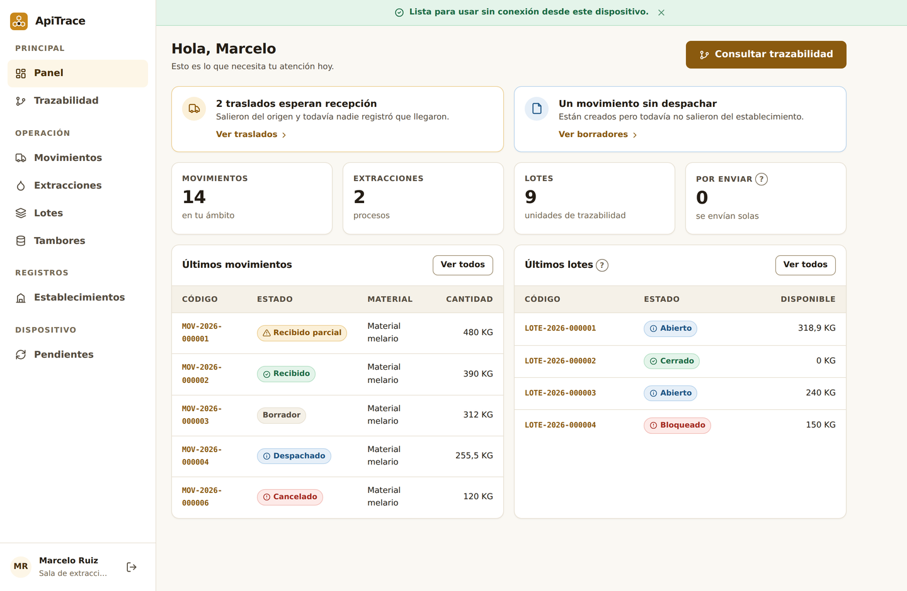
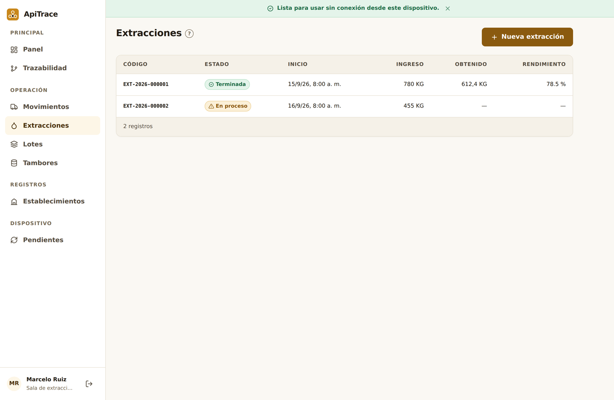
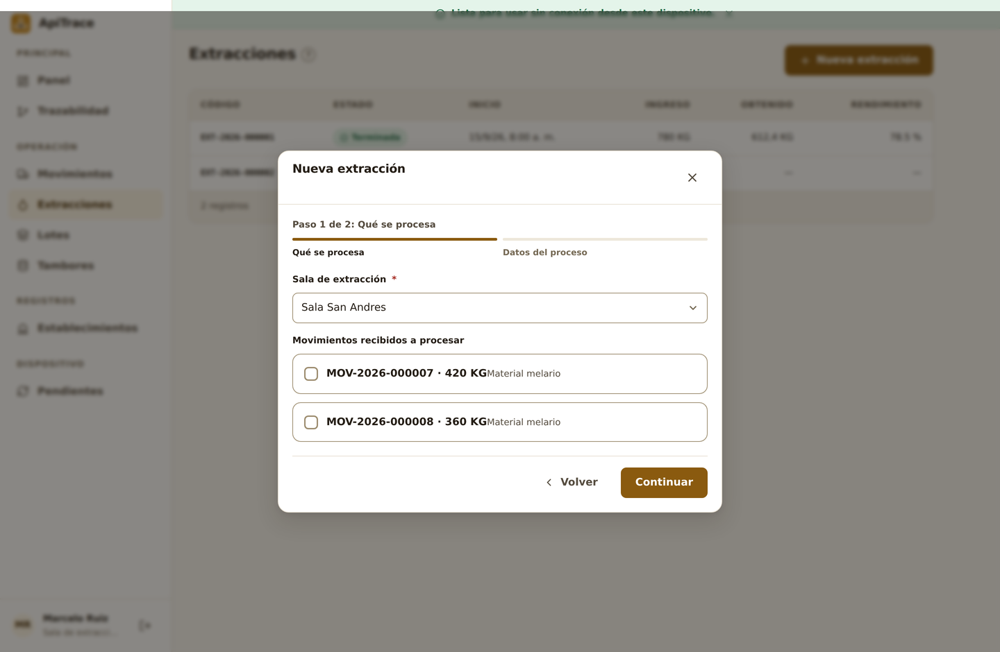
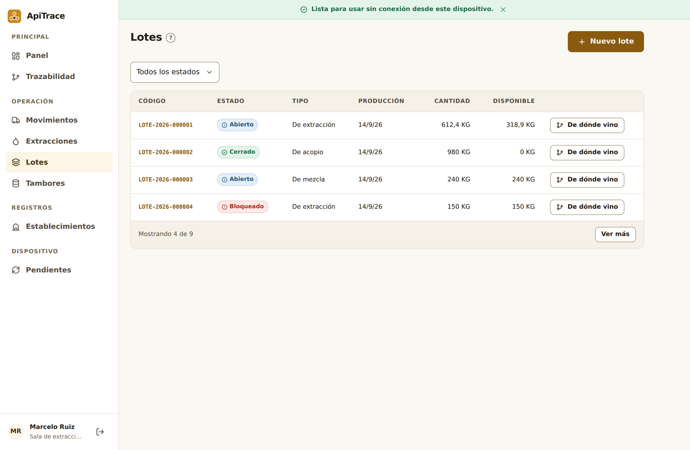
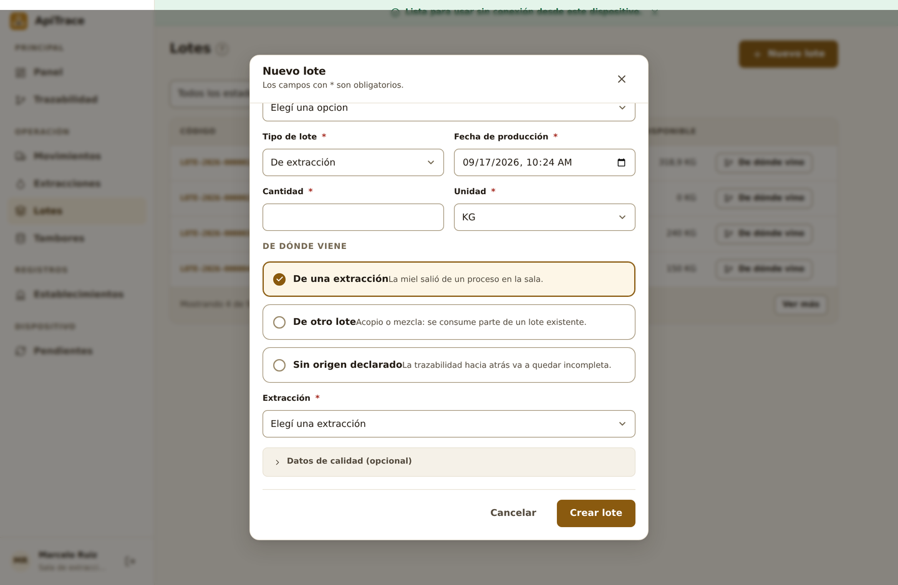
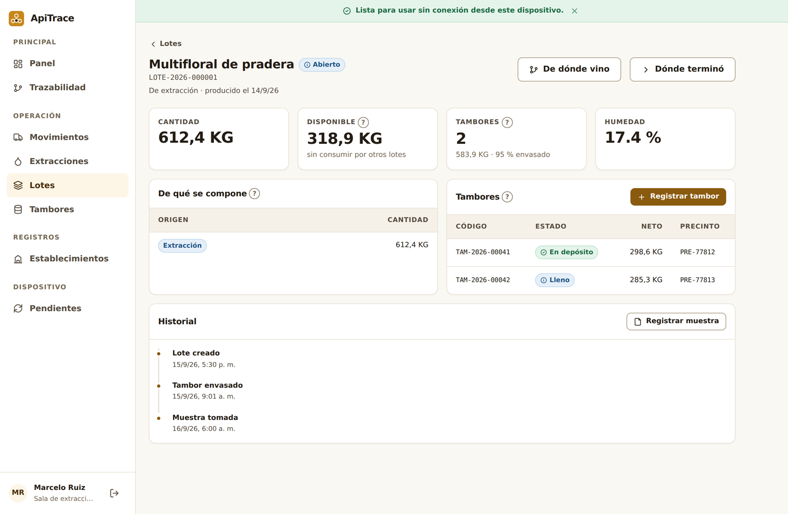
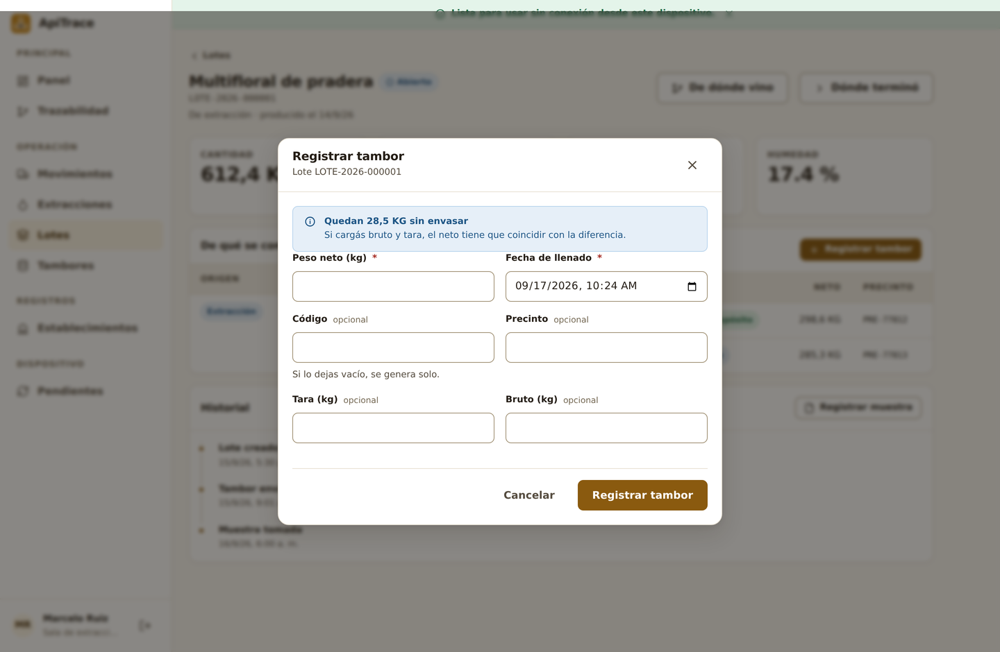
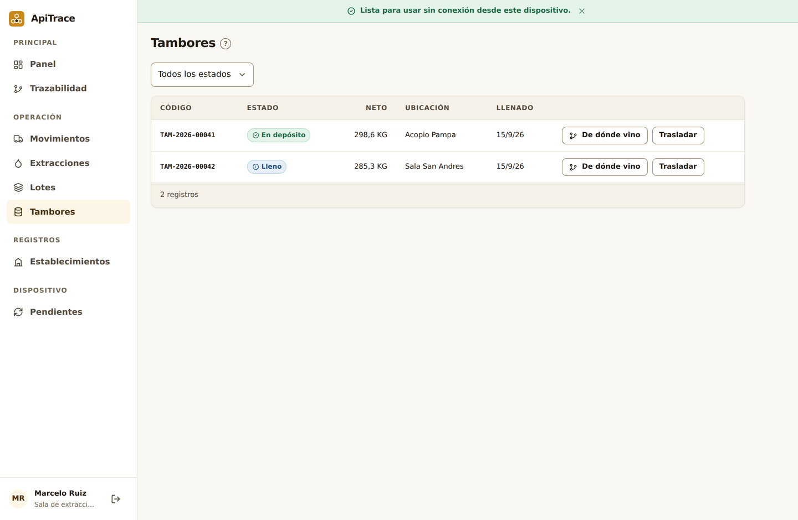

# Manual de Usuario ApiTrace — 02. Perfil Sala de Extracción de Miel

Este manual está diseñado para los **jefes de planta, encargados de báscula y operarios de salas de extracción de miel** habilitadas por SENASA.

---

## 1. Tu Rol en la Sala de Extracción

La sala de extracción es el **centro de transformación física** de la cadena apícola. En tus instalaciones ocurren tres momentos críticos de la trazabilidad:
1. **Recepción y Conformidad**: Recibís los melarios del camión, pesás la carga y **cerrás el DT-e oficial de SENASA** para liberar el transporte.
2. **Proceso de Extracción**: Desoperculás y centrifugás los cuadros para convertir los melarios en miel líquida decantada.
3. **Loteado y Envasado en Tambores**: Creás el lote de producción, pesás cada tambor en báscula (descontando la tara del envase) y colocás el **precinto de seguridad inviolable**.

---

## 2. El Panel de Control de la Sala

Al ingresar al sistema con el perfil de Sala, tu pantalla de inicio te muestra las métricas operativas del día:

* **Movimientos**: Traslados entrantes pendientes de recibir.
* **Extracciones**: Procesos de centrifugado realizados o en curso.
* **Lotes**: Partidas de miel extraída listas para tambores.
* **Tambores**: Inventario de tambores en depósito esperando flete.

---

## 3. Recepción de Cargas y Cierre del DT-e Oficial

Cuando el camión llega a la rampa de descarga de la sala:

### A. Registrar la Recepción Física
1. En el menú lateral hacé clic en **Movimientos**.
2. Buscá el traslado que está en estado `En camino` o `Despachado` y hacé clic para abrir su detalle.
3. En la tarjeta superior *"Siguiente paso"*, presioná el botón azul **"Registrar recepción"**.
4. Completá el formulario:
   * **Cantidad recibida**: Ingresá las alzas o kilos efectivamente descargados en la rampa.
   * **¿Hay diferencia?**: Si salieron 80 alzas del campo pero llegaron 75 (por ejemplo, por rotura o conteo erróneo en origen), tildá la opción y explicá el motivo. ApiTrace registrará la merma técnica de forma transparente.
5. Presioná **"Confirmar recepción"**.

### B. Cierre Oficial del DT-e ante SENASA
Para que el transportista quede liberado y el documento sanitario concluya formalmente:
1. En la tarjeta de **Documento Sanitario Oficial**, presioná **"Cerrar en sala"**.
2. **Código de Verificación SENASA**: Solicitale al chofer el código alfanumérico de 12 caracteres que figura impreso al pie de su DT-e (ej: `V4K9-2P8M-7X1Q`).
3. Ingresá el código y presioná **"Confirmar cierre"**. El estado del DT-e pasará inmediatamente a 🟢 **CERRADO**.

---

## 4. Cómo Registrar una Nueva Extracción

Una vez que los melarios están en la sala, es momento de procesarlos en la línea de desoperculado y centrifugado.

### Paso 1: Elegir los melarios a procesar
1. En el menú lateral hacé clic en **Extracciones**.
2. Presioná el botón verde **"Nueva extracción"**.
3. Seleccioná tu **Sala de extracción**.
4. En la lista de movimientos recibidos, **tildá los traslados que vas a vaciar en la centrífuga**. Podés seleccionar uno o varios movimientos si pertenecen a la misma partida.
5. Verificá la suma de alzas/kilos ingresados y presioná **"Continuar"**.

### Paso 2: Rendimiento y Miel Obtenida
1. Indicá la fecha y hora de inicio y fin del proceso.
2. Ingresá los **kilos netos de miel líquida obtenida** que salieron del extractor hacia los decantadores.
3. **Cálculo de Rendimiento**: El sistema calcula automáticamente los kilos por alza.
   * *Rango normal*: Entre 18 kg y 25 kg de miel por alza Langstroth.
   * Si rinde menos de 15 kg/alza, el sistema te advertirá para que verifiques si los cuadros venían poco cargados o si hubo miel retenida en la cera.
4. Presioná **"Finalizar extracción"**.

---

## 5. Creación del Lote de Miel

La miel que salió de la centrífuga debe agruparse en un **Lote** para que pueda ser analizada y envasada.

1. En el menú lateral hacé clic en **Lotes** y presioná **"Nuevo lote"**.
2. **De dónde viene**: Seleccioná **"De una extracción"** y elegí la extracción que acabás de completar.
3. **Datos de Calidad**:
   * **Tipo de miel**: Floración botánica (ej: `Multifloral de Pradera`, `Trébol`, `Eucalipto`).
   * **Humedad (%)**: Medición tomada con refractómetro calibrado (ej: `17.4%`). *El límite máximo legal para exportación es del 18.0% a 18.5%*.
   * **Color**: Clasificación visual o Pfund (ej: `Ámbar extra blanco`, `Ámbar claro`).
4. Presioná **"Crear lote"**.

---

## 6. Llenado y Precintado de Tambores

Con el lote creado, procedemos a envasar la miel en los tambores de exportación.

1. En el detalle del lote, presioná el botón **"Registrar tambor"**.
2. Completá la planilla de pesaje:
   * **Código de tambor**: Código único rotulado en el tambor (ej: `TAM-2026-0841`).
   * **Peso bruto**: Lo que marca la báscula con el tambor lleno (ej: `351.5 kg`).
   * **Tara del tambor**: Lo que pesa el envase vacío con tapa y aro (habitual: `18.5 kg`).
   * **Peso neto**: Se calcula automáticamente restando la tara (`333.0 kg`).
   * **Número de Precinto**: El código irrepetible del precinto plástico inviolable colocado en el aro (ej: `SENASA-B-994120`).
3. Presioná **"Guardar tambor"**.

> [!IMPORTANT]
> **Balance de Masas**:
> La suma de los pesos netos de todos los tambores envasados **no puede superar** la cantidad total declarada en el lote. Cada tambor que cargás descuenta automáticamente de la *Cantidad Disponible* del lote.

---

## 7. Despacho de Tambores hacia el Acopio o Depósito

Cuando el camión de larga distancia viene a retirar los tambores:
1. En el menú lateral hacé clic en **Tambores**.
2. Buscá el tambor que va a viajar y presioná el botón **"Trasladar"**.
3. Seleccioná el establecimiento de destino (Depósito o Acopio comercial), la fecha del flete y confirmá la operación.

---

## 8. Consejos Prácticos para la Sala de Extracción

> [!TIP]
> **Configurá tu Tara Predeterminada**:
> En el menú **Configuración** (`/settings`), ingresá el peso de los tambores vacíos que usa habitualmente tu sala (por ejemplo, `18.5 kg`). Así, cada vez que peses un tambor, la tara se cargará sola ahorrándote tiempo.

> [!WARNING]
> **Nunca cierres un DT-e sin verificar el Código**:
> El Código de Verificación de 12 dígitos es la prueba legal de que la carga realmente ingresó a tu planta. No cierres documentos sin constatar que la mercadería física esté descargada en tus instalaciones.

---

## 9. Preguntas Frecuentes de la Sala

### ¿Puedo procesar melarios de dos apicultores distintos en la misma extracción?
No es recomendable. Para mantener la trazabilidad de origen y el pago justo por rendimiento a cada apicultor, cada lote de extracción debe procesar melarios de un único productor.

### ¿Qué hago si la humedad de la miel da más del 18.5%?
El sistema te permitirá crear el lote, pero marcará una advertencia de calidad. Esa miel no podrá ser rotulada para exportación directa a la Unión Europea hasta que sea deshumidificada o mezclada de forma controlada en un proceso de homogeneización autorizado.
