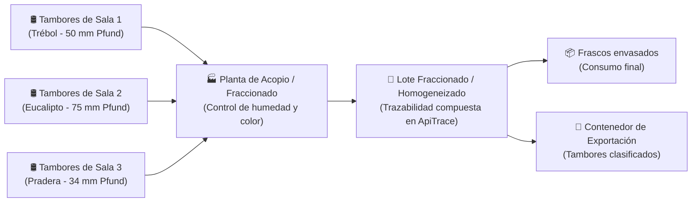
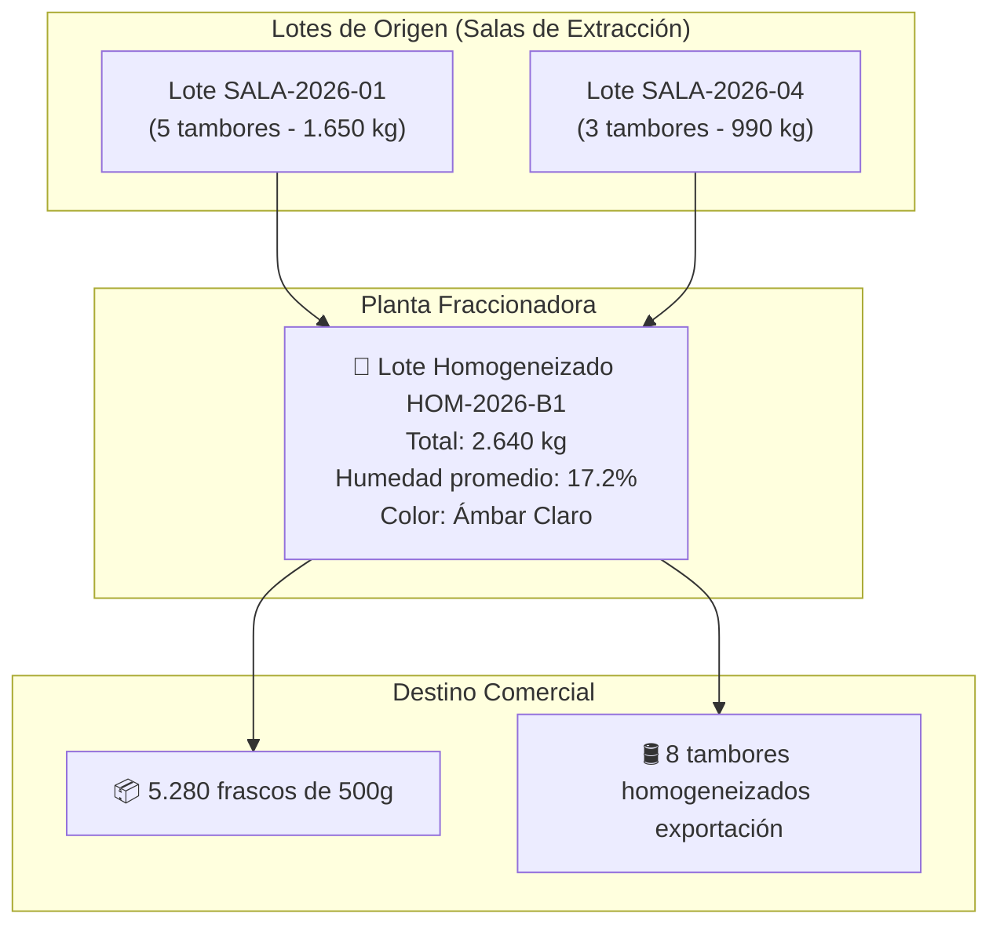

# Manual de Usuario ApiTrace — 03. Perfil Acopiador y Fraccionador

Este manual está destinado a los **responsables de depósito, jefes de acopio, encargados de mezclas y envasadores** que gestionan miel a granel o fraccionada en plantas de acopio, homogeneizado y fraccionamiento.

---

## 1. ¿Qué es un Acopiador y qué es un Fraccionador?

Si sos nuevo en el negocio de la miel, es fundamental entender la diferencia entre estas dos funciones:

* **Acopiador**: Es el operador comercial que compra tambores de miel ya extraída a múltiples salas de extracción o cooperativas. Su función es concentrar grandes volúmenes en galpones habilitados, clasificar la miel por calidad (color, humedad, origen botánico) y consolidar cargamentos para exportadores o industrias.
* **Fraccionador**: Es la planta industrial que toma la miel de los tambores de 300 kg, la calienta suavemente a baño maría (sin superar los 45°C para no dañar sus enzimas), la filtra, y:
  * O bien la **envasa en envases comerciales** (frascos de vidrio, potes de plástico de 250g, 500g o 1 kg) para supermercados y dietéticas.
  * O bien realiza un **homogeneizado (blending)**: mezcla varios tambores para obtener un lote uniforme con un color Pfund y humedad exacta solicitados por un comprador internacional.

---

## 2. Recepción de Tambores en Planta

Cuando un camión arriba con tambores procedentes de una sala de extracción, el operador de acopio debe verificar física y digitalmente cada unidad.

### A. Inspección Física del Tambor
Antes de ingresar al sistema, el operario debe corroborar:
1. **Precinto de seguridad**: Que el número de precinto plástico/metálico coincida exactamente con el registrado en el remito y no esté roto ni manipulado.
2. **Identificación exterior**: Que tenga la etiqueta o esténcil con el número de lote y sala de extracción habilitada.
3. **Estado del envase**: Que no tenga abolladuras graves ni pérdidas de miel por los zunchos de la tapa.

### B. Registrar la Recepción en ApiTrace
1. En el menú lateral hacé clic en **Movimientos**.
2. Localizá el traslado de tambores que viene hacia tu planta y hacé clic sobre él.
3. Presioná el botón **"Registrar recepción"**.
4. Verificá que la cantidad de tambores recibidos coincida con la despachada.
5. Si todos los precintos y pesos son correctos, confirmá la recepción.
6. En la sección **Tambores**, las unidades pasarán automáticamente al estado 🟢 **EN_DEPOSITO**.

---

## 3. Parámetros de Calidad Clave en Acopio

La miel se clasifica y valoriza según dos variables fundamentales que debés tener en cuenta al crear o mezclar lotes:

| Parámetro | Unidad / Rango | Importancia comercial y legal |
| :--- | :--- | :--- |
| **Humedad** | **Porcentaje (%)** Ideal: 16.5% - 17.5% Máximo legal: **18.0%** | Si supera el 18%, la miel contiene demasiada agua libre y las levaduras naturales pueden multiplicarse, **fermentando el producto** y arruinando el lote. Mieles con >18% no se pueden exportar a la Unión Europea ni a EE.UU. |
| **Color (Escala Pfund)** | **Milímetros (mm)** 0 a 140 mm | Determina el precio internacional. Las mieles claras (Water White, Extra White) son muy cotizadas para endulzar sin teñir, mientras que las oscuras (Light Amber, Amber) tienen sabores más intensos. |

### Clasificación Pfund de Colores:
* `0 - 8 mm`: Blanco Agua (Water White)
* `9 - 17 mm`: Extra Blanco (Extra White)
* `18 - 34 mm`: Blanco (White)
* `35 - 50 mm`: Ámbar Extra Claro (Extra Light Amber)
* `51 - 85 mm`: Ámbar Claro (Light Amber)
* `86 - 114 mm`: Ámbar (Amber)
* `> 114 mm`: Oscuro (Dark)

---

## 4. Creación de Lotes Secundarios (Mezclas o Blending)

Cuando mezclás varios tambores de distintos orígenes para estandarizar color o envasar, en ApiTrace debés crear un **Lote Secundario** que hereda la trazabilidad de todos los lotes que lo componen.

### Paso a paso para crear un Lote Secundario:
1. En el menú lateral hacé clic en **Lotes**.
2. Presioná el botón azul **"Nuevo lote"**.
3. En el selector de tipo de lote, elegí **"Lote a partir de lotes existentes (Mezcla/Fraccionado)"**.
4. **Nombre / Código del Lote**: Asignale un código identificatorio interno (ej: `LOT-HOMOG-2026-01`).
5. **Seleccionar lotes de origen**:
   * Marcá los lotes de extracción que se van a incorporar al tanque de homogenizado.
   * El sistema irá sumando los kilogramos disponibles.
6. **Parámetros del nuevo lote**:
   * **Tipo floral**: `Multifloral`, `Monofloral Trébol`, `Monte Nativo`, etc.
   * **Humedad resultante (%)**: El valor medido con refractómetro calibrado en el tanque mezclador (ej: `17.1%`).
   * **Color Pfund (mm)**: Lectura obtenida en el fotómetro o comparador óptico.
7. Presioná **"Crear lote secundario"**.

> [!NOTE]
> **Integridad de Trazabilidad Garantizada**: ApiTrace guarda de manera inalterable los identificadores de todos los tambores originales que entraron a la mezcla. Si un comprador internacional o SENASA audita el frasco final, el sistema desplegará el árbol completo hasta llegar a las colmenas de origen de cada apicultor.

---

## 5. Control y Gestión de Tambores en Depósito

En la vista de **Tambores**, podés filtrar tu inventario según su situación operativa:

* **En depósito (Verde)**: Tambor listo para ser muestreado, comercializado o fraccionado.
* **Reservado (Amarillo)**: Tambor asignado a una orden de venta o a un lote de fraccionado que está en proceso.
* **Fraccionado / Vaciado (Azul)**: Tambor que ya fue vaciado en el tanque de homogenizado. Su miel sigue viva en el lote nuevo, pero el tambor físico queda disponible para lavado.
* **Despachado (Gris)**: Tambor que salió de la planta con rumbo al puerto o cliente mayorista.

---

## 6. Despacho a Puerto o Distribuidora

Cuando vendas un lote de tambores o pallets de frascos:

1. Ingresá a **Movimientos** > **"Nuevo movimiento"**.
2. **Qué se traslada**: Seleccioná `Miel en tambor` o `Miel fraccionada`.
3. **Origen**: Seleccioná tu planta de acopio/fraccionado.
4. **Destino**: Seleccioná el depósito fiscal de aduana, terminal portuaria o centro de distribución del cliente.
5. **Asignación de tambores**: Seleccioná los números de serie o precintos de los tambores que componen la carga.
6. **DT-e de Tránsito**: ApiTrace tramitará el documento sanitario para el camión de larga distancia, vinculando todos los precintos involucrados.

---

## 7. Consejos de Oro para el Acopiador

> [!TIP]
> **1. Calibración del refractómetro**: Verificá la calibración de tu refractómetro óptico o digital todas las mañanas antes de tomar muestras de recepción. Una lectura errónea de 0.5% puede hacerte aceptar miel que luego fermente en el depósito.

> [!WARNING]
> **2. Temperatura máxima de calentamiento**: Al descristalizar miel para fraccionado, asegurate de que las camisas de agua caliente no superen los 45°C. Superar esta temperatura genera **HMF (Hidroximetilfurfural)**, un compuesto que indica degradación térmica y que provoca el rechazo automático en laboratorios de exportación.

> [!IMPORTANT]
> **3. Registro inmediato de precintos cortados**: Al momento de cortar el precinto de un tambor para volcarlo al tanque de mezcla, cambialo de estado a `FRACCIONADO` en ApiTrace. Mantener tambores "abiertos" como si siguieran llenos genera desajustes graves en las auditorías de stock de SENASA.
