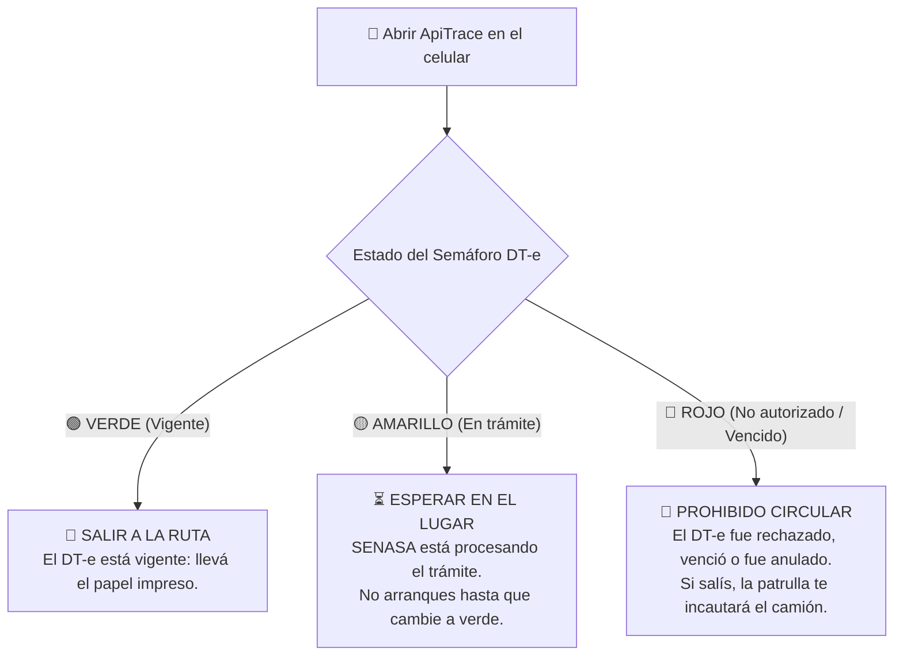
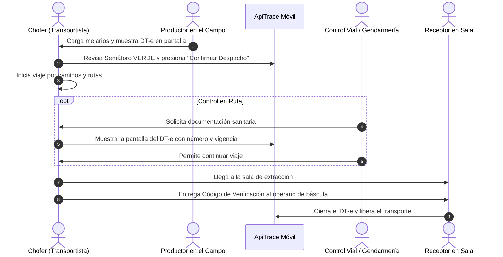

# Manual de Usuario ApiTrace — 04. Perfil Transportista y Logística en Ruta

Este manual está especialmente orientado a los **choferes de camiones, camionetas y fleteros rurales** encargados de trasladar material apícola (alzas con melarios) o miel a granel (tambores de 300 kg) por caminos rurales y rutas nacionales.

---

## 1. Tu Responsabilidad Legal en la Ruta

En el transporte de miel y colmenas, **la carga viaja bajo la responsabilidad del transportista** desde que sale de la tranquera del campo hasta que ingresa a la sala de extracción o planta de acopio.

En las rutas argentinas, organismos como **Gendarmería Nacional, Policía de Seguridad Vial y Patrullas Sanitarias de SENASA** realizan controles permanentes. Viajar sin la documentación en regla puede ocasionar:
* Retención del vehículo y de la carga al costado de la ruta.
* Multas económicas severas para el titular del camión y para el productor.
* Pérdida o descomposición de la carga por demoras bajo el sol.

> [!IMPORTANT]
> **La Regla de Oro del Transportista**: **NUNCA salgas a la ruta sin verificar que el Semáforo de Tránsito en ApiTrace esté en 🟢 VERDE (AUTORIZADO).**

---

## 2. El Semáforo de Tránsito: Tu Guía Antes de Arrancar

Antes de poner primera y salir a la ruta, abrí la aplicación ApiTrace en tu celular y mirá el indicador del traslado asignado:

### ¿Qué significa cada color?
* 🟢 **VIGENTE (Verde)**: El DT-e tiene número y está dentro de su período de vigencia (desde la fecha de carga hasta la de vencimiento). Es el único estado que ampara el tránsito, y siempre con la representación impresa del DT-e en la cabina.
* 🟡 **EN TRÁMITE / PREFLIGHT (Amarillo)**: El productor o la sala cargaron los datos, pero SENASA aún está validando las CUITs o el pago de aranceles. Si arrancás en este estado y te para un control, figurás como infractor.
* 🔴 **NO AUTORIZADO / VENCIDO (Rojo)**: La operación no tiene validez legal. Ocurre si el establecimiento de destino está clausurado sanitariamente, si el productor tiene el RENSPA vencido, o si pasaron los días de vigencia del viaje sin haber arribado a destino.

---

## 3. Uso de la App en el Teléfono Móvil (PWA)

ApiTrace está diseñada para funcionar como una aplicación liviana en cualquier teléfono Android o iPhone, incluso en zonas rurales sin señal celular.

### Cómo guardar la App en la pantalla de inicio de tu celular
1. Abrí Google Chrome (en Android) o Safari (en iPhone) e ingresá a la dirección web de ApiTrace.
2. Tocá los tres puntitos del navegador (o el botón compartir en iPhone).
3. Seleccioná **"Instalar aplicación"** o **"Agregar a pantalla de inicio"**.
4. ¡Listo! Ahora tenés el ícono de ApiTrace como si fuera WhatsApp, con acceso instantáneo.

---

## 4. Paso a Paso del Viaje: Desde la Carga hasta el Destino

### Paso 1: En el campo de origen (Control antes de cargar)
1. **Contar bultos**: Verificá que la cantidad de alzas cargadas en la caja del camión coincida con la que figura en la aplicación (ej: 90 alzas).
2. **Revisar ataduras**: Asegurate de que la carga esté zunchada y encarpada adecuadamente para evitar pérdidas en caminos de tierra o ripio.
3. **Confirmar despacho**: Abrí el movimiento en ApiTrace y presioná el botón azul **"Confirmar despacho"**. Con esta acción, el estado del traslado pasa a `En camino` y queda asentada la hora exacta de salida.

### Paso 2: Si te detiene un control de tránsito o SENASA
Cuando los inspectores de ruta te pidan la guía o documento de amparo:
1. Abrí ApiTrace en tu celular y mostrales la pantalla del **Detalle del Movimiento**:
   * **Número de DT-e** (ej: `022440451-4`).
   * **Vigencia**: Fecha y hora límite de validez.
   * **Origen y Destino**: Nombres de los establecimientos y números de RENSPA.
   * **Código de Verificación**: Serie alfanumérica de seguridad para que el inspector valide la autenticidad en el sistema central de SENASA.
2. El documento que vale en el control es el **DT-e impreso** que te entregó el productor antes de salir: SENASA exige llevarlo en la cabina. La app sirve para consultar los datos, no lo reemplaza.

> [!TIP]
> **¿Qué pasa si no hay señal 4G en el control de ruta?**
> No te preocupes: Si abriste el movimiento en tu celular antes de salir del pueblo o del campo con señal, **ApiTrace guarda la información en la memoria de tu teléfono**. La pantalla del DT-e se abrirá con el número, la vigencia y los datos de la carga aunque no tengas ni una raya de señal. El documento que se exhibe en un control sigue siendo el impreso.

### Paso 3: Al llegar a la Sala de Extracción o Acopio
1. Acercá el camión a la báscula de pesaje.
2. Entregale al encargado de la planta tu número de movimiento y el **código de cierre** que figura impreso al pie de tu DT-e.
3. El encargado ingresará ese código en su computadora para cerrar el DT-e en el sistema nacional.
4. Una vez cerrado el documento, tu camión queda legalmente libre de esa carga para emprender el siguiente flete.

---

## 5. Transporte de Tambores de Miel (Cargas a Granel)

Cuando transportás tambores de miel de 300 kg (por ejemplo, desde una sala de extracción hacia un depósito de acopio o puerto):

1. **Inspección de precintos**: Cada tambor tiene un precinto de seguridad plástico o metálico numerado colocado en el zuncho de la tapa. Verificá que ningún precinto esté cortado o adulterado.
2. **Carga y estiba**: Los tambores deben viajar parados sobre pallets firmes y debidamente trabados con fajas de amarre reglamentarias. La miel es muy densa (1.4 kg por litro) y el movimiento del líquido en curvas puede desestabilizar el vehículo si no está bien asegurada.
3. **Control de remito**: Verificá en ApiTrace que la lista de números de tambores coincida con los que tenés cargados en la carrocería.

---

## 6. Respuestas Rápidas para el Chofer ("Qué hacer si...")

* **¿Qué hago si se me pincha una rueda o se me rompe el camión y se me vence el DT-e?**
  * Comunicate de inmediato con el productor o la sala para que soliciten una prórroga o justificación de contingencia en ApiTrace antes de que el semáforo cambie a rojo.
* **¿Qué pasa si la sala receptora está cerrada cuando llego a la noche?**
  * Estacioná en el predio habilitado de la sala. No descargues los melarios ni los tambores en galpones particulares no registrados, ya que romperías la cadena de custodia de la trazabilidad.
* **¿Puedo transportar melarios de dos productores distintos en el mismo viaje?**
  * Sí, siempre y cuando tengas en tu aplicación **dos movimientos independientes con sus respectivos DT-e autorizados**, y los cajones de cada productor estén claramente separados físicamente en la caja del camión.
