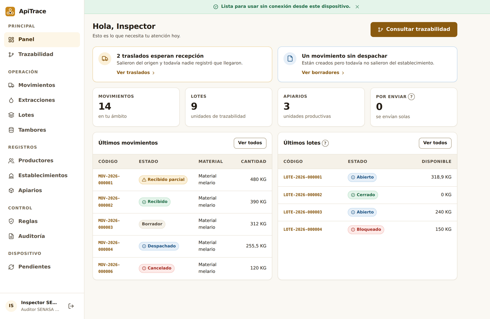
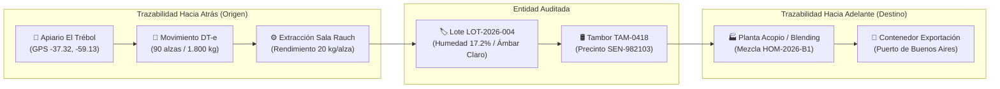
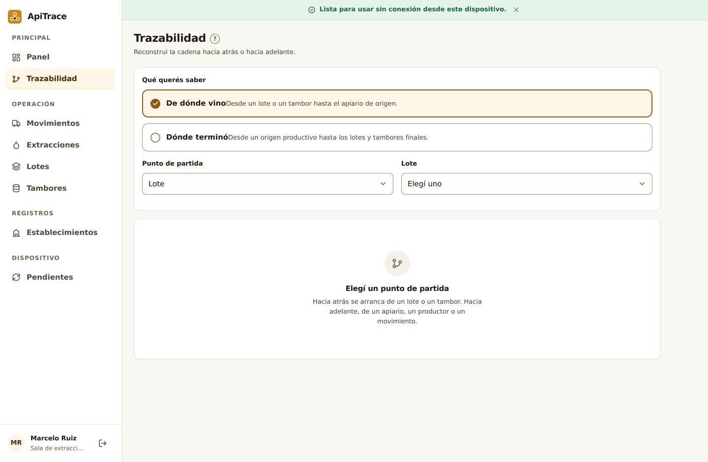
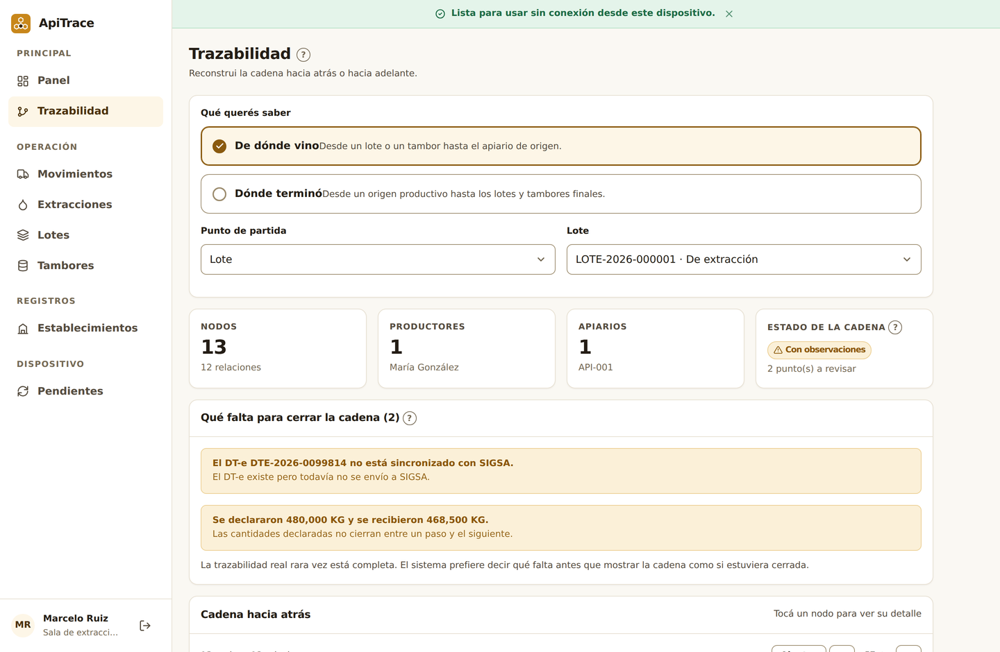
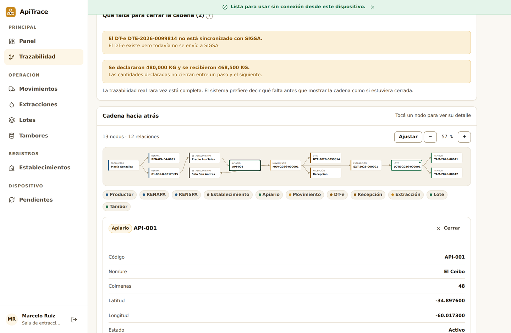
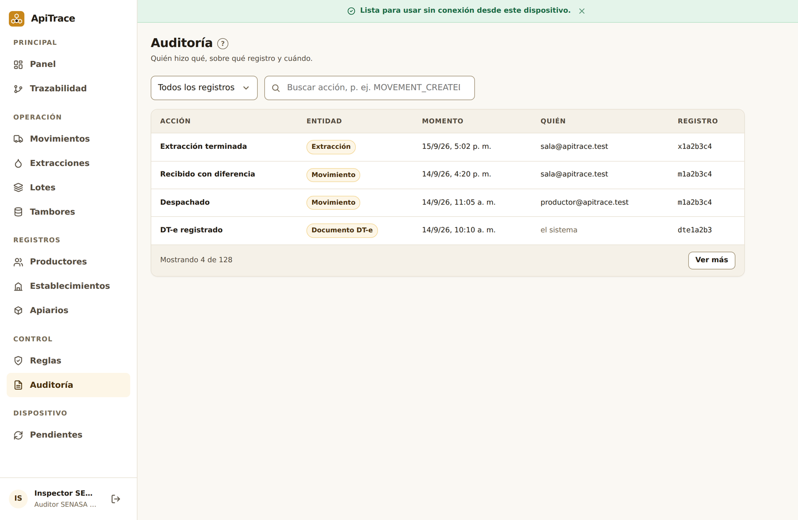

# Manual de Usuario ApiTrace — 05. Perfil Auditor, Inspector y Laboratorio

Este manual está diseñado para **inspectores de organismos sanitarios (SENASA, Bromatología provincial), auditores de normas de certificación (Orgánico, Kosher, Halal, Fair Trade, True Source Honey) y analistas de laboratorio físico-químico**.

---

## 1. El Rol de la Auditoría en la Cadena de la Miel

La miel argentina es un producto de exportación de prestigio mundial. Para acceder a los mercados más exigentes (Unión Europea, Estados Unidos, Japón), cada lote debe demostrar **integridad biológica y legal total**.

El rol del auditor y del analista de laboratorio es:
1. **Verificar la Cadena de Custodia**: Comprobar que ningún gramo de miel haya ingresado al circuito sin un origen claro, un DT-e de tránsito válido y una sala de extracción habilitada.
2. **Detectar Huecos de Trazabilidad (Traceability Gaps)**: Identificar discrepancias de peso, rendimientos anómalos o tambores "fantasma".
3. **Vincular Análisis de Laboratorio**: Registrar y controlar que los parámetros de pureza (humedad, HMF, ausencia de antibióticos y adulterantes de azúcar C4) cumplan con las resoluciones de SENASA y del Código Alimentario Argentino (CAA).
4. **Emitir Dictámenes Técnicos**: Aprobar o bloquear lotes sospechosos para proteger a los consumidores y la reputación comercial del país.

---

## 2. El Panel de Control del Auditor

Al iniciar sesión con credenciales de auditor o inspector, la pantalla principal te brinda una visión panorámica de cumplimiento:

En este tablero vas a encontrar:
* **Índice de Trazabilidad Global**: Porcentaje de lotes que cuentan con su árbol documental completo sin advertencias.
* **Lotes en Cuarentena**: Partidas que presentan alguna discrepancia de peso o están a la espera de resultados de laboratorio.
* **Alertas Documentales**: Avisos sobre DT-e vencidos o diferencias entre kilos declarados en origen y recibidos en destino.
* **Acceso Directo al Motor de Trazabilidad**: Herramienta gráfica para reconstruir la historia de cualquier producto en segundos.

---

## 3. El Grafo Interactivo de Trazabilidad (Herramienta Estrella)

El motor gráfico de ApiTrace permite rastrear cualquier producto tanto hacia el pasado (aguas arriba) como hacia el futuro (aguas abajo).

### Cómo realizar una consulta de trazabilidad:
1. En el menú lateral hacé clic en **Trazabilidad**.
2. Ingresá el identificador que querés auditar:
   * **Número de precinto de tambor** (ej: `SEN-982103`).
   * **Código de lote** (ej: `LOT-2026-004`).
   * **Número de DT-e oficial de SENASA** (ej: `26-004-9281740-1`).
   * **RENSPA del productor o sala**.
3. Presioná el botón azul **"Rastrear"**.

### Interpretación del árbol visual resultante
El sistema dibujará un diagrama interactivo con todos los nodos conectados cronológicamente:

* **Hacé clic en cualquier nodo**: Se desplegará un panel lateral con los metadatos completos del evento (fecha, hora, operario responsable, coordenadas geográficas, firmas digitales y documentos adjuntos).

### Los dos tipos de rastreo disponibles:
* **Trazabilidad Hacia Atrás (Backward Trace)**: Ideal cuando tenés un frasco de miel en una góndola o un tambor en el puerto y necesitás saber de qué campo, apiario y colmena provino la miel, qué camión la llevó y qué sala la extrajo.
* **Trazabilidad Hacia Adelante (Forward Trace / Recall)**: Vital ante un caso de contaminación sanitaria (por ejemplo, si se detecta un residuo de antibiótico en un apiario). Permite identificar instantáneamente todos los tambores, mezclas, clientes y contenedores que recibieron miel de ese apiario para emitir una orden de retiro inmediato del mercado (recall).

---

## 4. Detección y Análisis de "Huecos de Trazabilidad" (Traceability Gaps)

Un "hueco de trazabilidad" es una rotura lógica en la cadena de custodia donde la miel no puede justificar su procedencia o donde los números no cierran matemáticamente.

### Discrepancias comunes que el auditor debe verificar:

| Alerta en ApiTrace | Causa habitual | Acción sugerida para el auditor |
| :--- | :--- | :--- |
| **Diferencia de peso origen vs destino > 5%** | Error de calibración en báscula, evaporación por calor excesivo, o merma no documentada. | Exigir los certificados de calibración INTI de las básculas de ambas plantas y el acta de pesada. |
| **Rendimiento superior a 35 kg/alza** | Alimentación artificial de las colmenas con jarabe de azúcar (fructosa de maíz o caña) durante la floración. | Ordenar inmediatamente análisis isotópico de azúcares C4 (EA-IRMS) en laboratorio acreditado. |
| **Tambor sin lote de extracción asignado** | Miel comprada "en negro" o ingresada desde circuitos informales no registrados. | Proceder a la interdicción preventiva del tambor y labrar acta de infracción sanitaria. |
| **Extracción con DT-e no cerrado en sala** | El camión descargó melarios pero el operario no ingresó el código de verificación oficial. | Solicitar al transportista el código impreso para regularizar el estado documental en SENASA. |

---

## 5. El Registro de Auditoría Inmutable (Audit Log)

Para garantizar que nadie dentro de la empresa ni en los organismos públicos pueda alterar los registros a posteriori, ApiTrace cuenta con un **Libro de Auditoría Inmutable**.

Cada vez que un usuario:
* Da de alta un lote o apiario,
* Modifica un peso o estado,
* Intenta cancelar un movimiento despachado,
* O inicia sesión en el sistema,

El sistema genera una entrada criptográficamente sellada que almacena:
1. **Marca temporal exacta (Timestamp ISO 8601)** al milisegundo.
2. **Usuario y CUIT responsable**.
3. **Dirección IP de conexión** y dispositivo utilizado.
4. **Copia de los datos anteriores y nuevos** (Diff de cambios).

> [!NOTE]
> Este registro no puede ser editado ni eliminado por ningún usuario del sistema, ni siquiera por el Administrador Supremo, garantizando validez probatoria ante auditorías judiciales o internacionales.

---

## 6. Módulo de Laboratorio y Control de Calidad

Los técnicos y analistas de laboratorio cargan los resultados analíticos para dictaminar la conformidad de los lotes antes de su comercialización:

### Parámetros Físico-Químicos Reglamentarios:
* **Humedad (Refractometría)**: Límite máximo según CAA y SENASA: **18.0%**. Mieles con mayor humedad se bloquean automáticamente en el sistema para evitar fermentación.
* **HMF (Hidroximetilfurfural)**: Máximo permitido: **40 mg/kg** (o 60 mg/kg en regiones tropicales). Un valor elevado indica miel vieja, sobrecalentada o adulterada.
* **Actividad Diastásica**: Mínimo **8 unidades Schade**. Refleja la frescura y conservación de las enzimas naturales de la abeja.
* **Contenido de Azúcares Aparentes**: Glucosa + Fructosa ≥ 65 g/100g. Sacarosa aparente ≤ 5 g/100g.

### Parámetros de Inocuidad y Residuos:
* **Antibióticos (Sulfonamidas, Nitrofuranos, Tetraciclinas, Cloranfenicol)**: Límite de detección: **0.0 ppb (CERO absoluto)**. El uso de antibióticos en colmenas está estrictamente prohibido en Argentina. La detección de trazas inhabilita el lote para consumo humano.
* **Plaguicidas y Acaricidas (Coumaphos, Amitraz, Glifosato)**: Deben encontrarse por debajo de los Límites Máximos de Residuos (LMR) establecidos por el país comprador.
* **Adulteración por Jarabes C4 / C3**: Análisis isotópico por espectrometría de masas (EA-IRMS / LC-IRMS) para descartar el agregado fraudulento de jarabe de maíz de alta fructosa (JMAF) o caña de azúcar.

---

## 7. Exportación de Expedientes Oficiales

Al finalizar la inspección, el auditor puede generar con un solo clic el **Expediente de Conformidad Sanitaria**:
* Hace clic en **"Exportar Dossier de Trazabilidad"**.
* El sistema compila en un documento PDF firmado digitalmente el árbol completo de movimientos, los certificados de DT-e involucrados, los números de precinto de tambores y los informes de laboratorio vinculados.
* Este archivo cuenta con un código QR verificable en línea por los inspectores de aduanas en los puertos de destino de todo el mundo.
