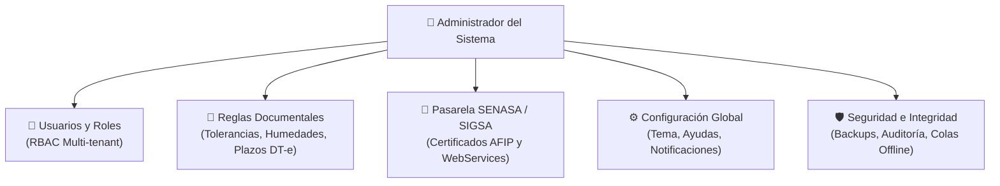
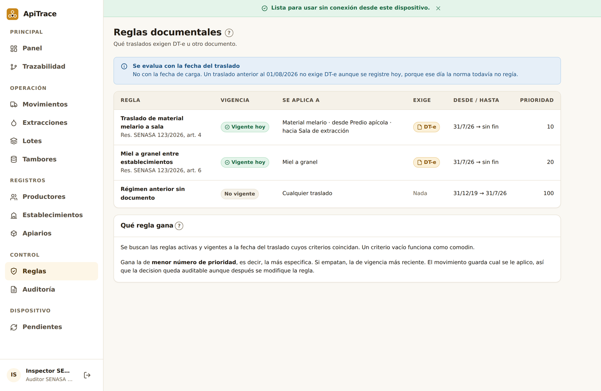
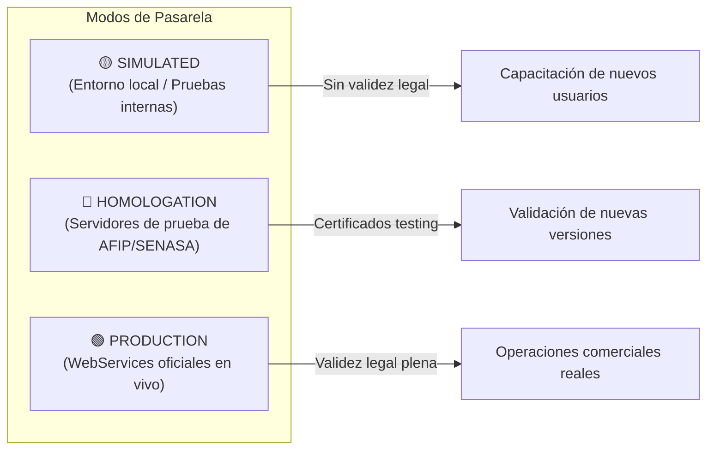
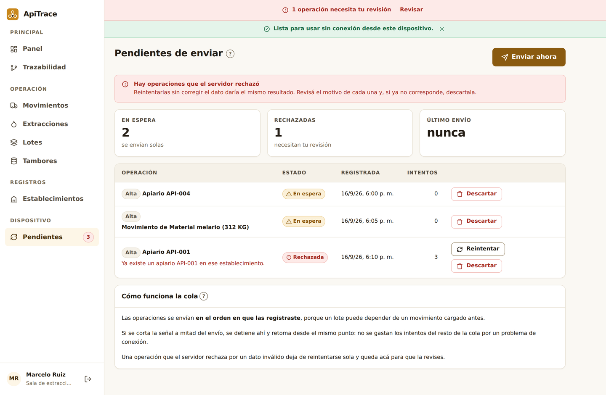

# Manual de Usuario ApiTrace — 06. Perfil Administrador del Sistema

Este manual está dirigido a los **administradores de plataforma, responsables de sistemas (TI), gerentes operativos de cooperativas apícolas y administradores de empresas exportadoras** que gestionan la parametrización técnica y funcional de ApiTrace.

---

## 1. Responsabilidades del Administrador de ApiTrace

Como Administrador, tenés el control total sobre la gobernanza y seguridad de la plataforma. Tus principales responsabilidades son:
1. **Administración de Entidades y Usuarios**: Dar de alta cooperativas, salas, productores y transportistas, asignando los roles correspondientes (RBAC).
2. **Gobernanza de Reglas Documentales**: Configurar tolerancias de pesaje, límites de humedad, rendimientos por alza y plazos de vigencia según la normativa vigente de SENASA.
3. **Gestión de Pasarelas SENASA / SIGSA**: Controlar el modo de conexión (Simulado, Homologación o Producción) y la renovación de certificados digitales de Clave Fiscal.
4. **Supervisión de Rendimiento y Sincronización**: Monitorear colas de transacciones offline, errores de comunicación y copias de seguridad de la base de datos.
5. **Configuración Global del Sistema**: Parametrizar las ayudas pedagógicas, temas visuales y preferencias institucionales desde el módulo de configuración.

---

## 2. Gestión de Usuarios, Organizaciones y Roles (RBAC)

ApiTrace implementa un esquema de seguridad basado en roles (**Role-Based Access Control**) con aislamiento seguro por organización (**Multi-tenant**).

### Matriz de Permisos por Rol:

| Función / Módulo | ADMIN | PRODUCTOR | SALA | ACOPIADOR | TRANSPORTISTA | AUDITOR |
| :--- | :---: | :---: | :---: | :---: | :---: | :---: |
| **Panel de Inicio (Dashboard)** | Global | Explotación | Planta | Depósito | En ruta | Métricas |
| **Apiarios y Establecimientos** | Total | Sus propios | Solo lectura | Solo lectura | ❌ | Auditoría |
| **Emisión de Movimientos (DT-e)**| Total | Origen campo | Origen sala | Origen acopio| ❌ | Solo lectura |
| **Confirmar Despacho en Ruta** | Total | ❌ | ❌ | ❌ | ✅ | ❌ |
| **Cierre de DT-e en Destino** | Total | ❌ | ✅ | ✅ | ❌ | ❌ |
| **Registro de Extracciones** | Total | ❌ | ✅ | ❌ | ❌ | Auditoría |
| **Lotes y Tambores** | Total | ❌ | ✅ | ✅ | ❌ | Auditoría |
| **Grafo de Trazabilidad** | Total | Acotado | Acotado | Acotado | ❌ | Total e Irrestricto |
| **Libro Inmutable de Auditoría**| Total | ❌ | ❌ | ❌ | ❌ | Inspección |
| **Reglas Documentales** | Edición | ❌ | ❌ | ❌ | ❌ | Solo lectura |

### Cómo crear un nuevo usuario y asignarle perfil:
1. En el menú de navegación hacé clic en **Usuarios**.
2. Presioná el botón azul **"Nuevo usuario"**.
3. Completá los campos:
   * **Nombre y Apellido**: Nombre completo del operador.
   * **Correo electrónico**: Será su identificador de inicio de sesión.
   * **CUIT / CUIL**: Fundamental para las declaraciones juradas de SENASA.
   * **Rol asignado**: Seleccioná el perfil operativo según las tareas que realizará.
   * **Organización / Establecimiento**: Vinculalo a la sala de extracción, cooperativa o empresa a la que pertenece.
4. Presioná **"Crear usuario"**. El sistema generará las credenciales seguras de acceso inicial.

---

## 3. Gobernanza de Reglas Documentales Dinámicas

A diferencia de otros sistemas donde las reglas de negocio están fijas en el código de programación, ApiTrace permite a los administradores ajustar las validaciones de manera ágil ante cambios en las resoluciones de SENASA o del Código Alimentario Argentino.

### Reglas clave configurables:

1. **Vigencia Máxima del DT-e (`DTE_MAX_DAYS`)**:
   * *Valor por defecto*: `5 días`.
   * Determina cuántos días corridos tiene el transportista para completar el viaje antes de que el documento sanitario caduque automáticamente.
2. **Tolerancia de Merma / Diferencia de Peso (`WEIGHT_DISCREPANCY_TOLERANCE_PCT`)**:
   * *Valor por defecto*: `3.0%`.
   * Si la diferencia entre los kilos declarados en el campo y los kilos pesados en la báscula de la sala supera este porcentaje, el sistema bloquea el cierre automático y exige registrar un descargo justificado.
3. **Límite Crítico de Humedad (`HONEY_MAX_MOISTURE_PCT`)**:
   * *Valor por defecto*: `18.0%`.
   * Si un lote de extracción o mezcla se registra con humedad >18%, se coloca preventivamente en estado `CUARENTENA` para evitar fermentación.
4. **Rango de Rendimiento por Alza (`YIELD_KG_PER_ALZA_MIN` / `MAX`)**:
   * *Valores recomendados*: Mínimo `12 kg/alza`, Máximo `32 kg/alza`.
   * Dispara alertas si se declara un rendimiento inverosímil que pudiera indicar fraude o subdeclaración.

---

## 4. Gestión de la Pasarela SENASA / SIGSA

ApiTrace se comunica con los servidores oficiales de SENASA mediante pasarelas de integración modulares (`sigsa.gateway.ts`).

### Modos Operativos Disponibles:

* **Modo Simulado (`SIMULATED`)**: Los DT-e se generan instantáneamente utilizando un simulador criptográfico interno. No requiere conexión a internet ni Clave Fiscal de AFIP. Es el modo ideal para capacitar a productores y operarios sin incurrir en aranceles ni trámites reales.
* **Modo Homologación (`HOMOLOGATION`)**: Se conecta a los entornos de ensayo de SENASA (Testing WebServices). Se utiliza para homologar nuevas cooperativas o validar certificados fiscales antes de la temporada de cosecha.
* **Modo Producción (`PRODUCTION`)**: Conexión directa y en tiempo real con los servidores centrales de SENASA y ARCA/AFIP. Genera documentos con Código de Barras, QR y validez tributaria/sanitaria oficial.

> [!CAUTION]
> **Cambio a Modo Producción**: Únicamente debe activarse cuando los certificados digitales X.509 de Clave Fiscal nivel 3 estén debidamente delegados en el servicio AFIP y verificados por el administrador de TI.

---

## 5. El Módulo de Configuración (`/settings`)

El nuevo módulo de configuración centraliza las preferencias de la plataforma:

### Opciones Disponibles para Administradores:
* **Ayudas Contextuales (Popups Pedagógicos)**: Activar o desactivar los globos de ayuda en toda la aplicación. Permite que los usuarios novatos aprendan la terminología sin necesidad de consultar el manual impreso.
* **Tema Visual (Claro / Oscuro)**: Configurar la preferencia visual predeterminada o forzar el modo oscuro para operarios que trabajan en ambientes con poca luz o pantallas de galpón.
* **Sincronización Automática de PWA**: Establecer la frecuencia con la que la aplicación móvil intenta vaciar la cola de transacciones locales cuando detecta reconexión a internet.

---

## 6. Mantenimiento, Copias de Seguridad y Contingencias

### A. Política de Copias de Seguridad (Backups)
La base de datos relacional de ApiTrace almacena la historia legal de la miel por un período no menor a 5 años (exigencia de SENASA para exportación).
* **Backup Completo Diario**: Se ejecuta automáticamente todas las noches a las 02:00 AM mediante volcado comprimido de PostgreSQL (`pg_dump`).
* **Resguardo Criptográfico**: Los archivos de backup se cifran con clave AES-256 y se replican en dos zonas geográficas distintas.

### B. Supervisión de la Cola Offline
Cuando los usuarios trabajan sin señal de internet en el campo, sus operaciones se acumulan en la cola local de IndexedDB:

* Si un usuario reporta que sus movimientos no aparecen en el servidor central una vez que volvió al pueblo, el administrador puede indicarle que abra el menú **"Pendientes"** y presione el botón **"Sincronizar ahora"**.
* El motor de sincronización de ApiTrace utiliza **Claves de Idempotencia (UUID v4)**, lo que garantiza que ninguna operación se duplique aunque se presione el botón varias veces o se interrumpa la conexión a la mitad.

### C. Protocolo de Caída de los Servidores de SENASA
Si los servidores centrales de SENASA / ARCA sufren una interrupción técnica nacional:
1. ApiTrace activa automáticamente el **Modo de Contingencia Sanitaria**.
2. El sistema emite un comprobante provisorio de tránsito con código hash de seguridad interno para que el camión no quede varado en el campo.
3. En cuanto SENASA restablece sus servicios, un proceso en segundo plano (**DTE Sync Worker**) envía en lote todos los trámites diferidos y actualiza los códigos oficiales de verificación sin requerir intervención manual del usuario.
