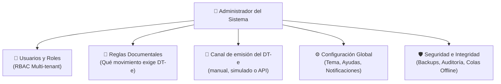
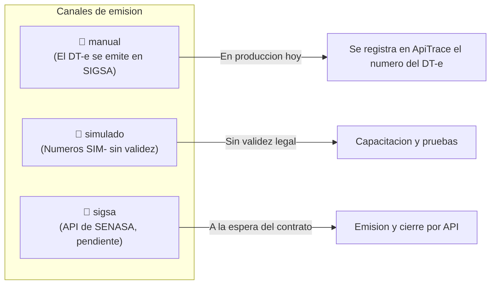

# Manual de Usuario ApiTrace — 06. Perfil Administrador del Sistema

Este manual está dirigido a los **administradores de plataforma, responsables de sistemas (TI), gerentes operativos de cooperativas apícolas y administradores de empresas exportadoras** que gestionan la parametrización técnica y funcional de ApiTrace.

---

## 1. Responsabilidades del Administrador de ApiTrace

Como Administrador, tenés el control total sobre la gobernanza y seguridad de la plataforma. Tus principales responsabilidades son:
1. **Administración de Entidades y Usuarios**: Dar de alta cooperativas, salas, productores y transportistas, asignando los roles correspondientes (RBAC).
2. **Gobernanza de Reglas Documentales**: Consultar y auditar qué regla obliga a emitir DT-e en cada tipo de movimiento y desde cuándo rige.
3. **Canal de emisión del DT-e**: Definir, en la configuración del despliegue, si el DT-e se registra a mano (modo manual), se simula para capacitar (modo simulado) o se emite por la API de SENASA cuando esté disponible.
4. **Supervisión de Rendimiento y Sincronización**: Monitorear colas de transacciones offline, errores de comunicación y copias de seguridad de la base de datos.
5. **Configuración Global del Sistema**: Parametrizar las ayudas pedagógicas, temas visuales y preferencias institucionales desde el módulo de configuración.

---

## 2. Gestión de Usuarios, Organizaciones y Roles (RBAC)

ApiTrace implementa un esquema de seguridad basado en roles (**Role-Based Access Control**) con aislamiento seguro por organización (**Multi-tenant**).

### Matriz de Permisos por Rol:

| Función / Módulo | ADMIN | PRODUCTOR | SALA | ACOPIADOR | TRANSPORTISTA | AUDITOR |
| :--- | :---: | :---: | :---: | :---: | :---: | :---: |
| **Panel de Inicio (Dashboard)** | Global | Explotación | Planta | Depósito | En ruta | Métricas |
| **Apiarios y Establecimientos** | Total | Sus propios | Solo lectura | Solo lectura | ❌ | Auditoría |
| **Emisión de Movimientos (DT-e)**| Total | Origen campo | Origen sala | Origen acopio| ❌ | Solo lectura |
| **Confirmar Despacho en Ruta** | Total | ❌ | ❌ | ❌ | ✅ | ❌ |
| **Cierre de DT-e en Destino** | Total | ❌ | ✅ | ✅ | ❌ | ❌ |
| **Registro de Extracciones** | Total | ❌ | ✅ | ❌ | ❌ | Auditoría |
| **Lotes y Tambores** | Total | ❌ | ✅ | ✅ | ❌ | Auditoría |
| **Grafo de Trazabilidad** | Total | Acotado | Acotado | Acotado | ❌ | Total e Irrestricto |
| **Libro de Auditoría**| Total | ❌ | ❌ | ❌ | ❌ | Inspección |
| **Reglas Documentales** | Edición | ❌ | ❌ | ❌ | ❌ | Solo lectura |

### Cómo crear un nuevo usuario y asignarle perfil:
1. En el menú de navegación hacé clic en **Usuarios**.
2. Presioná el botón azul **"Nuevo usuario"**.
3. Completá los campos:
   * **Nombre y Apellido**: Nombre completo del operador.
   * **Correo electrónico**: Será su identificador de inicio de sesión.
   * **CUIT / CUIL**: Fundamental para las declaraciones juradas de SENASA.
   * **Rol asignado**: Seleccioná el perfil operativo según las tareas que realizará.
   * **Organización / Establecimiento**: Vinculalo a la sala de extracción, cooperativa o empresa a la que pertenece.
4. Presioná **"Crear usuario"**. El sistema generará las credenciales seguras de acceso inicial.

---

## 3. Gobernanza de Reglas Documentales Dinámicas

Las reglas documentales dicen qué movimiento exige DT-e y desde cuándo rige esa obligación. Viven en la base de datos (tabla `movement_rule`), con fecha de inicio y de fin, y la pantalla **Reglas** las muestra para auditarlas: hoy se cargan al preparar el entorno, no se editan desde la aplicación.

### Qué fija la norma y no se configura

Estos plazos vienen del trámite API-SEM de SENASA y están escritos en el código del servidor (`backend/src/modules/movement/dte.rules.ts`), no en una pantalla:

| Regla | Valor | Qué significa |
| :--- | :--- | :--- |
| Vigencia del DT-e | 2 días por defecto, hasta 4 | Días corridos entre la fecha de carga y la de vencimiento. |
| Anticipación de emisión | hasta 4 días | Cuánto antes de la fecha de carga se puede emitir por autogestión. |
| Gracia después del vencimiento | 4 días | Plazo para cerrar tarde. Pasado ese plazo el DT-e queda CADUCADO y el titular no puede emitir nuevos. |
| Cantidad confirmada | Qreal ≤ Qdeclarada | La sala no puede confirmar más alzas que las declaradas. |
| Zona horaria | UTC−3 | Los días del DT-e son días calendario argentinos. |

### Qué se configura en el despliegue

Son variables de entorno del servicio (en Render, *Environment*), no opciones de una pantalla:

* `SENASA_MODE`: `manual`, `simulado` o `sigsa`. Es el canal de emisión del DT-e (ver el punto 4).
* `SENASA_ENV`: `homologacion` o `produccion`, para cuando el canal sea `sigsa`.
* `DTE_LIFECYCLE_ENABLED` y `DTE_LIFECYCLE_INTERVAL_MS`: el barrido que mueve los DT-e entre EMITIDO, VIGENTE, VENCIDO y CADUCADO según la fecha.
* `OUTBOX_ENABLED`, `OUTBOX_INTERVAL_MS`, `OUTBOX_MAX_ATTEMPTS`: la cola que reintenta los envíos a SENASA.

---

## 4. Gestión de la Pasarela SENASA / SIGSA

ApiTrace habla con SENASA a través de un único puerto de integración con tres adaptadores intercambiables (`backend/src/modules/movement/senasa/`). El canal se elige con la variable `SENASA_MODE` y la aplicación muestra en pantalla cuál está activo y qué permite hacer.

* **Modo manual (`manual`)**: es el que está en uso. El productor emite el DT-e en SIGSA y en ApiTrace registra el número, el código de cierre y la vigencia. ApiTrace controla las reglas del trámite (cantidades, plazos, estados) y lleva la trazabilidad; la emisión la hace SIGSA.
* **Modo simulado (`simulado`)**: genera números de prueba con prefijo `SIM-` para capacitar y para las pruebas automáticas. **No tienen validez legal** y quedan marcados como simulados en toda la aplicación.
* **Modo sigsa (`sigsa`)**: el adaptador de la API oficial. Está escrito como esqueleto y declara sus capacidades en cero, porque SENASA todavía no entregó el contrato técnico (endpoints, esquema y autenticación). Lo que ApiTrace necesita de ese contrato está documentado en `docs/plan-dte/10-API-Integracion-SENASA-ApiTrace.md`.

> [!CAUTION]
> **Antes de pasar a `sigsa`**: hace falta el contrato técnico de SENASA, el certificado digital de Clave Fiscal a nombre de la plataforma y la delegación del servicio por parte de cada productor. Mientras eso no esté, el modo `sigsa` responde que la integración no está disponible, sin inventar números.

---

## 5. El Módulo de Configuración (`/settings`)

El nuevo módulo de configuración centraliza las preferencias de la plataforma:

### Opciones Disponibles para Administradores:
* **Ayudas Contextuales (Popups Pedagógicos)**: Activar o desactivar los globos de ayuda en toda la aplicación. Permite que los usuarios novatos aprendan la terminología sin necesidad de consultar el manual impreso.
* **Tema Visual (Claro / Oscuro)**: Configurar la preferencia visual predeterminada o forzar el modo oscuro para operarios que trabajan en ambientes con poca luz o pantallas de galpón.
* **Vehículo habitual**: Patente del chasis y del acoplado que se usan casi siempre. Precargan el paso «Transporte» del DT-e y se guardan en el dispositivo.
* **Canal de emisión del DT-e**: Se muestra de solo lectura, tal como lo informa el servidor, junto con lo que ese canal permite hacer. Se cambia en la configuración del despliegue, no desde la aplicación.

> [!NOTE]
> Lo que se guarda en esta pantalla vive en el dispositivo: cada teléfono o computadora tiene sus preferencias. Los plazos y las reglas del DT-e no son preferencias: los fija la norma.

---

## 6. Mantenimiento, Copias de Seguridad y Contingencias

### A. Política de Copias de Seguridad (Backups)
La base de datos guarda la historia de cada partida de miel y debe conservarse por varios años para respaldar exportaciones y fiscalizaciones.

> [!IMPORTANT]
> Hoy las copias son las que ofrece el proveedor de la base (Neon: recuperación a un punto en el tiempo, según el plan contratado). **Todavía no hay una copia propia programada ni verificada.** Antes de cargar datos reales conviene definir y dejar por escrito: cada cuánto se hace una copia, dónde se guarda, cuánto tiempo se conserva y quién prueba una restauración.

### B. Supervisión de la Cola Offline
Cuando los usuarios trabajan sin señal de internet en el campo, sus operaciones se acumulan en la cola local de IndexedDB:

* Si un usuario reporta que sus movimientos no aparecen en el servidor central una vez que volvió al pueblo, el administrador puede indicarle que abra el menú **"Pendientes"** y presione el botón **"Sincronizar ahora"**.
* El motor de sincronización de ApiTrace utiliza **Claves de Idempotencia (UUID v4)**, lo que garantiza que ninguna operación se duplique aunque se presione el botón varias veces o se interrumpa la conexión a la mitad.

### C. Protocolo de Caída de los Servidores de SENASA
Si los servicios de SENASA no responden, con el canal `sigsa` activo:
1. La solicitud queda **encolada** en ApiTrace y el DT-e se muestra como *solicitado*, con el motivo del reintento a la vista. No se inventa ningún número ni comprobante provisorio: sin DT-e emitido por SENASA, el camión no puede circular.
2. Un proceso en segundo plano (**DTE Sync Worker**) reintenta con espera creciente y registra cada intento en el log de integración.
3. Cuando SENASA responde, el DT-e queda emitido con su número y su código de cierre, y el productor lo ve en la aplicación sin tener que hacer nada.
4. Si el organismo rechaza el trámite por un dato inválido, no se reintenta: el DT-e queda rechazado con el mensaje del organismo, para corregir y volver a solicitarlo.

Con el canal `manual` (el de hoy) la contingencia es otra: si SIGSA no está disponible, el productor no puede emitir el DT-e y el viaje no sale. ApiTrace deja preparado el borrador para registrarlo apenas SIGSA vuelva.
