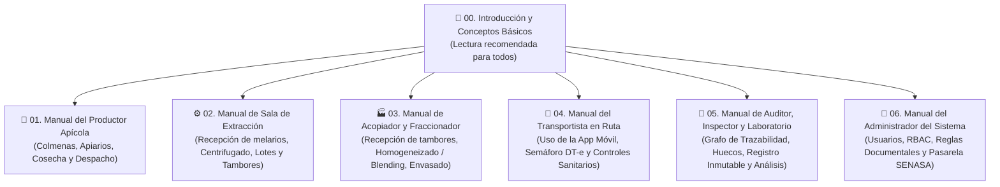

# 📚 Centro de Documentación y Manuales de Usuario — ApiTrace

Bienvenido al centro oficial de manuales de usuario de **ApiTrace**, la plataforma integral de trazabilidad apícola diseñada para conectar el trabajo del campo con las exigencias sanitarias de SENASA y los mercados internacionales de exportación de miel.

Estos manuales han sido redactados de manera **didáctica y paso a paso**, pensando especialmente en **personas que se inician en la actividad apícola o que no tienen experiencia previa en sistemas informáticos**.

---

## 🗺️ Mapa de Manuales por Perfil de Usuario

Elegí el manual correspondiente a tu actividad en la cadena productiva:

---

## 📑 Índice Detallado de Documentos

> [!TIP]
> **Manual Consolidado Completo**: Si deseás descargar o imprimir todos los manuales en un único libro unificado de alta resolución, podés acceder al documento maestro:
> 📥 [**Descargar Manual Maestro Completo (PDF - 8.9 MB)**](pdf/ApiTrace-Manual-Completo.pdf)

| N° | Manual de Usuario | Versión Web (MD) | Versión Imprimible (PDF) | Destinatarios principales | Contenidos clave |
| :---: | :--- | :---: | :---: | :--- | :--- |
| **00** | **Introducción y Conceptos Básicos** | [Ver Markdown](00-introduccion-y-conceptos-basicos.md) | [📥 Descargar PDF](pdf/00-introduccion-y-conceptos-basicos.pdf) | **Todos los usuarios** | ¿Qué es la trazabilidad de la miel? Glosario apícola ilustrado (alzas, tambores, precintos, tara, melarios), marco legal SENASA/ARCA, cómo ingresar al sistema, uso sin internet (offline) y ayudas contextuales. |
| **01** | **Manual del Productor Apícola** | [Ver Markdown](01-manual-productor.md) | [📥 Descargar PDF](pdf/01-manual-productor.pdf) | Apicultores, chacareros, dueños de colmenares | Alta de apiarios con coordenadas GPS, vinculación de RENAPA oficial, delegación en AFIP (Formulario 3283/E), asistente de despacho de melarios en 3 pasos, semáforo DT-e verde y consejos de campo. |
| **02** | **Manual de Sala de Extracción** | [Ver Markdown](02-manual-sala-extraccion.md) | [📥 Descargar PDF](pdf/02-manual-sala-extraccion.pdf) | Jefes de planta, operarios de extracción y báscula | Recepción física en rampa, pesaje y merma, cierre de DT-e con Código de Verificación SENASA, centrifugado, cálculo automático de rendimiento (kg/alza), loteado y precintado de tambores. |
| **03** | **Manual de Acopiador y Fraccionador** | [Ver Markdown](03-manual-acopiador-fraccionador.md) | [📥 Descargar PDF](pdf/03-manual-acopiador-fraccionador.pdf) | Encargados de galpón de acopio, envasadores | Recepción de tambores a granel, control de humedad (<18%) y escala de color Pfund, creación de lotes secundarios (blending/homogeneizado) sin perder el origen, y despacho a puerto. |
| **04** | **Manual del Transportista en Ruta** | [Ver Markdown](04-manual-transportista.md) | [📥 Descargar PDF](pdf/04-manual-transportista.pdf) | Fleteros, choferes de camión y camioneta | Instalación de la app en el celular (PWA), consulta del semáforo antes de arrancar, qué mostrar en controles de Gendarmería/SENASA, funcionamiento sin señal en ruta y cierre de viaje. |
| **05** | **Manual de Auditor y Laboratorio** | [Ver Markdown](05-manual-auditor-laboratorio.md) | [📥 Descargar PDF](pdf/05-manual-auditor-laboratorio.pdf) | Inspectores de SENASA, auditores de calidad y bioquímicos | Búsqueda en el grafo interactivo de trazabilidad (hacia atrás y hacia adelante), detección de "huecos de trazabilidad", libro de auditoría inmutable, parámetros químicos y exportación de expedientes. |
| **06** | **Manual del Administrador del Sistema** | [Ver Markdown](06-manual-administrador.md) | [📥 Descargar PDF](pdf/06-manual-administrador.pdf) | Administradores de TI, gerentes de cooperativa | Gestión de usuarios y permisos (RBAC multi-tenant), parametrización de reglas documentales dinámicas (tolerancias, humedades, plazos), modos de pasarela SENASA/SIGSA y contingencias. |

---

## 🔑 Cuentas de Acceso para Capacitación y Ensayos

Si estás utilizando el entorno de demostración o capacitación, podés ingresar con los siguientes perfiles de prueba. La contraseña para todos es:

> **Contraseña universal de prueba**: `ApiTrace2026!`

| Perfil | Correo de acceso | Rol asignado | Ámbito de operación |
| :--- | :--- | :--- | :--- |
| **Administrador** | `admin@apitrace.ar` | `ADMIN` | Control total del sistema y configuración |
| **Sala de Extracción** | `sala.tandil@apitrace.ar` | `SALA` | Operaciones de extracción y loteado de tambores |
| **Productor Apícola** | `productor.rodriguez@apitrace.ar`| `PRODUCTOR` | Gestión de colmenares y despacho de cosechas |
| **Acopiador / Fraccionador** | `acopio.pampa@apitrace.ar` | `ACOPIADOR` | Gestión de stock a granel y mezclas |
| **Transportista** | `chofer.gomez@apitrace.ar` | `TRANSPORTISTA` | Traslados en ruta y control vehicular |
| **Auditor / Inspector** | `auditor.senasa@apitrace.ar` | `AUDITOR` | Fiscalización y grafo de trazabilidad |

---

## 💡 Ayuda en Pantalla y Soporte Continuo

Recordá que dentro de la aplicación podés acceder a las **Ayudas Contextuales** en cualquier momento:
1. Al lado de los campos técnicos y botones vas a ver un pequeño ícono de ayuda `?`.
2. Al posar el mouse o tocarlo en el celular, se abrirá un cuadro explicativo con:
   * **Definición sencilla**: Explicación del término en lenguaje cotidiano.
   * **Ejemplo real**: Un caso práctico con números reales.
   * **Norma SENASA**: La resolución legal que exige ese dato.
3. Podés activar o desactivar estas ayudas en cualquier momento desde el menú **Configuración (`/settings`)**.
