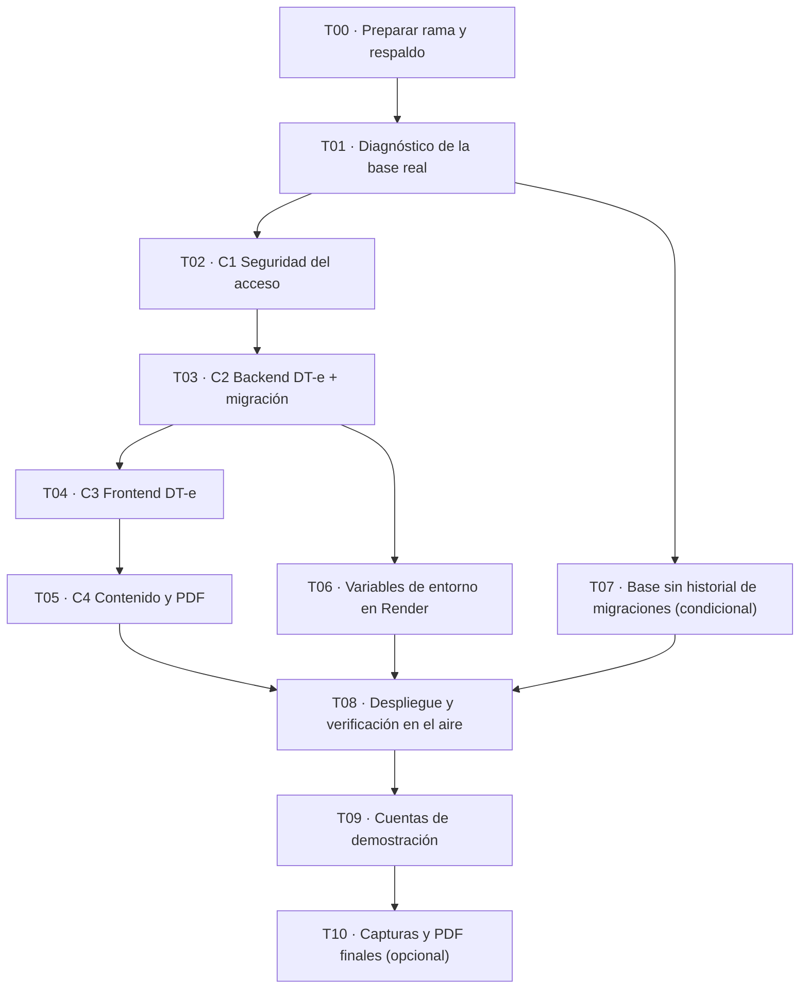

# 11 · Plan de corrección del DT-e — instrucciones para Antigravity

**Proyecto:** ApiTrace · **Fecha:** 2026-09-21
**Base:** repositorio en `bdd2a5b` (rama `main`). Si `main` avanzó, ver §6.
**Origen de los hallazgos:** `09-Revision-Antigravity-y-Alineacion-DTE.md`.

---

## 0. Cómo leer este plan

Cada tarea está en `tareas/T0x-*.md` y tiene siempre las mismas seis partes:

1. **Objetivo** — una frase.
2. **Precondiciones** — qué tiene que estar hecho y verificado antes.
3. **Pasos** — comandos exactos, en PowerShell, desde la raíz del repositorio
   (`C:\github\ApiTrace`). Ningún paso dice "configurar" o "ajustar": dice qué escribir.
4. **Salida esperada** — qué imprime cada comando cuando sale bien.
5. **Verificación (gate)** — la condición que deja pasar a la tarea siguiente. Si no se
   cumple, **no se sigue**: se informa qué salió y se espera.
6. **Qué NO hacer** — las decisiones que no corresponden a esta tarea.

**Reglas del plan, sin excepciones:**

- **No inventar datos.** Si falta el RENAPA de un apiario o el código SENASA de una sala,
  el campo queda vacío y la pantalla lo pide. Nunca un valor de relleno
  (`VER-0000`, `AAA000`, `SIN DATO`).
- **No cambiar `0001_dte_api_sem.sql`.** Ya se aplicó en Neon. Toda corrección va hacia
  adelante, en `0002_dte_reparacion.sql`.
- **No borrar filas del DT-e.** Un DT-e que no sirve se marca `ELIMINADO` o `ANULADO` con
  motivo, y queda en el historial.
- **No tocar la base de producción a mano** fuera de los scripts de `sql/`, y siempre
  después de correr el diagnóstico.
- **Si un comando falla, se detiene la tarea.** No se sigue "a ver si el próximo anda".

Las correcciones ya están implementadas y probadas: `parches/` (para aplicar con
`git apply`) y `referencia-dte.zip` (copias completas de cada archivo, con `sha256` en
`referencia-INVENTARIO.md`). Cada tarea dice cuál usar. Para tener las copias a mano:

```powershell
Expand-Archive docs\plan-dte\referencia-dte.zip -DestinationPath docs\plan-dte\referencia -Force
```

---

## 1. Orden de las tareas y dependencias



| Tarea | Título | Duración estimada | Riesgo |
| :--- | :--- | :--- | :--- |
| [T00](tareas/T00-preparacion.md) | Preparar rama de trabajo y respaldo de la base | 15 min | Bajo |
| [T01](tareas/T01-diagnostico-base.md) | Diagnóstico de la base real y resolución de bloqueos | 30–90 min | **Alto** (decisiones humanas) |
| [T02](tareas/T02-seguridad-acceso.md) | Cerrar la puerta de la autenticación | 20 min | Bajo |
| [T03](tareas/T03-backend-dte.md) | Modelo DT-e correcto + migración de reparación | 60 min | Medio |
| [T04](tareas/T04-frontend-dte.md) | Pantallas del DT-e | 30 min | Bajo |
| [T05](tareas/T05-contenido-y-pdf.md) | Contenido de landing y manuales + PDF | 45 min | Bajo |
| [T06](tareas/T06-render-entorno.md) | Variables de entorno del despliegue | 20 min | Medio |
| [T07](tareas/T07-base-sin-migraciones.md) | Registrar migraciones si la base se creó con `push` | 15 min | **Alto** |
| [T08](tareas/T08-despliegue-y-verificacion.md) | Desplegar y verificar en el aire | 45 min | Medio |
| [T09](tareas/T09-cuentas-demostracion.md) | Cuentas de demostración y acceso rápido | 30 min | Medio |
| [T10](tareas/T10-capturas-y-cierre.md) | Capturas, PDF finales y commit | 60 min | Bajo |

---

## 2. Qué corrige cada fase

| Fase | Parche | Hallazgos que cierra | Archivos |
| :--- | :--- | :--- | :--- |
| C1 Seguridad | `parches/01-seguridad-acceso.patch` | S-01, S-02, S-04 | 3 |
| C2 Backend | `parches/02-backend-dte.patch` | D-01 a D-08, A-01 a A-07, S-05, S-06 | 59 |
| C3 Frontend | `parches/03-frontend-dte.patch` | A-01 (pantallas), C-11 | 26 |
| C4 Contenido | `parches/04-contenido-landing-manuales.patch` | C-01 a C-12 | 10 |

Los hallazgos S-03 y S-04 se terminan de cerrar en **T09** (base y despliegue), no con un
parche de código.

---

## 3. La migración `0002_dte_reparacion.sql`

Es la pieza delicada del plan, así que conviene saber qué hace antes de correrla:

| Paso | Qué hace | Si no puede |
| :--- | :--- | :--- |
| 1 | Devuelve a `movement_rule` los nombres de columna de `0000_init` (corrige D-01, sirva la base del migrador o de `push`) | — |
| 2 | Crea los tipos nuevos (`dte_issue_mode`, `dte_history_source`, `senasa_service`, `senasa_delegation_status`) | — |
| 3 | Traduce los estados del DT-e y del historial al vocabulario oficial | **Se detiene** si aparece un estado que no sabe traducir (D1) |
| 4 | Deja una delegación por productor y servicio, conservando la última | **Se detiene** con valores desconocidos (D2) |
| 5 | Normaliza RENAPA y códigos SENASA, sus estados y sus vencimientos | **Se detiene** con estados desconocidos, códigos repetidos o fechas imposibles (D3, D4) |
| 6 | Convierte fechas a día calendario, alzas a entero, aplica los códigos API-SEM, marca `SIMULADO` lo que emitió el simulador y borra los marcadores inventados | **Se detiene** con códigos o patentes más largos que el formato (D5) |
| 7 | Rehace las claves foráneas y **marca `ELIMINADO`** los borradores y simulaciones duplicados, con su fila de historial | — |
| 8 | Completa titularidad, documento asociado e historial de los DT-e que ya existían | — |
| 9 | Crea la unicidad: un DT-e en juego por movimiento y número API-SEM único | **Se detiene** si quedan dos DT-e con número real en el mismo movimiento (D6) |

Todo ocurre en **una sola transacción**: si un paso se detiene, la base queda exactamente
como estaba. Por eso el diagnóstico de T01 se corre antes: para que la migración no se
encuentre con nada que la detenga.

---

## 4. Definición de "terminado"

El plan está cumplido cuando **todo** esto es verdad:

- [ ] `npm run build`, `npm test` (43) y `npm run test:e2e` (68) pasan en `backend/`.
- [ ] `npm run build` y `npx vitest run` (21) pasan en `frontend/`.
- [ ] `POST /auth/login` con `admin` y contraseña `123456` responde **401**.
- [ ] `POST /api/v1/movements` responde **201** en el entorno desplegado (D-01 cerrado).
- [ ] El diagnóstico `sql/diagnostico-pre-0002.sql` devuelve **cero filas** en D1 a D6
      contra la base de producción, y `drizzle.__drizzle_migrations` tiene tres filas.
- [ ] Un DT-e nuevo guarda `movement_type_code = 'API-SEM'`, `product_code = '24.45'`,
      `unit = 'UNIDAD'`, `transit_reason = 'Extracción de miel'` y el `origin_code` es el
      RENAPA del apiario.
- [ ] Ningún DT-e tiene `verification_code = 'VER-0000'` ni `transport_plate = 'AAA000'`.
- [ ] Ningún movimiento tiene más de un DT-e en juego (índice `dte_movement_active_uq`).
- [ ] La landing y los manuales no afirman homologación, integración oficial, QR del
      frasco, backups cifrados ni parámetros inexistentes; los PDF están regenerados.
- [ ] La decisión sobre las cuentas de demostración está tomada y aplicada (T09).

---

## 5. Si algo sale mal

| Situación | Qué hacer |
| :--- | :--- |
| Un parche no aplica (`error: patch failed`) | Descomprimir `referencia-dte.zip` y usar la copia completa de `referencia/<misma ruta>` para ese archivo, verificando su `sha256` contra `referencia-INVENTARIO.md`. No editar a mano el parche. |
| La migración se detiene | Leer la línea que empieza con `cause: error: 0002_dte_reparacion:`; indica la consulta (`D1`…`D6`) de `sql/diagnostico-pre-0002.sql`. Resolver con la corrección que acompaña esa consulta y volver a desplegar. La base no quedó a medias. |
| El despliegue de Render falla en `start:render` | El servicio anterior sigue en el aire. Revisar el log del deploy: si el error viene de la migración, aplica la fila anterior. |
| Después de desplegar, la aplicación no ve la API | `VITE_API_URL` se compila en el bundle: hay que **volver a construir** el sitio web, no sólo reiniciarlo. |
| Se perdió el acceso de administrador | T09 crea una cuenta propia antes de desactivar las de demostración. Si ya se desactivaron, reactivar una con `UPDATE app_user SET status = 'ACTIVE' WHERE email = '<correo>';` desde el SQL Editor de Neon. |

---

## 6. Si `main` avanzó desde `bdd2a5b`

Los parches se hicieron contra `bdd2a5b`. Antes de empezar:

```powershell
cd C:\github\ApiTrace
git log --oneline -1
```

- Si imprime `bdd2a5b`, seguir con T00.
- Si imprime otro commit, correr `git diff --stat bdd2a5b..HEAD` y mirar si toca alguno de
  los 91 archivos de `referencia-INVENTARIO.md`. Si no los toca, los parches aplican igual.
  Si los toca, usar las copias del zip de referencia para esos archivos y resolver a mano la
  diferencia, dejando anotado en el commit qué se conservó.
